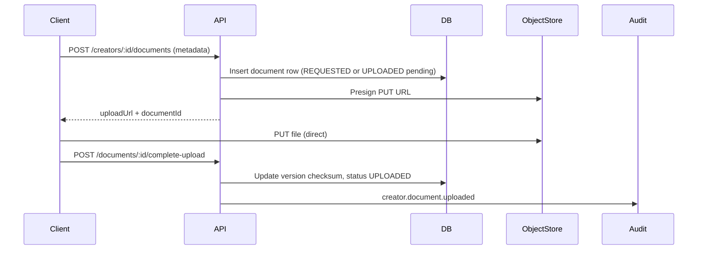
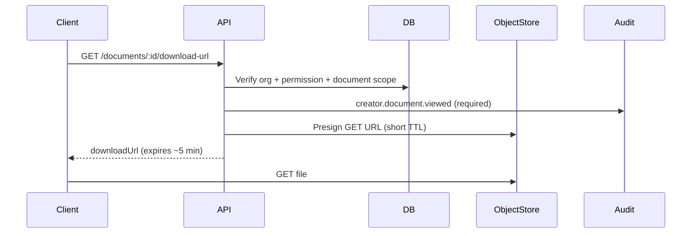

# Creator Documents & Contracts Architecture

Architecture for creator onboarding documents, versioned contracts, and future e-signature workflows on KŌLAB Platform.

**Status:** Planning (no implementation in this document)

---

## Context

### Prerequisites

- **Release 0.2** — organization-scoped identity, memberships, audit logs
- **Release 0.3** — Recruitment CRM, `CreatorProfile`, creator management APIs (`/api/creators`)

### Problem

Agencies must collect government IDs, tax forms, and signed agreements during creator onboarding. Today KOLAB tracks conversion status on leads but has **no first-class document or contract model**, no secure file storage workflow, and no compliance reporting for expiring credentials.

---

## Logical architecture

```text
┌──────────────────┐     ┌─────────────────────────────────────────┐     ┌─────────────────────┐
│ admin / web      │────▶│  @kolab/api                             │────▶│ PostgreSQL (Prisma) │
│ creator-portal   │     │  Creators module (extended)             │     │ CreatorDocument *   │
│ (future)         │     │  ├─ DocumentsController                 │     │ CreatorContract *   │
└──────────────────┘     │  ├─ ContractsController                 │     │ (metadata only)     │
                         │  └─ StoragePresignService               │     └─────────────────────┘
                         └──────────────┬──────────────────────────┘
                                        │
                         ┌──────────────▼──────────────┐
                         │  @kolab/storage             │
                         │  S3-compatible object store │
                         │  (presigned upload/download)│
                         └──────────────┬──────────────┘
                                        │
                         ┌──────────────▼──────────────┐     (future)
                         │  E-sign provider webhook    │
                         │  DocuSign / HelloSign / …   │
                         └─────────────────────────────┘
```

The Documents & Contracts capability extends the existing **Creators module** in `apps/api`. It reuses organization RBAC, JWT context, and `AuditService`. It does **not** introduce a separate microservice in v1.

---

## Module boundaries

| Module          | Responsibility                                      | Out of scope               |
| --------------- | --------------------------------------------------- | -------------------------- |
| **Creators**    | Document + contract metadata, workflows, presign    | File bytes in DB           |
| **Storage**     | Upload/download URLs, object key conventions        | Business workflow state    |
| **Audit**       | Append-only security events (incl. sensitive views) | Document approval logic    |
| **Recruitment** | Lead status `CONTRACT_SENT` / `SIGNED`              | Long-term document store   |
| **Payments**    | —                                                   | Bank verification (future) |

---

## File storage strategy

### Principles

1. **Never** persist raw file content in PostgreSQL.
2. Store **object key**, **bucket**, **content type**, **size**, **checksum**, and **encryption** metadata on document/contract version rows.
3. Clients upload/download via **short-lived presigned URLs** issued by the API.
4. Object keys are **non-guessable** and include organization + creator scope.

### Object key layout (planned)

```text
{env}/orgs/{organizationId}/creators/{creatorProfileId}/documents/{documentId}/v{version}/{uuid}.{ext}
{env}/orgs/{organizationId}/creators/{creatorProfileId}/contracts/{contractId}/v{version}/{uuid}.pdf
```

Lead-stage uploads (pre-conversion) may use `leads/{leadId}/` prefix until linked to `creatorProfileId`.

### Storage package

`@kolab/storage` (currently a Phase 3 placeholder) will expose:

- `getPresignedUploadUrl(key, contentType, expiresIn)`
- `getPresignedDownloadUrl(key, expiresIn)`
- `deleteObject(key)` (soft-delete / legal hold aware)

Local development may use MinIO or LocalStack; production uses S3-compatible storage with **SSE-KMS** or provider default encryption.

### Upload flow



### Download flow (sensitive)



---

## Security and privacy rules

| Rule                     | Implementation                                                            |
| ------------------------ | ------------------------------------------------------------------------- |
| Tenant isolation         | Every query filters `organizationId` from JWT                             |
| Least privilege          | Separate permissions for read vs upload vs approve vs download sensitive  |
| Audited sensitive access | `GOVERNMENT_ID`, `PASSPORT`, `TAX_FORM`, `BANK_INFO`, signed contracts    |
| PII minimization         | No document bytes or full account numbers in DB or audit payload          |
| URL expiry               | Presigned URLs ≤ 15 minutes upload, ≤ 5 minutes download                  |
| MIME allowlist           | `application/pdf`, `image/jpeg`, `image/png`, `image/webp` (configurable) |
| Size limits              | Default 10 MB documents; 25 MB contracts (agency-configurable later)      |
| Immutability             | Signed contract versions cannot be overwritten in object storage          |
| Legal hold               | `ARCHIVED` / terminated creators retain objects per retention policy      |

### Sensitivity classification

| Class       | Types                                     | Download audit |
| ----------- | ----------------------------------------- | -------------- |
| `PUBLIC`    | `PROFILE_PHOTO` (when marked public)      | Optional       |
| `INTERNAL`  | `OTHER`, draft contracts                  | Recommended    |
| `SENSITIVE` | ID, passport, tax, bank, signed contracts | **Required**   |

---

## Access permissions (planned)

Extends CRM permission family on `OrganizationMembership`:

| Permission               | Capability                                              |
| ------------------------ | ------------------------------------------------------- |
| `crm:read`               | List document/contract metadata (non-download)          |
| `crm:documents:upload`   | Upload / request documents                              |
| `crm:documents:review`   | Approve / reject / mark under review                    |
| `crm:documents:download` | Issue download URLs for sensitive files                 |
| `crm:contracts:manage`   | Create, send, cancel contracts                          |
| `crm:contracts:sign`     | Manual sign capture (manager); creator self-sign future |

Recruiters may upload for owned creators; managers approve. **Creators** receive portal-scoped permissions in a later milestone (`creator:documents:upload`).

`SYSTEM_ADMIN` bypasses guards for support but **must still emit audit events** when downloading sensitive files.

---

## Contract versioning

| Concept           | Behavior                                                                   |
| ----------------- | -------------------------------------------------------------------------- |
| `CreatorContract` | Logical agreement (type, creator, current status)                          |
| `ContractVersion` | Immutable snapshot per revision; monotonic `versionNumber`                 |
| Draft edits       | Mutate latest draft version only                                           |
| Send              | Locks draft fields; status → `SENT`                                        |
| Sign              | New storage object for executed PDF; version flagged `signedAt`; immutable |
| Amendment         | New contract version or child contract linked via `parentContractId`       |

Signed versions store:

- `storageKey`, `contentHash` (SHA-256)
- `signedAt`, `signedByUserId` (or e-sign external signer id)
- Optional `externalEnvelopeId` for provider

---

## Expiration and renewal

| Mechanism             | Behavior                                                       |
| --------------------- | -------------------------------------------------------------- |
| `expiresAt`           | On document row; nightly job marks `EXPIRED`                   |
| Contract `validUntil` | Transitions to `EXPIRED` if not `SIGNED` by date               |
| Reporting             | `GET /api/creators/documents/expiring?withinDays=30` (planned) |
| Renewal               | New upload creates new version; prior → `SUPERSEDED`           |
| Notifications         | Future `@kolab/notifications` emails to recruiter + creator    |

---

## Integration with Recruitment CRM

| CRM event            | Documents / contracts interaction                              |
| -------------------- | -------------------------------------------------------------- |
| Lead `CONTRACT_SENT` | Optional link to `CreatorContract` id in lead metadata         |
| Lead `SIGNED`        | Contract status should be `SIGNED` (manual or e-sign)          |
| Lead conversion      | Re-link documents from `leadId` → `creatorProfileId`           |
| Onboarding checklist | Block or warn on convert based on agency policy (configurable) |

---

## Future e-signature integration

Planned as **provider adapter** behind `EsignService` interface:

```text
createEnvelope(contractVersionId, signers[]) → externalEnvelopeId
handleWebhook(event) → update contract status VIEWED / SIGNED
fetchExecutedPdf(envelopeId) → store immutable object + hash
```

Requirements for provider selection ADR:

- Multi-signer support (creator + agency counter-sign)
- Webhook authenticity (HMAC)
- Completed PDF retrieval
- Audit trail export
- Data residency / SOC 2

Until integrated, agencies **manually upload** executed PDFs and transition status to `SIGNED`.

---

## Future payment / commission linkage

| Link                       | Phase   | Notes                                                 |
| -------------------------- | ------- | ----------------------------------------------------- |
| `BANK_INFO` document       | v1 plan | Metadata + external token only                        |
| `commissionPlan` on lead   | Exists  | Unchanged; not driven by contract module in v1        |
| Payout eligibility         | Future  | Requires `TAX_FORM` + `BANK_INFO` approved + contract |
| Campaign contract → payout | Future  | Campaigns + payments verticals                        |

**No payment APIs or Stripe connections** in documents/contracts v1.

---

## Audit events (planned)

| Action                        | When                            |
| ----------------------------- | ------------------------------- |
| `creator.document.requested`  | Checklist item created          |
| `creator.document.uploaded`   | Upload completed                |
| `creator.document.viewed`     | Download URL issued (sensitive) |
| `creator.document.approved`   | Review approved                 |
| `creator.document.rejected`   | Review rejected                 |
| `creator.document.expired`    | Expiration job or manual mark   |
| `creator.contract.created`    | Contract + v1 draft             |
| `creator.contract.sent`       | Sent to creator                 |
| `creator.contract.viewed`     | Creator opened                  |
| `creator.contract.signed`     | Executed version locked         |
| `creator.contract.expired`    | Offer lapsed                    |
| `creator.contract.cancelled`  | Voided pre-signature            |
| `creator.contract.terminated` | Post-signature termination      |

---

## Observability

- Metrics: upload success rate, presign latency, expiration job counts
- Alerts: failed webhook processing (e-sign), quarantined uploads
- Logs: structured logs without PII or presigned URL query strings

---

## Related documents

- [Product plan](../product/creator-documents-contracts.md)
- [Database ERD](../database/creator-documents-contracts-erd.md)
- [API plan](../api/creator-documents-contracts.md)
- [Creators API](../api/creators.md)
- [Recruitment CRM architecture](./recruitment-crm.md)
