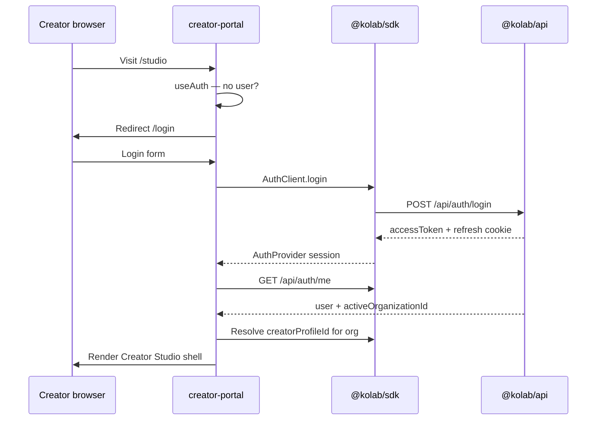

# Creator Studio Architecture

**Status:** ✅ Production Ready — Creator Studio v1.0  
**Application:** `apps/creator-portal` (Next.js 15 App Router)  
**Related:** [Product brief](../product/creator-studio.md) · [UX specification](../design/creator-studio-ux.md) · [Creators API](../api/creators.md) · [Frontend standards](../engineering/frontend-standards.md)

---

## v1.0 delivery summary

Creator Studio v1.0 (CS-01–CS-10) is complete. The web app provides ten integrated workspaces with shared UI patterns, mock/live data modes, navigation polish, and accessibility improvements. Business logic remains in `@kolab/api`; the portal is a presentation layer only.

| Track                                   | Status                                    |
| --------------------------------------- | ----------------------------------------- |
| Web workspaces (CS-01–CS-08, CS-10)     | ✅ Production ready                       |
| Production workspace foundation (CS-09) | ✅ UI foundation complete (mock provider) |
| Desktop wrapper / OBS integration       | 📋 Deferred to v0.9                       |

---

## Overview

Creator Studio is a **presentation and workflow layer** over existing `@kolab/api` domain services. It aggregates creator intelligence, goals, campaigns, live data, and compliance through typed clients — primarily `GET /api/creators/:id/dashboard` for the home experience and focused endpoints for detail views.

```mermaid
flowchart LR
  subgraph creatorPortal [apps/creator-portal]
    RSC[Server Components]
    CC[Client Components]
    SDK[@kolab/sdk]
  end
  subgraph api [@kolab/api]
    DASH[Dashboard aggregation]
    GOALS[Goals service]
    LIVE[Live intelligence]
    CAM[Campaigns]
    CRM[Creators / compliance]
  end
  CC --> SDK
  RSC --> SDK
  SDK --> api
  DASH --> GOALS
  DASH --> LIVE
  DASH --> CAM
  DASH --> CRM
```

**Engineering boundary:** Creator Studio is product UI, not a new backend domain. Do not add Creator Studio-specific tables or services until a clear backend gap is approved via ADR.

---

## Web-first vs desktop wrapper

| Option            | Role in Kōlab                             | Decision                                                                                        |
| ----------------- | ----------------------------------------- | ----------------------------------------------------------------------------------------------- |
| **Web (Next.js)** | v0.7 Creator Studio daily workspace       | **Ship first** — CS-01 through CS-08                                                            |
| **Electron**      | Mature OBS plugin ecosystem               | **Deferred** — evaluate only if OBS plugin interop is mandatory for v0.9                        |
| **Tauri**         | Lightweight desktop shell wrapping web UI | **Preferred candidate** for post-web desktop wrapper — smaller footprint, embeds creator-portal |

**Rationale:** Creators already stream from mobile and desktop browsers. Shipping web Creator Studio validates workflows before packaging cost, auto-update infrastructure, and OBS integration complexity. Desktop wrapper and browser-source overlays enter at **CS-09** only after success criteria in [Product brief](../product/creator-studio.md#success-criteria) are met.

OBS and Live Studio remain a separate surface in [System Map](./system-map.md) — Creator Studio deep-links; it does not embed OBS in Phase 1.

---

## Frontend architecture

| Layer               | Responsibility                                                                |
| ------------------- | ----------------------------------------------------------------------------- |
| **App Router**      | Route segments, layouts, loading and error boundaries                         |
| **`@kolab/ui`**     | Shared primitives, `AuthProvider`, `DashboardShell` patterns                  |
| **`@kolab/types`**  | Zod schemas and TypeScript DTOs — single shape with API                       |
| **`@kolab/sdk`**    | Typed HTTP clients — no ad-hoc `fetch` in components                          |
| **`@kolab/auth`**   | `APP_ALLOWED_ROLES` for creator-portal (`CREATOR` primary)                    |
| **Feature modules** | `apps/creator-portal/features/<module>/` — colocated components, hooks, pages |

**Server vs client:** Default to Server Components for layouts and static shells. Use Client Components for interactive forms, polling live session status, timeline scrubbers, and auth redirects. See [Frontend standards](../engineering/frontend-standards.md#server-vs-client-components).

**State:** Prefer server-fetched initial data + client refetch on user action. Do not mirror backend aggregates in global client stores unless required for real-time UX (CS-06+).

---

## Auth and session flow



| Rule             | Detail                                                                                                            |
| ---------------- | ----------------------------------------------------------------------------------------------------------------- |
| Access token     | Short-lived JWT in memory via `AuthProvider`                                                                      |
| Refresh          | HttpOnly cookie; `AuthClient.refresh` on 401                                                                      |
| Organization     | Active org from JWT; creators belong to one primary org per session                                               |
| Role gate        | `creator-portal` allows `CREATOR` (and configured org roles if agency staff preview is ever added — default deny) |
| Creator profile  | Map authenticated user → `CreatorProfile` in active org before studio routes render                               |
| Protected layout | `(studio)/layout.tsx` redirects unauthenticated users; no parallel auth checks                                    |

Audit: dashboard view fires `creator.dashboard.viewed` via API — do not skip by caching dashboard in client-only storage.

---

## API client and data fetching

| Pattern            | Use                                                                                              |
| ------------------ | ------------------------------------------------------------------------------------------------ |
| **Dashboard home** | `GET /api/creators/:id/dashboard` — primary CS-02 data source                                    |
| **Detail modules** | Direct endpoints when dashboard section insufficient (goal detail, replay timeline, gifter list) |
| **Mutations**      | POST/PATCH via sdk clients; invalidate or refetch affected sections                              |
| **Types**          | Import from `@kolab/types` — e.g. `creator-dashboard.ts`, `creator-goals.ts`                     |

**Do not duplicate backend scoring logic in the frontend.** Performance scores, trend direction, goal progress percentages, and quick-action ranking come from API responses only. Client may format numbers and sort UI lists but must not recompute scores from raw events.

**Do not persist dashboard aggregates client-side** beyond normal HTTP cache — the endpoint is live-generated.

| Module                  | Primary API                                                    |
| ----------------------- | -------------------------------------------------------------- |
| Home dashboard          | `GET .../dashboard`                                            |
| Goals                   | `GET/POST/PATCH .../goals`, `POST .../progress/recalculate`    |
| Performance             | `GET .../performance-score`                                    |
| Intelligence            | `GET .../intelligence`                                         |
| Trends                  | `GET .../trends/live`                                          |
| Campaigns               | [Campaigns API](../api/campaigns.md)                           |
| Deliverables            | Campaigns API deliverable routes                               |
| Live schedule           | [Live Intelligence API](../api/live-intelligence.md) schedules |
| Go Live / sessions      | Live sessions + status transitions                             |
| Coach / recommendations | Live session metadata + dashboard `coach` section              |
| Replay / highlights     | Live timeline and highlights endpoints                         |
| Gifters                 | `/api/live/gifters`                                            |
| Compliance              | `GET .../onboarding`, compliance bundle endpoints              |

Extend `@kolab/sdk` with domain clients as routes stabilize — follow [Frontend standards — API communication](../engineering/frontend-standards.md#api-communication).

### Dashboard data modes (CS-02)

| Variable                         | Purpose                                                                      |
| -------------------------------- | ---------------------------------------------------------------------------- |
| `NEXT_PUBLIC_USE_MOCK_DASHBOARD` | `true` (default) serves typed mock data; `false` calls live API              |
| `NEXT_PUBLIC_API_BASE_URL`       | API host (falls back to `NEXT_PUBLIC_API_URL`, then `http://localhost:4000`) |
| `NEXT_PUBLIC_CREATOR_PROFILE_ID` | Creator profile ID for dashboard requests until user→profile mapping ships   |

Live mode uses the existing auth access token from `@kolab/sdk` / `AuthProvider` (Bearer header + refresh cookie). Responses are validated with `CreatorDashboardResponseSchema` from `@kolab/types`.

| HTTP status   | Client behavior                                      |
| ------------- | ---------------------------------------------------- |
| `401` / `403` | Redirect to `/unauthorized`                          |
| `404`         | Render empty dashboard DTO with informational banner |
| Other errors  | Error state with retry                               |

Implementation: `services/dashboard-service.ts`, `hooks/use-dashboard.ts`, `components/dashboard/*`.

### Goals and performance data modes (CS-03)

Uses the same `NEXT_PUBLIC_USE_MOCK_DASHBOARD` toggle as CS-02 (`useMockStudioData()` in `lib/env.ts`).

| Module      | Live endpoint                             | Schema                           |
| ----------- | ----------------------------------------- | -------------------------------- |
| Goals       | `GET /api/creators/:id/goals`             | `ListCreatorGoalsResponseSchema` |
| Performance | `GET /api/creators/:id/performance-score` | `CreatorPerformanceScoreSchema`  |

| HTTP status   | Goals behavior              | Performance behavior        |
| ------------- | --------------------------- | --------------------------- |
| `401` / `403` | Redirect to `/unauthorized` | Redirect to `/unauthorized` |
| `404`         | Empty goals list            | Empty state (no score yet)  |
| Other errors  | Error state with retry      | Error state with retry      |

Progress bars derive display percentages from API `currentValue` / `targetValue` strings only — no goal recalculation. Performance scores, bands, and narratives render API fields as-is.

Implementation: `services/goal-service.ts`, `services/performance-service.ts`, `hooks/use-goals.ts`, `hooks/use-performance.ts`, `types/goal-adapters.ts`, `types/performance-adapters.ts`, `components/goals/*`, `components/performance/*`.

### Campaign workspace data modes (CS-04)

Uses the same `NEXT_PUBLIC_USE_MOCK_DASHBOARD` toggle as CS-02/CS-03.

| Module            | Live endpoints                                                          |
| ----------------- | ----------------------------------------------------------------------- |
| Campaign list     | `GET /api/campaigns`                                                    |
| Campaign detail   | `GET /api/campaigns/:campaignId`                                        |
| Assignments       | `GET /api/campaigns/:campaignId/assignments?creatorProfileId=...`       |
| Applications      | `GET /api/campaigns/:campaignId/applications?creatorProfileId=...`      |
| Deliverables      | `GET /api/campaigns/:campaignId/assignments/:assignmentId/deliverables` |
| Templates         | `GET /api/campaigns/:campaignId/deliverables`                           |
| Dashboard summary | `GET /api/creators/:id/dashboard` (home card only)                      |

Live mode composes campaign workspace data client-side from org-scoped campaign routes filtered by creator profile ID. Display-only rendering — no assignment, deliverable, or payment calculations in the frontend.

Implementation: `services/campaign-service.ts`, `services/campaign-assignment-service.ts`, `services/campaign-deliverable-service.ts`, `services/campaign-workspace-loader.ts`, `hooks/use-campaign-workspace.ts`, `types/campaign-adapters.ts`, `components/campaigns/*`.

### Coach workspace data modes (CS-05)

Uses the same `NEXT_PUBLIC_USE_MOCK_DASHBOARD` toggle as CS-02–CS-04.

| Module                  | Live endpoints                                                 |
| ----------------------- | -------------------------------------------------------------- |
| Session recommendations | `GET /api/live/sessions/:sessionId/recommendations`            |
| Coach alerts            | `GET /api/live/sessions/:sessionId/coach/alerts`               |
| Session intelligence    | `GET /api/live/sessions/:sessionId/intelligence`               |
| Creator intelligence    | `GET /api/creators/:id/intelligence`                           |
| Dashboard coach summary | `GET /api/creators/:id/dashboard` (overview seed + session id) |

Live mode resolves the latest session ID from dashboard `liveActivity.latestLiveSession`, then composes session-scoped coach endpoints with creator intelligence. Display-only rendering — no recommendation, alert, or score recalculation in the frontend.

Implementation: `services/coach-service.ts`, `services/recommendation-service.ts`, `services/alert-service.ts`, `services/intelligence-service.ts`, `services/creator-intelligence-service.ts`, `hooks/use-coach-workspace.ts`, `types/coach-adapters.ts`, `components/coach/*`.

### Live workspace data modes (CS-06)

Uses the same `NEXT_PUBLIC_USE_MOCK_DASHBOARD` toggle as CS-02–CS-05.

| Module               | Live endpoints                                     |
| -------------------- | -------------------------------------------------- |
| Live session         | `GET /api/live/sessions/:sessionId`                |
| Timeline             | `GET /api/live/sessions/:sessionId/timeline`       |
| Session summary      | `GET /api/live/sessions/:sessionId/summary`        |
| Session intelligence | `GET /api/live/sessions/:sessionId/intelligence`   |
| Dashboard live seed  | `GET /api/creators/:id/dashboard` (`liveActivity`) |

Live mode resolves the latest session ID from dashboard `liveActivity.latestLiveSession`, then composes session, timeline, summary, and intelligence endpoints. Display-only rendering — no timeline, replay, or analytics recalculation in the frontend.

Implementation: `services/live-workspace-service.ts`, `services/live-session-service.ts`, `services/timeline-service.ts`, `services/session-summary-service.ts`, `hooks/use-live-workspace.ts`, `types/live-adapters.ts`, `components/live/*`.

---

## Route and module structure

Base path: `/studio` (or existing `(dashboard)` group — align with current creator-portal conventions during CS-01).

```text
apps/creator-portal/
  app/
    (auth)/login|register
    (studio)/
      layout.tsx              # Auth guard, CreatorStudioShell, nav
      page.tsx                # Home dashboard
      goals/                  # CS-03
      performance/            # CS-03
      campaigns/              # CS-04
      deliverables/           # CS-04
      live/
        schedule/             # CS-06
        workspace/            # CS-06 Go Live
        production/           # CS-09 Production Workspace
      coach/                  # CS-05
      intelligence/           # CS-03/05
      trends/                 # CS-03
      replay/[sessionId]/     # CS-07
      gifters/                # CS-07
      compliance/             # CS-08
      settings/               # CS-08
  features/
    dashboard/
    goals/
    campaigns/
    live/
    coach/
    compliance/
    settings/
```

Navigation reflects daily workflow order: **Home → Goals → Campaigns → Live → Coach → Performance → Settings**.

---

## Creator Studio modules

### Home dashboard

Aggregated sections from dashboard DTO: overview, today's goals, campaigns, deliverables, live activity, coach, performance, achievements, compliance, quick actions. CS-02 deliverable.

### Goals

List, create, edit, status transitions, manual recalculate. Display progress from API — no local goal math.

### Campaign tasks

Assigned campaigns, pending applications, due dates from dashboard `upcomingCampaigns` and campaigns list API.

### Deliverables

Upcoming, overdue, submission flows via campaigns API. Link from dashboard `deliverables` section.

### Live schedule

`CreatorLiveSchedule` CRUD views — calendar/list. Read-heavy in CS-06; mutations for creators with `crm:update`.

### Go Live workspace

Session create/link, status transitions (`SCHEDULED` → `LIVE` → `ENDED`). Pre-live checklist from compliance + goals quick actions. No OBS embed in CS-06.

### Coach alerts

Read alert summaries from dashboard `coach` and session detail. No raw event payloads.

### Recommendations

Stored session recommendations and intelligence `recommendedNextActions`. Action buttons route to goals, campaigns, or live modules.

### Performance score

Read-only visualization of components, strengths, risks, and `dataQualityWarnings` from stored snapshot. Regenerate triggers POST endpoint — display loading state.

### Intelligence profile

Read-only profile with coaching priorities and risk signals. Regenerate via POST.

### Trends

Live trend metrics and narrative arrays from trend snapshot API.

### Timeline replay

Session picker → timeline replay API. Highlights panel. Scrubber is client UX; event data from API only.

### Gifter insights

Gifter list and detail — aggregate fields only per [Live Intelligence API](../api/live-intelligence.md#gifter-profiles).

### Compliance

Onboarding checklist, document status, compliance bundle from creators and documents APIs.

### Profile / settings

User profile, notification preferences (when available), organization context display, platform accounts read-only.

---

## Manager visibility

Creator Studio routes resolve **one** `creatorProfileId` — the authenticated user's creator record in the active organization. No roster picker, no cross-creator navigation.

Managers viewing creator data use **admin** (interim) and **Manager Portal** (v0.8). API permissions already enforce org scope; UI must not expose other creators' IDs.

---

## OBS and Live Studio future

| Phase       | Capability                                                           |
| ----------- | -------------------------------------------------------------------- |
| CS-01–CS-08 | Web-only; optional external OBS with manual session linkage          |
| CS-09       | Production workspace UI foundation; OBS/desktop integration deferred |
| v0.9        | Live Studio foundation — event bridge to append-only timeline        |

Creator Studio **Go Live** deep-links to Live Studio when installed; otherwise shows platform streaming instructions and session ID for ingest API.

Research: [Master Roadmap — Research](../roadmap/master-roadmap.md#research) (OBS automation, Browser Source SDK).

---

## Engineering boundaries

| Rule                  | Detail                                                                       |
| --------------------- | ---------------------------------------------------------------------------- |
| No duplicated scoring | Performance, trends, goals, matching scores — API only                       |
| Dashboard aggregation | Prefer `GET .../dashboard` for home; avoid N+1 client composition on landing |
| DTO fidelity          | Render `@kolab/types` shapes; do not invent parallel interfaces              |
| No new backend domain | UI calls existing modules; gaps require ADR + API proposal first             |
| Privacy               | Never render raw chat/transcript from timeline APIs in creator UI            |
| Audit                 | Rely on server-side audit for views and mutations                            |

---

## Implementation phases

### CS-01 — Shell

Auth integration, org context, creator profile resolution, studio layout, navigation, role guard, dashboard mock adapter.

**Status:** Implemented in `apps/creator-portal` — routes under `/studio/*`, mock dashboard via `NEXT_PUBLIC_USE_MOCK_DASHBOARD=true` (default).

**Exit:** Creator logs in and lands on authenticated shell with dashboard cards. ✅

### CS-02 — Dashboard

Implement home page consuming dashboard endpoint; quick actions route to stubs.

**Status:** Implemented — live API integration with mock fallback, typed DTO rendering, auth error routing.

**Exit:** All dashboard sections render with loading/error states; audit on view. ✅

### CS-03 — Goals and performance

Goals workspace (`/studio/goals`) and performance workspace (`/studio/performance`) consuming list goals and performance score endpoints. Display-only rendering — no client-side score or goal recalculation.

**Status:** Implemented — live API integration with mock fallback, typed DTO adapters, grouped goals UI, component scores and narrative sections, auth error routing.

**Exit:** Creator reviews goals and performance score without client-side math. ✅

### CS-04 — Campaign workspace

Campaign workspace at `/studio/campaigns` with assigned campaigns, deliverables, applications, and read-only campaign detail panel. List and kanban views; calendar/filter/search placeholders.

**Status:** Implemented — live API composition with mock fallback, typed DTO adapters, status badges, loading/empty/partial/error states, auth error routing.

**Exit:** Creator reviews campaign assignments, deliverables, and applications without client-side business logic. ✅

### CS-05 — Coach and recommendations

Coach workspace at `/studio/coach` combining recommendations, alerts, session intelligence, and creator intelligence. Tab navigation: Summary, Recommendations, Alerts, Intelligence.

**Status:** Implemented — live API composition with mock fallback, typed DTO adapters, priority/confidence UI, loading/empty/partial/error states, auth error routing.

**Exit:** Creator reviews coaching signals and intelligence without client-side business logic. ✅

### CS-06 — Live workspace

Live workspace at `/studio/live` with session overview, read-only timeline, session summary, and live intelligence panels. Desktop-first resizable panel layout (UI only).

**Status:** Implemented — live API composition with mock fallback, typed DTO adapters, loading/empty/partial/error states, auth error routing.

**Exit:** Creator reviews live session activity without client-side timeline or analytics logic. ✅

### CS-07 — Replay and gifter insights

Replay & Gifter Intelligence workspace at `/studio/intelligence` with replay timeline (navigation only, no video), grouped highlights, trigger analysis, gifter intelligence, and session signals panels. Desktop-first responsive layout.

**Status:** Implemented — live API composition with mock fallback, typed DTO adapters, loading/empty/partial/error states, auth error routing.

**APIs:** `GET /api/live/sessions/:sessionId/replay`, `/highlights`, `/gifters`, `/analysis/triggers`, `/intelligence`.

**Exit:** Post-live review available without admin API. ✅

### Replay workspace data modes (CS-07)

Uses the same `NEXT_PUBLIC_USE_MOCK_DASHBOARD` toggle as CS-02–CS-06.

| Module            | Live endpoints                                        |
| ----------------- | ----------------------------------------------------- |
| Replay timeline   | `GET /api/live/sessions/:sessionId/replay`            |
| Highlights        | `GET /api/live/sessions/:sessionId/highlights`        |
| Trigger analysis  | `GET /api/live/sessions/:sessionId/analysis/triggers` |
| Gifter list       | `GET /api/live/sessions/:sessionId/gifters`           |
| Session signals   | `GET /api/live/sessions/:sessionId/intelligence`      |
| Dashboard session | `GET /api/creators/:id/dashboard` (`liveActivity`)    |

Live mode resolves the latest session ID from dashboard `liveActivity.latestLiveSession`, then composes replay, highlights, trigger, gifter, and intelligence endpoints. Display-only rendering — no replay generation, timeline logic, trigger analysis, or gifter rollup recalculation in the frontend.

Implementation: `services/replay-workspace-service.ts`, `services/replay-service.ts`, `services/highlight-service.ts`, `services/trigger-analysis-service.ts`, `services/gifter-service.ts`, `hooks/use-replay-workspace.ts`, `types/replay-adapters.ts`, `components/replay/*`.

### CS-08 — Profile and settings

Profile workspace at `/studio/profile` with creator profile, platform accounts, skills & categories, and read-only compliance panels. Settings workspace at `/studio/settings` with general account info, appearance, notifications placeholder, workspace preferences, and system metadata.

**Status:** Implemented — live API composition with mock fallback, typed DTO adapters, loading/empty/partial/error states, auth error routing.

**APIs:** `GET /api/creators/:id`, `/platform-accounts`, `/skills`, `/availability`, `/compliance`, and `GET /api/profile`.

**Exit:** Creator finishes onboarding from studio; compliance visible on dashboard match. ✅

### Profile workspace data modes (CS-08)

Uses the same `NEXT_PUBLIC_USE_MOCK_DASHBOARD` toggle as CS-02–CS-07.

| Module            | Live endpoints                            |
| ----------------- | ----------------------------------------- |
| Creator profile   | `GET /api/creators/:id`                   |
| Platform accounts | `GET /api/creators/:id/platform-accounts` |
| Skills            | `GET /api/creators/:id/skills`            |
| Availability      | `GET /api/creators/:id/availability`      |
| Compliance        | `GET /api/creators/:id/compliance`        |
| Account settings  | `GET /api/profile`                        |

Live mode composes creator profile endpoints plus user profile for settings. Display-only rendering — no profile mutation, compliance calculation, or onboarding logic in the frontend.

Implementation: `services/profile-workspace-service.ts`, `services/profile-service.ts`, `services/settings-service.ts`, `hooks/use-profile-workspace.ts`, `hooks/use-settings-workspace.ts`, `types/profile-adapters.ts`, `components/profile/*`, `components/settings/*`.

### CS-09 — OBS/browser-source foundation

Production Workspace UI foundation at `/studio/live/production` with dock-style resizable panels for scene management, sources, audio mixer, overlays, stream health, and output controls. Mock provider only — no OBS, RTMP, WebRTC, streaming, or desktop integration.

**Status:** Implemented — mock-only provider layer designed for future desktop/OBS replacement without UI rewrites.

**Exit:** Documented go/no-go for v0.9 Live Studio investment. ✅

### Production workspace data modes (CS-09)

Always mock. No backend calls. Future desktop integration replaces `ProductionWorkspaceProvider` only.

| Panel             | Data source    |
| ----------------- | -------------- |
| Production header | Mock provider  |
| Scene manager     | Mock provider  |
| Source manager    | Mock provider  |
| Audio mixer       | Mock provider  |
| Overlay manager   | Mock provider  |
| Stream health     | Mock telemetry |
| Output            | Mock provider  |

Implementation: `services/production-workspace-service.ts`, `services/production-mock.ts`, `hooks/use-production-workspace.ts`, `types/production-adapters.ts`, `components/production/*`.

**Deferred intentionally:** OBS capture, RTMP/WebRTC streaming, Electron/Tauri desktop shell, browser-source SDK, and backend production APIs.

### CS-10 — Integration and polish

Cross-workspace integration pass to unify Creator Studio UX without adding product features.

**Status:** Implemented — shared workspace shell, standardized loading/empty/error states, navigation and breadcrumb polish, dashboard response caching, persisted theme and tab preferences, accessibility improvements, and lazy-loaded heavy panels.

**Major UX improvements:**

- Shared `WorkspacePage`, `WorkspaceHeader`, `WorkspaceCard`, loading skeletons, and empty/error states across all workspaces
- Consistent spacing, card styling, panel headers, and refresh actions
- Nested route breadcrumbs (e.g. Live → Production) with corrected sidebar active states
- Coach and campaign tab memory via localStorage
- Compact sidebar and mock/live source badge preferences applied studio-wide
- Theme preference persistence for consistent dark mode behavior

**Exit:** Creator Studio feels like one cohesive application. ✅

---

## Security and privacy

| Concern             | Approach                                                                                            |
| ------------------- | --------------------------------------------------------------------------------------------------- |
| Tenant isolation    | All sdk calls use org-scoped JWT; never pass arbitrary creator IDs from URL without ownership check |
| Sensitive documents | Download flows use permission-gated presign endpoints only                                          |
| Live data           | Aggregate coaching and gifter views; timeline replay RBAC-aligned with API                          |
| Session storage     | No access tokens in localStorage; follow AuthProvider patterns                                      |
| CSP / headers       | Align with [Security headers](../security/headers.md)                                               |

See [Product Principles — Privacy first](../vision/product-principles.md#privacy-first).

---

## Related documentation

- [Product brief](../product/creator-studio.md)
- [UX specification](../design/creator-studio-ux.md)
- [System Map — Creator Studio](./system-map.md#creator-studio)
- [Decision Log — Backend first](./decision-log.md#adr-0004-backend-first-development)
- [Traceability Matrix](../roadmap/traceability.md)
