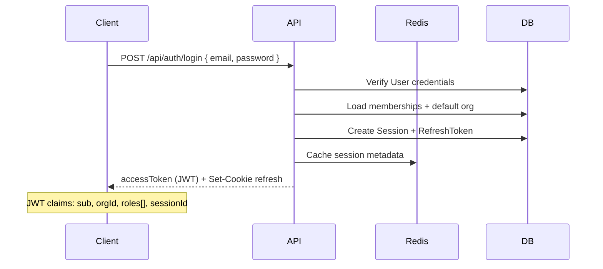

# Identity Architecture

Architecture for Release 0.2 — organization-scoped identity, authentication, authorization, and audit on KŌLAB Platform.

**Status:** Planning (no implementation in this document)

---

## Context

### Current state (Phase 1)

- Global `User` with flat `Role` enum and `Platform[]` access flags
- JWT access tokens + refresh token rotation (`RefreshToken` table, Redis session cache)
- RBAC via `@kolab/auth` role rank and `@Roles()` guards
- Four Next.js apps gate access with `APP_ALLOWED_ROLES`

### Target state (Release 0.2)

- **Organization** as top-level tenant
- **Membership** links users to orgs with org-scoped roles
- **Permissions** derived from roles (static matrix in 0.2; policy engine later)
- **Sessions** as first-class records (Redis cache + PostgreSQL source of truth)
- **AuditLog** for security-relevant mutations

---

## Logical architecture

```text
┌──────────────┐     ┌──────────────┐     ┌─────────────────────────┐
│ Next.js apps │────▶│  @kolab/api  │────▶│ PostgreSQL (Prisma)     │
│ admin, web,  │     │  Auth module │     │ User, Org, Membership,  │
│ creator, mod │     │  Org module  │     │ Invitation, Session,    │
└──────────────┘     │  Audit module│     │ AuditLog, RefreshToken  │
       │             └──────┬───────┘     └─────────────────────────┘
       │                    │
       ▼                    ▼
  @kolab/sdk            Redis
  @kolab/ui             session cache, rate limits, invitation tokens (TTL)
  AuthProvider
```

---

## Authentication flow

### Login (existing + org context)



### Refresh (rotation preserved)

1. Client sends `kolab_refresh_token` cookie
2. API validates refresh token hash in `RefreshToken` / links to `Session`
3. Rotate refresh token; invalidate prior hash
4. Issue new access JWT with same org context unless org switched

### Organization context

| Mechanism                  | Usage                                          |
| -------------------------- | ---------------------------------------------- |
| JWT claim `orgId`          | Default org for this session                   |
| Header `X-Organization-Id` | Explicit org switch (must validate membership) |
| `@CurrentOrg()` decorator  | NestJS param for org-scoped controllers        |

**Rule:** Org-scoped routes reject requests where the user is not a member of the resolved org.

---

## RBAC model

### Layers

1. **Platform role** — `SYSTEM_ADMIN` (optional global flag on user or separate admin table)
2. **Organization role** — one primary role per membership (`ORG_OWNER`, `CREATOR`, …)
3. **Permissions** — static mapping `role → permission[]` in `@kolab/auth` (Release 0.2)

### Permission examples (Release 0.2)

| Permission            | ORG_OWNER | ORG_ADMIN | CREATOR | VIEWER |
| --------------------- | --------- | --------- | ------- | ------ |
| `org:read`            | ✓         | ✓         | ✓       | ✓      |
| `org:update`          | ✓         | ✓         | —       | —      |
| `members:invite`      | ✓         | ✓         | —       | —      |
| `members:update_role` | ✓         | ✓         | —       | —      |
| `members:remove`      | ✓         | ✓         | —       | —      |
| `audit:read`          | ✓         | ✓         | —       | —      |
| `sessions:revoke`     | ✓         | ✓         | —       | —      |

### CRM permissions (Release 0.3)

| Permission   | ORG_OWNER | ORG_ADMIN | AGENCY_MANAGER | RECRUITER | MODERATOR | SUPPORT | CREATOR | FINANCE | VIEWER |
| ------------ | --------- | --------- | -------------- | --------- | --------- | ------- | ------- | ------- | ------ |
| `crm:read`   | ✓         | ✓         | ✓              | ✓         | ✓         | ✓       | —       | —       | —      |
| `crm:create` | ✓         | ✓         | ✓              | ✓         | —         | —       | —       | —       | —      |
| `crm:update` | ✓         | ✓         | ✓              | ✓         | —         | —       | —       | —       | —      |
| `crm:delete` | ✓         | ✓         | ✓              | —         | —         | —       | —       | —       | —      |
| `crm:assign` | ✓         | ✓         | ✓              | ✓         | —         | —       | —       | —       | —      |

Recruitment CRM routes under `/api/recruitment/*` use `@RequirePermissions()` with these CRM permissions. `isSystemAdmin` bypasses all authorization guards.

### Guard stack (NestJS — Release 0.2 RBAC implemented)

```text
Request → JwtAuthGuard → RolesGuard → OrganizationRolesGuard → PermissionsGuard → Controller
```

- `JwtAuthGuard` — validates JWT; attaches `request.user` with `organizationRole`, `organizationId`, `sessionId`
- `RolesGuard` — `@Roles()` Phase 1 legacy checks + org-role equivalent mapping
- `OrganizationRolesGuard` — `@OrganizationRoles()` checks JWT `organizationRole`
- `PermissionsGuard` — `@RequirePermissions()` resolves permissions from JWT `organizationRole` (legacy `role` fallback)

`isSystemAdmin` bypasses all authorization guards. Permission matrix lives in `@kolab/auth` (`ORGANIZATION_ROLE_PERMISSIONS`).

### Frontend

- `@kolab/ui` `AuthProvider` extended with `organization`, `memberships`, `hasPermission()`
- Apps continue to use route-level guards; server remains source of truth

---

## Session model

| Store                     | Purpose                                                              |
| ------------------------- | -------------------------------------------------------------------- |
| PostgreSQL `Session`      | Durable record: userId, orgId, device metadata, createdAt, revokedAt |
| PostgreSQL `RefreshToken` | Linked to session; hashed token, expiry                              |
| Redis                     | Hot session lookup, logout-all propagation, rate limiting            |

**Session revocation:**

- Single session: mark `Session.revokedAt`, delete Redis key, invalidate refresh token
- All sessions for user: bulk revoke
- All sessions for org member removal: revoke on membership delete

---

## Invitation flow

```mermaid
sequenceDiagram
  participant Admin
  participant API
  participant Email as Email (future)
  participant Invitee

  Admin->>API: POST /api/orgs/:orgId/invitations
  API->>API: Create Invitation (pending, token hash, expiry)
  API-->>Admin: invitation id + accept URL
  Note over Email: Phase 0.2 may return link only; email in 0.2.1
  Invitee->>API: POST /api/invitations/accept { token, password? }
  API->>API: Create/update User, Membership, AuditLog
  API-->>Invitee: AuthResponse (login)
```

---

## Audit logging strategy

### Principles

- **Append-only** — no updates or deletes in application code
- **Org-scoped** — every entry has `organizationId` when applicable
- **Actor + target** — `actorUserId`, `action`, `resourceType`, `resourceId`, `metadata` (JSON)
- **Correlation** — `requestId` from `@kolab/observability`

### Events (minimum Release 0.2)

| Action                    | Trigger               |
| ------------------------- | --------------------- |
| `invitation.created`      | Admin invites member  |
| `invitation.accepted`     | Invitee accepts       |
| `invitation.revoked`      | Admin cancels invite  |
| `membership.role_changed` | Role update           |
| `membership.removed`      | Member removed        |
| `organization.updated`    | Settings change       |
| `session.revoked`         | Logout / admin revoke |
| `user.profile_updated`    | Profile change        |

### Storage

- PostgreSQL `AuditLog` table; index by `(organizationId, createdAt)`
- Retention policy: _open decision_ (90 days default proposed)

---

## Package boundaries

| Package           | Responsibility                                          |
| ----------------- | ------------------------------------------------------- |
| `@kolab/database` | Prisma schema + migrations (implementation phase)       |
| `@kolab/types`    | Zod schemas for org, membership, invitation, audit DTOs |
| `@kolab/auth`     | JWT claims, permission matrix, guards helpers           |
| `@kolab/api`      | Auth, Org, Invitation, Admin modules                    |
| `@kolab/sdk`      | Typed client for new endpoints                          |
| `@kolab/ui`       | Org switcher, admin user management components          |
| `@kolab/admin`    | Primary surface for org/user/audit management           |

---

## Security considerations

- Invitation tokens: single-use, hashed at rest, 7-day expiry (configurable)
- Org slug: unique, URL-safe; used in admin routes not as sole auth boundary
- Rate limit invitation and login endpoints via Redis
- Audit logs must not store passwords, tokens, or PII beyond user ids
- `SYSTEM_ADMIN` actions always audited at platform scope (`organizationId` null)

---

## Related documents

- [Identity ERD](../database/identity-erd.md)
- [Authentication API](../api/authentication.md)
- [Release 0.2 product brief](../product/release-0.2.md)
- [Release 0.2 execution plan](../releases/release-0.2.md)
