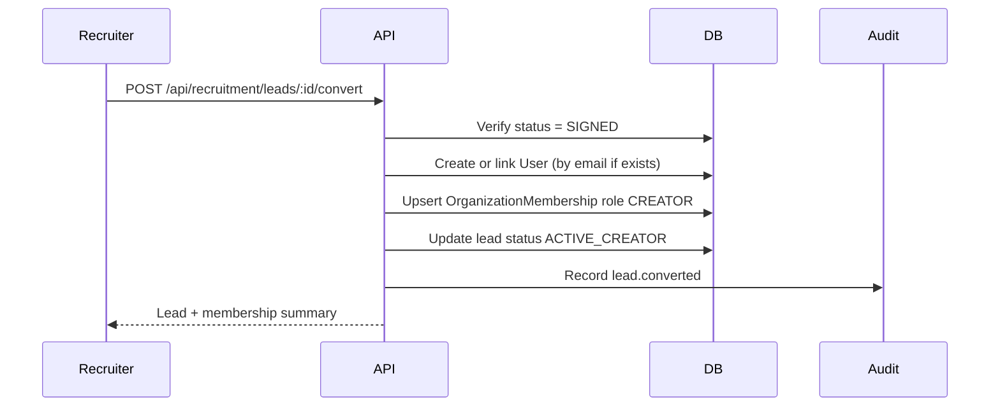

# Recruitment CRM Architecture

Architecture for Release 0.3 — Creator Recruitment CRM on KŌLAB Platform.

**Status:** Planning (no implementation in this document)

---

## Context

### Prerequisites

- **Release 0.2** — organization-scoped identity, memberships, invitations, sessions, audit logs
- **Release 0.3 agency foundation** — `AgencyProfile`, `AgencySettings`, `/api/agency/*` for org type `AGENCY`

### Problem

Agency recruiters need a shared CRM to track creator leads from first contact through signed contract and roster onboarding. Today there is no lead entity, ownership model, or conversion path from prospect to `CREATOR` membership.

---

## Logical architecture

```text
┌─────────────────┐     ┌──────────────────────────────┐     ┌─────────────────────┐
│ admin / web     │────▶│  @kolab/api                  │────▶│ PostgreSQL (Prisma) │
│ (future UI)     │     │  Recruitment module          │     │ RecruitmentLead     │
└─────────────────┘     │  ├─ LeadsController          │     │ LeadPlatformAccount │
                        │  ├─ ActivitiesController     │     │ LeadActivity        │
                        │  └─ ConversionService        │     │ LeadAssignmentLog   │
                        └──────────────┬───────────────┘     └─────────────────────┘
                                       │
                                       ▼
                               AuditService (existing)
                               Organization RBAC (existing)
```

The Recruitment module lives in `apps/api` and depends on existing auth guards, organization context, and audit logging. It does **not** introduce a separate microservice in v1.

---

## Module boundaries

| Module           | Responsibility                                               | Out of scope         |
| ---------------- | ------------------------------------------------------------ | -------------------- |
| **Recruitment**  | Leads, platform accounts, activities, follow-ups, conversion | Payments, campaigns  |
| **Agency**       | Agency profile and operational settings                      | Lead pipeline        |
| **Organization** | Memberships, roles                                           | Lead ownership rules |
| **Audit**        | Append-only security events                                  | CRM business logic   |

---

## Tenancy and access

| Rule                 | Behavior                                                                            |
| -------------------- | ----------------------------------------------------------------------------------- |
| Scope                | All CRM data is keyed by `organizationId`                                           |
| Org type gate        | Routes require active org with `type = AGENCY`                                      |
| Membership           | User must have active `OrganizationMembership`                                      |
| Recruiter visibility | Recruiters see leads where `assignedRecruiterId = self` unless granted manager read |
| Manager visibility   | `AGENCY_MANAGER`, `ORG_ADMIN`, `ORG_OWNER` see all org leads                        |

---

## Recruiter assignment rules

### First ownership

1. **Create with self** — recruiter creates lead → `assignedRecruiterId = actor`, `assignedAt = now`
2. **Claim** — unassigned lead (`assignedRecruiterId IS NULL`) → first successful claim wins (optimistic lock / unique constraint on claim transaction)
3. **Manager assign** — user with `leads:assign` sets `assignedRecruiterId` directly

### Reassignment

- Allowed for `AGENCY_MANAGER`, `ORG_ADMIN`, `ORG_OWNER` (and `SYSTEM_ADMIN` bypass)
- Writes `LeadAssignmentLog` row + `audit` event `lead.reassigned`
- Previous owner loses write access unless they hold manager permissions

### Concurrency

Use a database transaction for claim:

```text
BEGIN
  SELECT lead FOR UPDATE
  IF assignedRecruiterId IS NOT NULL → conflict
  UPDATE assignedRecruiterId, assignedAt
COMMIT
```

---

## Creator conversion

Conversion is a **domain action**, not a status edit alone.



**Rules:**

- Lead must be in `SIGNED` before conversion
- Conversion sets `convertedUserId` and `convertedAt` on lead
- Invitation email may be sent in a later release; v1 may require existing user or manual invite follow-up (_open decision_)

---

## Notes and contact history

Activities are **append-only** rows linked to a lead:

| Type       | Channel                      |
| ---------- | ---------------------------- |
| `CALL`     | Phone call                   |
| `WHATSAPP` | WhatsApp message             |
| `TIKTOK`   | TikTok DM / comment outreach |
| `FACEBOOK` | Facebook Messenger           |
| `EMAIL`    | Email                        |
| `MEETING`  | Video or in-person meeting   |
| `OTHER`    | Free-form                    |

Each activity stores: `type`, `summary`, `occurredAt`, `createdBy`, optional `metadata` (JSON).

Updating `nextFollowUpAt` on the lead can happen via dedicated follow-up endpoint or as part of activity creation.

---

## Follow-up model

| Field                  | Location             | Purpose                               |
| ---------------------- | -------------------- | ------------------------------------- |
| `nextFollowUpAt`       | `RecruitmentLead`    | Fast filtering for "due today" views  |
| `LeadFollowUp` history | optional child table | Record scheduled/completed follow-ups |

v1 minimum: **`nextFollowUpAt` on lead** + activity log when follow-up completed. History table is recommended in schema PR for manager reporting.

---

## Permissions (planned)

New permissions added to `@kolab/types` and `@kolab/auth`:

| Permission      | RECRUITER | AGENCY_MANAGER | ORG_ADMIN | ORG_OWNER |
| --------------- | --------- | -------------- | --------- | --------- |
| `leads:read`    | own leads | all            | all       | all       |
| `leads:create`  | ✓         | ✓              | ✓         | ✓         |
| `leads:update`  | own leads | all            | all       | all       |
| `leads:assign`  | —         | ✓              | ✓         | ✓         |
| `leads:convert` | —         | ✓              | ✓         | ✓         |

Implementation note: `leads:read` for recruiters enforced in service layer (filter by `assignedRecruiterId`) in addition to permission guard.

---

## Integration points

| System          | Integration                                                              |
| --------------- | ------------------------------------------------------------------------ |
| Agency settings | `recruiting.autoAssignRecruiter` may default assignment behavior in v1.1 |
| Invitations     | Post-conversion invite to creator portal (_future_)                      |
| Audit logs      | All assign, reassign, status change, convert events                      |
| Admin API       | Read-only cross-tenant support views (_future_)                          |

---

## Future extensions

| Extension   | Hook                                                |
| ----------- | --------------------------------------------------- |
| Campaigns   | Link leads to `campaignId` (nullable FK later)      |
| TikTok sync | Platform account `metadata` + external ID fields    |
| Payments    | `commissionPlan` + payout ledger                    |
| Analytics   | Materialized recruiter metrics from activity tables |
| Messaging   | Push notifications on follow-up due                 |
| AI scoring  | Replace manual score with model output              |

Store extension fields in JSON `metadata` columns until stable enough to promote to columns.

---

## Related documents

- [Product plan](../product/recruitment-crm.md)
- [Database ERD](../database/recruitment-crm-erd.md)
- [API plan](../api/recruitment-crm.md)
- [Identity architecture](./identity.md)
