# Kōlab System Map

**Status:** Strategic architecture reference  
**Audience:** Engineering, product, leadership  
**Related:** [Architecture overview](./README.md) · [Master Roadmap](../roadmap/master-roadmap.md) · [Product Strategy](../vision/product-strategy.md)

---

## Overview

Kōlab is a monorepo platform where **identity and organization scope** anchor **CRM**, **campaigns**, and **live intelligence**. Intelligence outputs feed **goals**, **performance**, and **matching**, which in turn power **Creator Studio** and the future **Manager Portal** and **Live Studio** clients.

---

## Full platform map

```mermaid
flowchart TB
  subgraph experience [Experience Layer]
    CS[Creator Studio]
    MP[Manager Portal]
    WEB[Web / Admin / Moderator]
    MOB[Mobile Apps]
    OBS[Live Studio / OBS Layer]
  end

  subgraph intelligence [Intelligence Layer]
    LIVE[Live Intelligence]
    CI[Creator Intelligence]
    GOALS[Goals Engine]
    MATCH[Matching & Performance]
    COACH[Recommendations & Coach Alerts]
  end

  subgraph operations [Operations Layer]
    CRM[Creator & Agency CRM]
    CAM[Campaign Management]
    COMP[Compliance & Documents]
  end

  subgraph platform [Platform Layer]
    ID[Identity & Permissions]
    API[@kolab/api + mobile-api]
    AUDIT[Audit & Storage]
  end

  subgraph future [Future Economic Layer]
    AN[Analytics Layer]
    AI[AI Layer]
    FIN[Financial Layer]
    MKT[Marketplace]
    TOK[Token Economy]
  end

  CS --> API
  MP --> API
  WEB --> API
  MOB --> API
  OBS --> API

  API --> operations
  API --> intelligence
  API --> platform

  intelligence --> future
  operations --> future
```

---

## Client surfaces

| Surface                     | Role                                   | Maturity           |
| --------------------------- | -------------------------------------- | ------------------ |
| **Creator Studio**          | Creator home — goals, dashboard, coach | Web UI 🚧 · API ✅ |
| **Manager Portal**          | Agency portfolio and campaign command  | 📋 Planned         |
| **Web / Admin**             | Internal ops, configuration, reporting | Shell ✅           |
| **Mobile**                  | Creator alerts, lightweight dashboard  | 📋 Planned         |
| **Live Studio (OBS Layer)** | Capture + intelligence overlays        | 📋 Planned         |

```mermaid
flowchart LR
  CS[Creator Studio] --> API[@kolab/api]
  MP[Manager Portal] --> API
  MOB[Mobile] --> MAPI[mobile-api]
  OBS[Live Studio] --> API
  WEB[Web Apps] --> API
```

---

## Intelligence and coaching stack

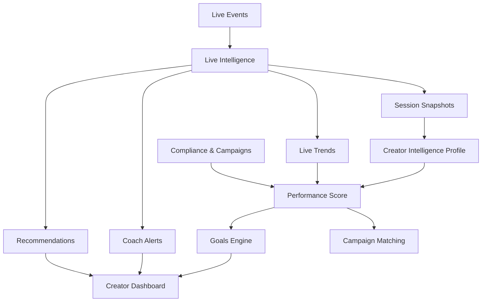

---

## AI layer (planned)

AI services consume **deterministic inputs only** — scores, goals, compliance status, trend summaries — never raw chat as the sole source of truth.

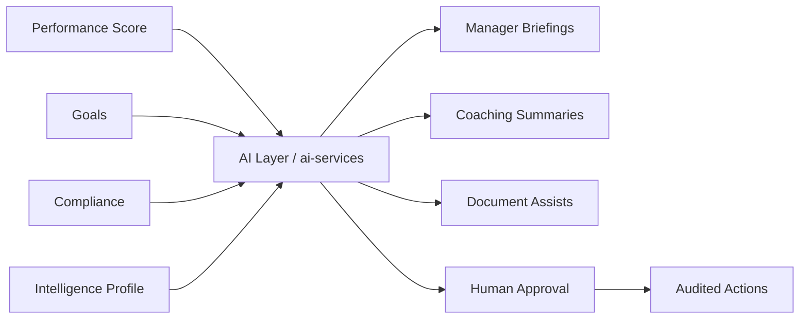

See [Product Principles — AI explains](../vision/product-principles.md#ai-explains--not-decides).

---

## Analytics layer (planned)

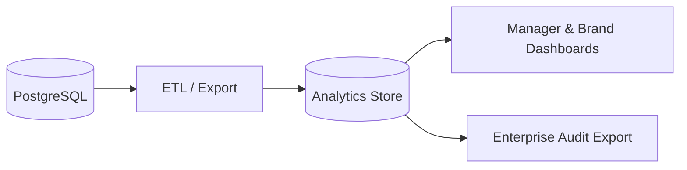

---

## Financial and marketplace layers (planned)

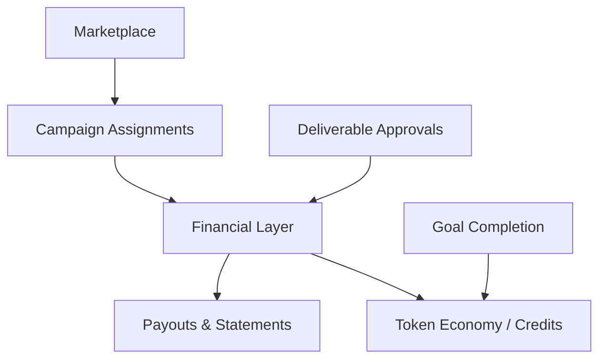

See [Business Model](../business/business-model.md).

---

## Platform layers

```mermaid
flowchart TB
  subgraph clients [Client Surfaces]
    CS[Creator Studio]
    MP[Manager Portal]
    LS[Live Studio / OBS Replacement]
    WEB[Web / Admin]
    MOB[Mobile Apps]
  end

  subgraph api [API Layer]
    API[@kolab/api]
    PAPI[public-api]
    MAPI[mobile-api]
    AI[ai-services]
  end

  subgraph domain [Domain Services]
    ID[Identity & Permissions]
    CRM[CRM]
    CAM[Campaigns]
    LIVE[Live Intelligence]
    CI[Creator Intelligence]
    GOALS[Goals Engine]
    PERF[Performance & Matching]
  end

  subgraph data [Data & Infrastructure]
    PG[(PostgreSQL / Prisma)]
    RD[(Redis)]
    ST[Storage]
  end

  CS --> API
  MP --> API
  LS --> API
  WEB --> API
  MOB --> MAPI
  AI --> PG

  API --> ID
  API --> CRM
  API --> CAM
  API --> LIVE
  API --> CI
  API --> GOALS
  API --> PERF

  ID --> PG
  CRM --> PG
  CAM --> PG
  LIVE --> PG
  CI --> PG
  GOALS --> PG
  PERF --> PG

  LIVE --> ST
  CRM --> ST
  API --> RD
```

---

## Identity, organizations, and permissions

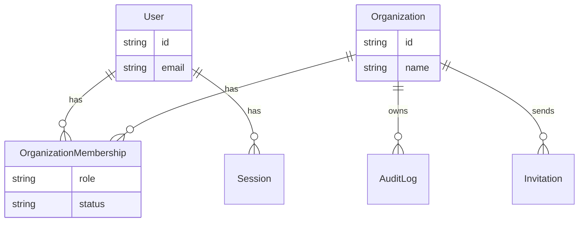

**Responsibilities:**

- JWT access tokens with active organization context
- Role and permission checks (`crm:read`, `documents:review`, etc.)
- Session revocation and audit

**Docs:** [Identity architecture](./identity.md) · [Authentication API](../api/authentication.md) · [Organizations API](../api/organizations.md)

---

## CRM domain

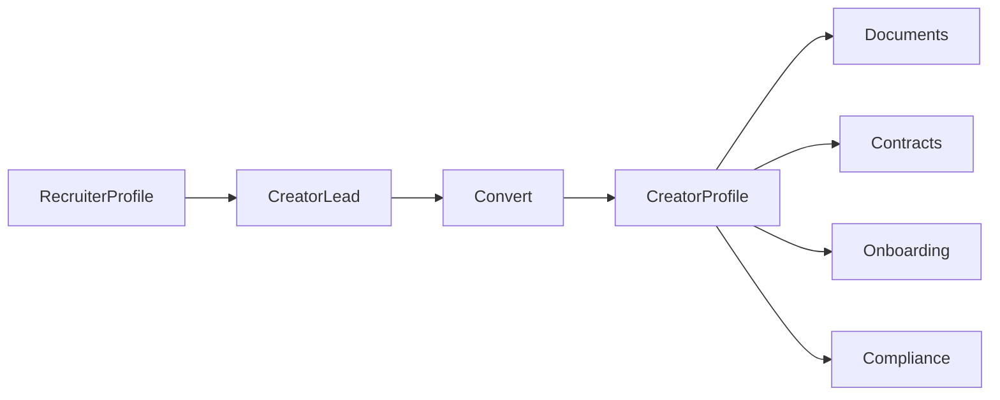

**Responsibilities:**

- Recruitment pipeline and lead conversion
- Creator roster and platform accounts
- Document and contract lifecycle
- Onboarding checklist and compliance bundles

**Docs:** [Recruitment CRM architecture](./recruitment-crm.md) · [Creators API](../api/creators.md)

---

## Campaigns domain

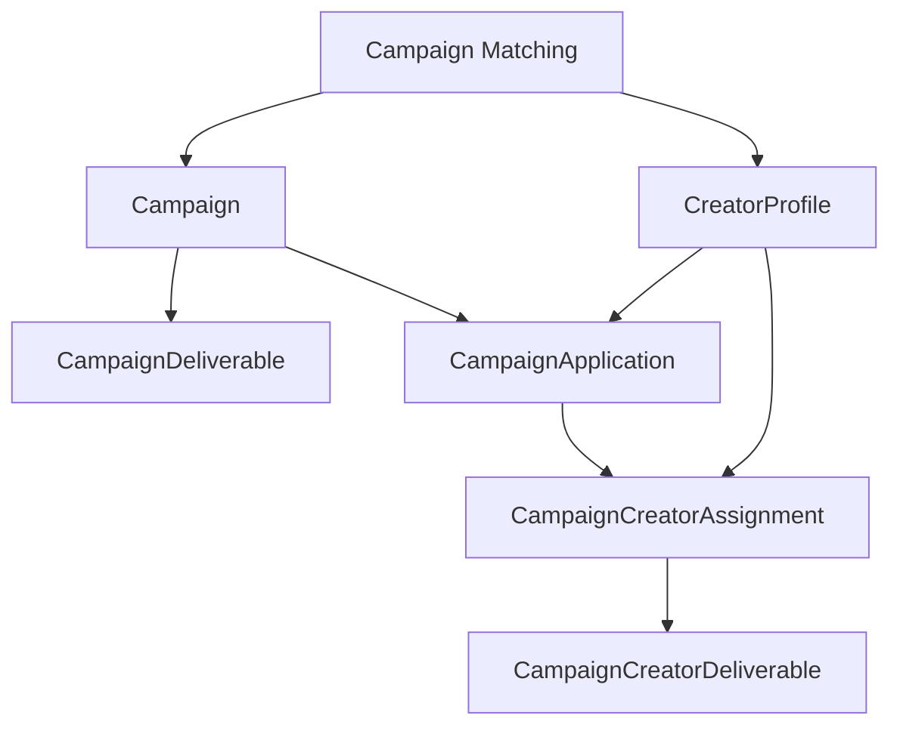

**Responsibilities:**

- Campaign definition and deliverable templates
- Creator applications and assignments
- Creator deliverable workflow (submit, approve, reject)
- Deterministic creator–campaign matching

**Docs:** [Campaigns ERD](../database/campaigns-erd.md) · [Campaigns API](../api/campaigns.md)

---

## Live intelligence domain

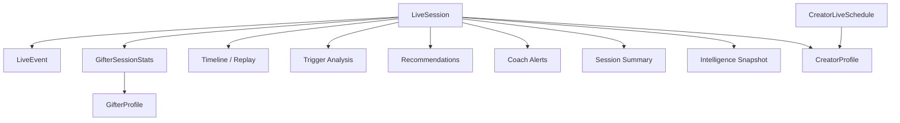

**Responsibilities:**

- Session lifecycle and event ingestion
- Gifter rollups and spending tiers
- Deterministic coaching recommendations and alerts
- Session-level intelligence snapshots

**Docs:** [Live Intelligence architecture](./live-intelligence.md) · [Live Intelligence API](../api/live-intelligence.md)

---

## Creator intelligence stack

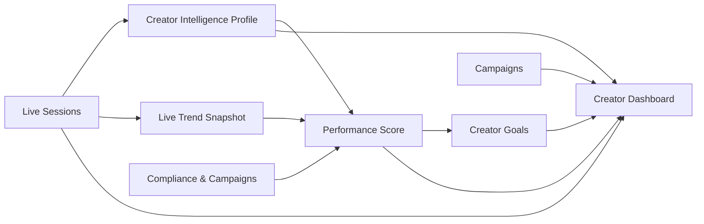

**Responsibilities:**

- Cross-session creator health and trend analysis
- Multi-dimensional performance scoring
- Goal tracking with deterministic recalculation
- Aggregated creator dashboard (no persistence)

**Docs:** [Creators API](../api/creators.md) · [Creator Goals ERD](../database/creator-goals-erd.md)

---

## Creator Studio

Creator Studio is the **experience layer** that consumes the creator intelligence stack. It does not own business logic.

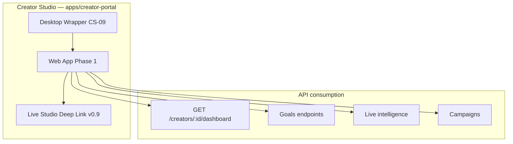

| Delivery track           | Timing           | Notes                                                              |
| ------------------------ | ---------------- | ------------------------------------------------------------------ |
| **Web**                  | v0.7 CS-01–CS-08 | Primary daily workspace                                            |
| **Desktop wrapper**      | CS-09 / v0.9     | Tauri preferred over Electron unless OBS plugins require otherwise |
| **OBS / browser source** | v0.9+            | After web workspace proves utility                                 |

**Docs:** [Creator Studio architecture](./creator-studio.md) · [Product brief](../product/creator-studio.md) · [UX](../design/creator-studio-ux.md)

---

## Future product surfaces

| Surface                | Consumes                                         | Status               |
| ---------------------- | ------------------------------------------------ | -------------------- |
| **Creator Studio**     | Dashboard, goals, live activity, coach           | Web v0.7 🚧 · API ✅ |
| **Manager Portal**     | Portfolio CRM, campaigns, matching, analytics    | 📋 Planned           |
| **Live Studio**        | Streaming, schedules, live intelligence overlays | 📋 Planned           |
| **Analytics Platform** | Warehouse exports, BI, brand reports             | 📋 Planned           |
| **AI Platform**        | Deterministic inputs → agents & automation       | 📋 Planned           |
| **Marketplace**        | Brand discovery, creator listings                | 🔮 Future            |
| **Financial Platform** | Payouts, invoicing, revenue share                | 🔮 Future            |
| **Token Economy**      | Credits ledger, utility tokens                   | 📋 Planned           |

---

## Cross-cutting concerns

| Concern           | Implementation                                    |
| ----------------- | ------------------------------------------------- |
| **Types**         | `@kolab/types` shared Zod schemas                 |
| **Auth**          | `@kolab/auth` permissions and JWT payload         |
| **Audit**         | `AuditLog` + standardized action names            |
| **Storage**       | Presigned uploads for documents and contracts     |
| **Notifications** | `@kolab/notifications` (future channel expansion) |
| **Payments**      | `@kolab/payments` (Financial Platform phase)      |

---

## Deployment topology (simplified)

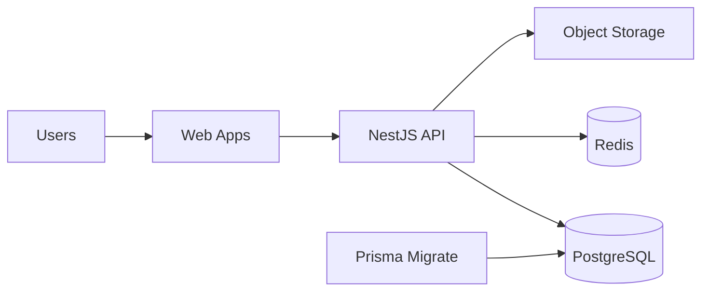

Local and production-like environments use Docker Compose. See [Deployment](../deployment/README.md).

---

## Related documentation

- [Architecture overview](./README.md)
- [Creator Studio architecture](./creator-studio.md)
- [Master Roadmap](../roadmap/master-roadmap.md)
- [Competitive Advantages](../vision/competitive-advantages.md)
- [Database overview](../database/README.md)
- [API index](../api/README.md)
