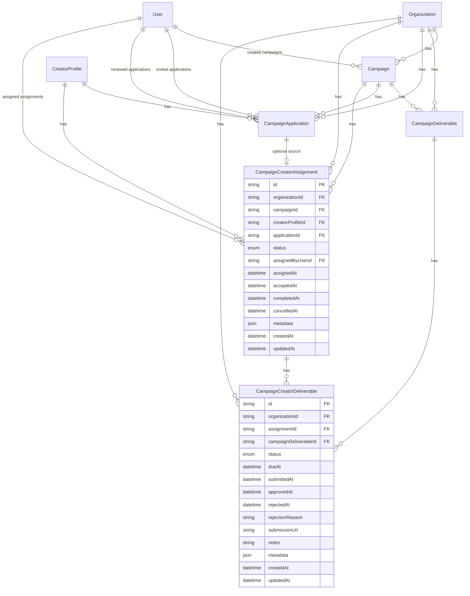

# Campaign Management Data Model (Release 0.4 foundation + applications + assignments)

**Status:** Implemented across campaign foundation, applications, and assignments branches  
Prisma schema: `packages/database/prisma/schema.prisma`

---

## Overview

Campaign Management adds organization-scoped campaign metadata, deliverable workflow, creator application, and creator assignment tables. All rows include `organizationId` and cascade-delete with the parent organization.

Payments and analytics tables are not included yet.

---

## Entity relationship diagram

---

## `campaigns`

| Column                 | Type             | Notes                                      |
| ---------------------- | ---------------- | ------------------------------------------ |
| `id`                   | `TEXT` PK        | `cuid()`                                   |
| `organization_id`      | `TEXT` FK        | Required; cascade on org delete            |
| `title`                | `TEXT`           | Required                                   |
| `description`          | `TEXT`           | Nullable                                   |
| `brand_name`           | `TEXT`           | Nullable                                   |
| `campaign_type`        | `CampaignType`   | Required                                   |
| `status`               | `CampaignStatus` | Default `DRAFT`                            |
| `budget_amount`        | `DECIMAL(12,2)`  | Nullable                                   |
| `budget_currency`      | `TEXT`           | Nullable ISO 4217 code                     |
| `starts_at`            | `TIMESTAMP`      | Nullable                                   |
| `ends_at`              | `TIMESTAMP`      | Nullable                                   |
| `application_deadline` | `TIMESTAMP`      | Nullable                                   |
| `brief`                | `JSONB`          | Default `{}`                               |
| `requirements`         | `JSONB`          | Default `{}`                               |
| `metadata`             | `JSONB`          | Default `{}`                               |
| `created_by_user_id`   | `TEXT` FK        | Required; references `users.id` (restrict) |
| `created_at`           | `TIMESTAMP`      | Auto                                       |
| `updated_at`           | `TIMESTAMP`      | Auto                                       |

Indexes: `(organization_id)`, `(organization_id, status)`, `(organization_id, campaign_type)`, `(organization_id, starts_at)`, `(organization_id, ends_at)`, `(created_by_user_id)`.

---

## `campaign_deliverables`

| Column            | Type                        | Notes                                |
| ----------------- | --------------------------- | ------------------------------------ |
| `id`              | `TEXT` PK                   | `cuid()`                             |
| `organization_id` | `TEXT` FK                   | Required; cascade on org delete      |
| `campaign_id`     | `TEXT` FK                   | Required; cascade on campaign delete |
| `title`           | `TEXT`                      | Required                             |
| `description`     | `TEXT`                      | Nullable                             |
| `status`          | `CampaignDeliverableStatus` | Default `DRAFT`                      |
| `due_at`          | `TIMESTAMP`                 | Nullable                             |
| `requirements`    | `JSONB`                     | Default `{}`                         |
| `metadata`        | `JSONB`                     | Default `{}`                         |
| `created_at`      | `TIMESTAMP`                 | Auto                                 |
| `updated_at`      | `TIMESTAMP`                 | Auto                                 |

Indexes: `(organization_id)`, `(organization_id, campaign_id)`, `(organization_id, status)`, `(campaign_id)`, `(campaign_id, status)`.

---

## `campaign_applications`

| Column                | Type                        | Notes                                      |
| --------------------- | --------------------------- | ------------------------------------------ |
| `id`                  | `TEXT` PK                   | `cuid()`                                   |
| `organization_id`     | `TEXT` FK                   | Required; cascade on org delete            |
| `campaign_id`         | `TEXT` FK                   | Required; cascade on campaign delete       |
| `creator_profile_id`  | `TEXT` FK                   | Required; cascade on creator delete        |
| `status`              | `CampaignApplicationStatus` | Default `INVITED`                          |
| `source`              | `CampaignApplicationSource` | Required                                   |
| `message`             | `TEXT`                      | Nullable                                   |
| `invited_by_user_id`  | `TEXT` FK                   | Nullable; references `users.id` (set null) |
| `applied_at`          | `TIMESTAMP`                 | Nullable                                   |
| `reviewed_by_user_id` | `TEXT` FK                   | Nullable; references `users.id` (set null) |
| `reviewed_at`         | `TIMESTAMP`                 | Nullable                                   |
| `decision_reason`     | `TEXT`                      | Nullable                                   |
| `metadata`            | `JSONB`                     | Default `{}`                               |
| `created_at`          | `TIMESTAMP`                 | Auto                                       |
| `updated_at`          | `TIMESTAMP`                 | Auto                                       |

Partial unique index: one active application per campaign + creator where `status IN ('INVITED', 'APPLIED')`.

---

## `campaign_creator_assignments`

| Column                | Type                       | Notes                                      |
| --------------------- | -------------------------- | ------------------------------------------ |
| `id`                  | `TEXT` PK                  | `cuid()`                                   |
| `organization_id`     | `TEXT` FK                  | Required; cascade on org delete            |
| `campaign_id`         | `TEXT` FK                  | Required; cascade on campaign delete       |
| `creator_profile_id`  | `TEXT` FK                  | Required; cascade on creator delete        |
| `application_id`      | `TEXT` FK                  | Nullable unique; references application    |
| `status`              | `CampaignAssignmentStatus` | Default `ASSIGNED`                         |
| `assigned_by_user_id` | `TEXT` FK                  | Required; references `users.id` (restrict) |
| `assigned_at`         | `TIMESTAMP`                | Default now                                |
| `accepted_at`         | `TIMESTAMP`                | Nullable                                   |
| `completed_at`        | `TIMESTAMP`                | Nullable                                   |
| `cancelled_at`        | `TIMESTAMP`                | Nullable                                   |
| `metadata`            | `JSONB`                    | Default `{}`                               |
| `created_at`          | `TIMESTAMP`                | Auto                                       |
| `updated_at`          | `TIMESTAMP`                | Auto                                       |

Partial unique index: one active assignment per campaign + creator where `status IN ('ASSIGNED', 'ACCEPTED', 'IN_PROGRESS')`.

---

## `campaign_creator_deliverables`

| Column                    | Type                               | Notes                                   |
| ------------------------- | ---------------------------------- | --------------------------------------- |
| `id`                      | `TEXT` PK                          | `cuid()`                                |
| `organization_id`         | `TEXT` FK                          | Required; cascade on org delete         |
| `assignment_id`           | `TEXT` FK                          | Required; cascade on assignment delete  |
| `campaign_deliverable_id` | `TEXT` FK                          | Required; cascade on deliverable delete |
| `status`                  | `CampaignCreatorDeliverableStatus` | Default `ASSIGNED`                      |
| `due_at`                  | `TIMESTAMP`                        | Nullable                                |
| `submitted_at`            | `TIMESTAMP`                        | Nullable                                |
| `approved_at`             | `TIMESTAMP`                        | Nullable                                |
| `rejected_at`             | `TIMESTAMP`                        | Nullable                                |
| `rejection_reason`        | `TEXT`                             | Nullable                                |
| `submission_url`          | `TEXT`                             | Nullable                                |
| `notes`                   | `TEXT`                             | Nullable                                |
| `metadata`                | `JSONB`                            | Default `{}`                            |
| `created_at`              | `TIMESTAMP`                        | Auto                                    |
| `updated_at`              | `TIMESTAMP`                        | Auto                                    |

Unique: `(assignment_id, campaign_deliverable_id)`.

---

## Enums

### `CampaignStatus`

`DRAFT`, `ACTIVE`, `PAUSED`, `COMPLETED`, `CANCELLED`, `ARCHIVED`

### `CampaignType`

`BRAND_DEAL`, `LIVE_STREAM`, `TIKTOK_SHOP`, `UGC`, `AFFILIATE`, `OTHER`

### `CampaignDeliverableStatus`

`DRAFT`, `OPEN`, `IN_PROGRESS`, `SUBMITTED`, `APPROVED`, `REJECTED`, `CANCELLED`

### `CampaignApplicationStatus`

`INVITED`, `APPLIED`, `ACCEPTED`, `REJECTED`, `WITHDRAWN`, `CANCELLED`

### `CampaignApplicationSource`

`INVITE`, `CREATOR_APPLIED`, `MANUAL`

### `CampaignAssignmentStatus`

`ASSIGNED`, `ACCEPTED`, `IN_PROGRESS`, `COMPLETED`, `CANCELLED`

### `CampaignCreatorDeliverableStatus`

`ASSIGNED`, `IN_PROGRESS`, `SUBMITTED`, `APPROVED`, `REJECTED`, `CANCELLED`

---

## Future extensions

| Area            | Planned change                                |
| --------------- | --------------------------------------------- |
| Recruitment CRM | Nullable `campaignId` FK on `CreatorLead`     |
| Contracts       | Nullable `campaignId` FK on `CreatorContract` |
| Payments        | Payout/invoice linkage tables                 |
| Analytics       | Read models or materialized reporting tables  |
