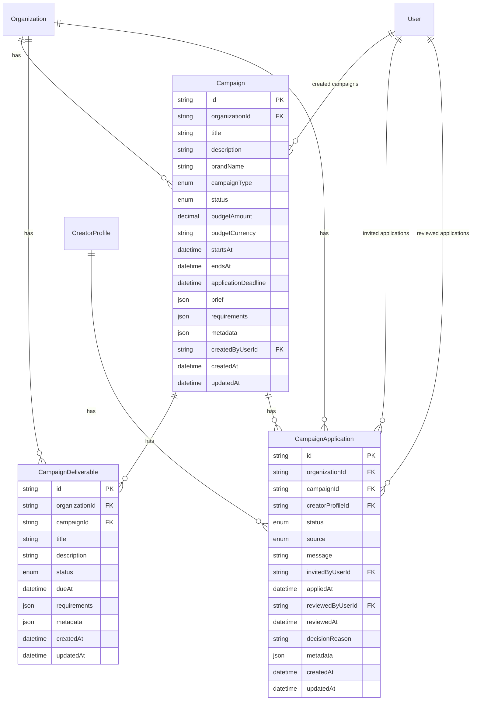

# Campaign Management Data Model (Release 0.4 foundation + applications)

**Status:** Implemented in `feature/campaign-foundation` and `feature/campaign-creator-applications`  
Prisma schema: `packages/database/prisma/schema.prisma`

---

## Overview

Campaign Management adds organization-scoped campaign metadata, deliverable workflow, and creator application tables. All rows include `organizationId` and cascade-delete with the parent organization.

Creator assignments to deliverables, payments, and analytics tables are not included yet.

---

## Entity relationship diagram

---

## `campaigns`

| Column                 | Type             | Notes                                      |
| ---------------------- | ---------------- | ------------------------------------------ |
| `id`                   | `TEXT` PK        | `cuid()`                                   |
| `organization_id`      | `TEXT` FK        | Required; cascade on org delete            |
| `title`                | `TEXT`           | Required                                   |
| `description`          | `TEXT`           | Nullable                                   |
| `brand_name`           | `TEXT`           | Nullable                                   |
| `campaign_type`        | `CampaignType`   | Required                                   |
| `status`               | `CampaignStatus` | Default `DRAFT`                            |
| `budget_amount`        | `DECIMAL(12,2)`  | Nullable                                   |
| `budget_currency`      | `TEXT`           | Nullable ISO 4217 code                     |
| `starts_at`            | `TIMESTAMP`      | Nullable                                   |
| `ends_at`              | `TIMESTAMP`      | Nullable                                   |
| `application_deadline` | `TIMESTAMP`      | Nullable                                   |
| `brief`                | `JSONB`          | Default `{}`                               |
| `requirements`         | `JSONB`          | Default `{}`                               |
| `metadata`             | `JSONB`          | Default `{}`                               |
| `created_by_user_id`   | `TEXT` FK        | Required; references `users.id` (restrict) |
| `created_at`           | `TIMESTAMP`      | Auto                                       |
| `updated_at`           | `TIMESTAMP`      | Auto                                       |

Indexes: `(organization_id)`, `(organization_id, status)`, `(organization_id, campaign_type)`, `(organization_id, starts_at)`, `(organization_id, ends_at)`, `(created_by_user_id)`.

---

## `campaign_deliverables`

| Column            | Type                        | Notes                                |
| ----------------- | --------------------------- | ------------------------------------ |
| `id`              | `TEXT` PK                   | `cuid()`                             |
| `organization_id` | `TEXT` FK                   | Required; cascade on org delete      |
| `campaign_id`     | `TEXT` FK                   | Required; cascade on campaign delete |
| `title`           | `TEXT`                      | Required                             |
| `description`     | `TEXT`                      | Nullable                             |
| `status`          | `CampaignDeliverableStatus` | Default `DRAFT`                      |
| `due_at`          | `TIMESTAMP`                 | Nullable                             |
| `requirements`    | `JSONB`                     | Default `{}`                         |
| `metadata`        | `JSONB`                     | Default `{}`                         |
| `created_at`      | `TIMESTAMP`                 | Auto                                 |
| `updated_at`      | `TIMESTAMP`                 | Auto                                 |

Indexes: `(organization_id)`, `(organization_id, campaign_id)`, `(organization_id, status)`, `(campaign_id)`, `(campaign_id, status)`.

---

## `campaign_applications`

| Column                | Type                        | Notes                                      |
| --------------------- | --------------------------- | ------------------------------------------ |
| `id`                  | `TEXT` PK                   | `cuid()`                                   |
| `organization_id`     | `TEXT` FK                   | Required; cascade on org delete            |
| `campaign_id`         | `TEXT` FK                   | Required; cascade on campaign delete       |
| `creator_profile_id`  | `TEXT` FK                   | Required; cascade on creator delete        |
| `status`              | `CampaignApplicationStatus` | Default `INVITED`                          |
| `source`              | `CampaignApplicationSource` | Required                                   |
| `message`             | `TEXT`                      | Nullable                                   |
| `invited_by_user_id`  | `TEXT` FK                   | Nullable; references `users.id` (set null) |
| `applied_at`          | `TIMESTAMP`                 | Nullable                                   |
| `reviewed_by_user_id` | `TEXT` FK                   | Nullable; references `users.id` (set null) |
| `reviewed_at`         | `TIMESTAMP`                 | Nullable                                   |
| `decision_reason`     | `TEXT`                      | Nullable                                   |
| `metadata`            | `JSONB`                     | Default `{}`                               |
| `created_at`          | `TIMESTAMP`                 | Auto                                       |
| `updated_at`          | `TIMESTAMP`                 | Auto                                       |

Indexes: `(organization_id)`, `(organization_id, campaign_id)`, `(organization_id, status)`, `(campaign_id)`, `(campaign_id, status)`, `(creator_profile_id)`, `(campaign_id, creator_profile_id)`.

Partial unique index (SQL migration): one active application per campaign + creator where `status IN ('INVITED', 'APPLIED')`.

---

## Enums

### `CampaignStatus`

`DRAFT`, `ACTIVE`, `PAUSED`, `COMPLETED`, `CANCELLED`, `ARCHIVED`

### `CampaignType`

`BRAND_DEAL`, `LIVE_STREAM`, `TIKTOK_SHOP`, `UGC`, `AFFILIATE`, `OTHER`

### `CampaignDeliverableStatus`

`DRAFT`, `OPEN`, `IN_PROGRESS`, `SUBMITTED`, `APPROVED`, `REJECTED`, `CANCELLED`

### `CampaignApplicationStatus`

`INVITED`, `APPLIED`, `ACCEPTED`, `REJECTED`, `WITHDRAWN`, `CANCELLED`

### `CampaignApplicationSource`

`INVITE`, `CREATOR_APPLIED`, `MANUAL`

---

## Future extensions

| Area                | Planned change                                |
| ------------------- | --------------------------------------------- |
| Creator assignments | `CampaignCreatorAssignment` join table        |
| Recruitment CRM     | Nullable `campaignId` FK on `CreatorLead`     |
| Contracts           | Nullable `campaignId` FK on `CreatorContract` |
| Payments            | Payout/invoice linkage tables                 |
| Analytics           | Read models or materialized reporting tables  |
