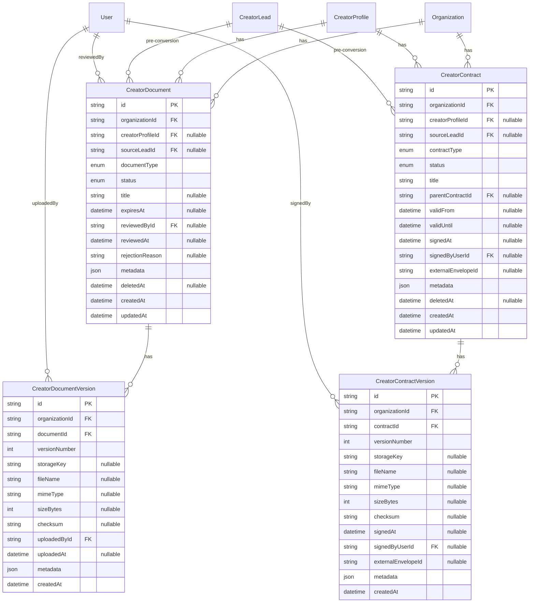

# Creator Documents & Contracts Data Model

**Status:** Implemented in `feature/creator-documents-schema` (M1 — Schema)  
Prisma schema: `packages/database/prisma/schema.prisma`  
Migration: `20250702143500_creator_documents_contracts_schema`

---

## Overview

Tables extend the creator roster model with **document metadata**, **document versions**, **contracts**, and **contract versions**. Binary files are stored in object storage; PostgreSQL holds references, workflow status, expiration, and audit-friendly metadata only.

All tables include `organizationId` and are scoped to agency organizations. Records link to `CreatorProfile` and optionally `CreatorLead` during pre-conversion onboarding.

**Prisma model names:** `CreatorDocument`, `CreatorDocumentVersion`, `CreatorContract`, `CreatorContractVersion`.

---

## Implementation notes (schema vs original plan)

| Planned                       | Implemented                                                                    |
| ----------------------------- | ------------------------------------------------------------------------------ |
| `storageBucket` on versions   | Omitted — bucket name can live in object key prefix or version `metadata`      |
| `contentType` / `contentHash` | Renamed to `mimeType` / `checksum` on version rows                             |
| `byteSize`                    | Renamed to `sizeBytes`                                                         |
| `CreatorDocumentUploadStatus` | Omitted — pending uploads use nullable file fields until upload completes      |
| `SUPERSEDED` document status  | Omitted — resubmissions use new version rows; prior doc may move to `ARCHIVED` |
| Signed version immutability   | Documented in Prisma model comments; enforced in application layer (v1)        |

At least one of `creatorProfileId` or `sourceLeadId` must be set — enforced in the API layer when implemented.

---

## Design rules

| Rule                         | Enforcement                                                                    |
| ---------------------------- | ------------------------------------------------------------------------------ |
| No raw files in DB           | `storageKey` + checksum on version rows only                                   |
| Signed contract immutability | DB trigger or service layer rejects version update after `signedAt`            |
| Versioning                   | Monotonic `versionNumber` per parent document/contract                         |
| Uniqueness                   | One active `APPROVED` doc per `(creator, type)` unless policy allows multiples |
| Soft delete                  | `deletedAt` on document/contract; objects retained per retention policy        |
| Sensitive fields             | Never store full bank account, SSN, or ID number in columns                    |

---

## Entity relationship diagram



---

## Enums

### `CreatorDocumentType`

`GOVERNMENT_ID`, `PASSPORT`, `TAX_FORM`, `BANK_INFO`, `PROFILE_PHOTO`, `CONTRACT_ATTACHMENT`, `OTHER`

### `CreatorDocumentStatus`

`REQUESTED`, `UPLOADED`, `UNDER_REVIEW`, `APPROVED`, `REJECTED`, `EXPIRED`, `ARCHIVED`

### `CreatorContractType`

`CREATOR_AGREEMENT`, `AGENCY_AGREEMENT`, `CAMPAIGN_CONTRACT`, `NDA`, `OTHER`

### `CreatorContractStatus`

`DRAFT`, `SENT`, `VIEWED`, `SIGNED`, `EXPIRED`, `CANCELLED`, `TERMINATED`

---

## Table details

### CreatorDocument

Logical document record (one per type instance or checklist line).

| Column             | Type        | Notes                                             |
| ------------------ | ----------- | ------------------------------------------------- |
| `id`               | cuid        | PK                                                |
| `organizationId`   | FK          | Tenant scope                                      |
| `creatorProfileId` | FK nullable | Set after conversion                              |
| `sourceLeadId`     | FK nullable | Pre-conversion uploads                            |
| `documentType`     | enum        | See types above                                   |
| `status`           | enum        | Workflow state                                    |
| `title`            | string?     | Required when type = `OTHER`                      |
| `expiresAt`        | datetime?   | For ID / tax renewal                              |
| `reviewedById`     | FK User?    | Last reviewer                                     |
| `reviewedAt`       | datetime?   |                                                   |
| `rejectionReason`  | string?     | Shown to uploader on resubmit                     |
| `metadata`         | json        | Non-sensitive labels, jurisdiction, external refs |
| `deletedAt`        | datetime?   | Soft delete                                       |

**Indexes:**

- `(organizationId, creatorProfileId, documentType, status)`
- `(organizationId, expiresAt)` — expiration reporting
- `(organizationId, sourceLeadId)`

### CreatorDocumentVersion

Immutable file reference per upload attempt.

| Column          | Type    | Notes                                         |
| --------------- | ------- | --------------------------------------------- |
| `versionNumber` | int     | Unique per `documentId`                       |
| `storageKey`    | string? | Opaque object path; set when upload completes |
| `fileName`      | string? | Sanitized original filename                   |
| `mimeType`      | string? | MIME type                                     |
| `sizeBytes`     | int?    | File size in bytes                            |
| `checksum`      | string? | SHA-256 hex                                   |
| `uploadedById`  | FK User | Required                                      |
| `metadata`      | json    | Scan result, storage hints                    |

**Constraint:** Application layer treats `storageKey` / `checksum` as write-once after upload completes.

### CreatorContract

Logical agreement tracking status and validity window.

| Column               | Type      | Notes                                   |
| -------------------- | --------- | --------------------------------------- |
| `contractType`       | enum      |                                         |
| `status`             | enum      | See lifecycle                           |
| `title`              | string    |                                         |
| `parentContractId`   | FK self?  | Amendments                              |
| `validFrom`          | datetime? |                                         |
| `validUntil`         | datetime? | Expiration if unsigned                  |
| `signedAt`           | datetime? | Denormalized from latest signed version |
| `signedByUserId`     | FK User?  | Denormalized signer on contract row     |
| `externalEnvelopeId` | string?   | E-sign provider id (future)             |

### CreatorContractVersion

Draft and executed PDF references.

| Column               | Type      | Notes                                       |
| -------------------- | --------- | ------------------------------------------- |
| `versionNumber`      | int       | Unique per `contractId`                     |
| `storageKey`         | string?   | Null while draft-only                       |
| `fileName`           | string?   | Executed PDF filename                       |
| `mimeType`           | string?   | Typically `application/pdf`                 |
| `sizeBytes`          | int?      |                                             |
| `checksum`           | string?   | SHA-256 hex                                 |
| `signedAt`           | datetime? | When set, row is **immutable** (app policy) |
| `signedByUserId`     | FK User?  | Manual sign; null for e-sign external       |
| `externalEnvelopeId` | string?   | Per-version envelope                        |

**Rule:** Rows with non-null `signedAt` cannot be updated or deleted (application-enforced; optional DB trigger).

---

## Linkage to existing models

| Existing model   | Relationship                                         |
| ---------------- | ---------------------------------------------------- |
| `CreatorProfile` | Primary owner of documents/contracts post-conversion |
| `CreatorLead`    | Optional pre-conversion link; re-point on convert    |
| `Organization`   | Tenant root                                          |
| `User`           | Uploader, reviewer, signer                           |
| `AuditLog`       | All sensitive access and status transitions          |

### Conversion migration (planned)

On `POST /api/recruitment/leads/:id/convert`:

```text
UPDATE creator_documents SET creatorProfileId = :profileId WHERE sourceLeadId = :leadId
UPDATE creator_contracts SET creatorProfileId = :profileId WHERE sourceLeadId = :leadId
```

---

## Expiration reporting query (planned)

```sql
SELECT d.*
FROM creator_documents d
WHERE d.organization_id = :orgId
  AND d.status = 'APPROVED'
  AND d.expires_at IS NOT NULL
  AND d.expires_at <= :threshold
  AND d.deleted_at IS NULL;
```

Scheduled job additionally transitions stale `APPROVED` → `EXPIRED` and emits `creator.document.expired`.

---

## Retention and deletion

| Scenario              | DB behavior            | Object storage behavior       |
| --------------------- | ---------------------- | ----------------------------- |
| Creator offboarded    | Soft-delete rows       | Retain until `retentionUntil` |
| Wrong upload rejected | Keep version for audit | Optional delete after 90 days |
| Signed contract       | Never hard-delete      | Immutable object, legal hold  |
| GDPR erasure request  | Policy ADR required    | Coordinated purge workflow    |

---

## Cascade and delete rules

| Parent deleted    | Child behavior                                               |
| ----------------- | ------------------------------------------------------------ |
| `Organization`    | Cascade delete all documents, versions, contracts            |
| `CreatorProfile`  | Cascade delete linked documents and contracts                |
| `CreatorLead`     | `SetNull` on `sourceLeadId` (preserve document history)      |
| `CreatorDocument` | Cascade delete versions                                      |
| `CreatorContract` | Cascade delete versions; use soft `deletedAt` in API instead |
| `User` (reviewer) | `SetNull` on `reviewedById` / `signedByUserId`               |
| `User` (uploader) | `Restrict` on `uploadedById` (preserve audit trail)          |

---

## Migration milestone order

1. ✅ Enums + `CreatorDocument` / `CreatorDocumentVersion` — `20250702143500_creator_documents_contracts_schema`
2. ✅ `CreatorContract` / `CreatorContractVersion` — same migration
3. API + storage adapter — future milestones
4. Optional `CreatorDocumentChecklistTemplate` (agency settings) — later

---

## Related documents

- [Product plan](../product/creator-documents-contracts.md)
- [Architecture](../architecture/creator-documents-contracts.md)
- [API plan](../api/creator-documents-contracts.md)
- [Recruitment CRM ERD](./recruitment-crm-erd.md)
