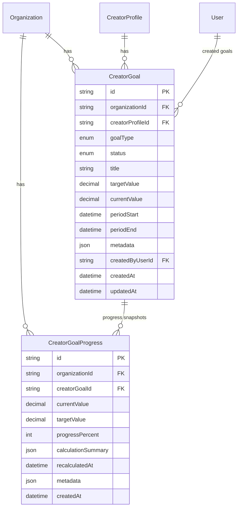

# Creator Goals Data Model

**Status:** Implemented on `feature/creator-goals-engine`  
Prisma schema: `packages/database/prisma/schema.prisma`

---

## Overview

Creator Goals adds organization-scoped goal tracking for creators. Goals store a target value, current progress, goal type, status, and period boundaries. Progress recalculation snapshots are stored in `CreatorGoalProgress`.

This foundation is deterministic only. It does not include token economy, payments, AI, frontend, or notifications.

---

## Entity relationship diagram

---

## `creator_goals`

| Column               | Type            | Notes                        |
| -------------------- | --------------- | ---------------------------- |
| `id`                 | `TEXT` PK       | `cuid()`                     |
| `organization_id`    | `TEXT` FK       | Required org scope           |
| `creator_profile_id` | `TEXT` FK       | Goal owner                   |
| `goal_type`          | enum            | See goal types below         |
| `status`             | enum            | Default `ACTIVE`             |
| `title`              | `TEXT`          | Optional label               |
| `target_value`       | `DECIMAL(14,2)` | Goal target                  |
| `current_value`      | `DECIMAL(14,2)` | Latest progress value        |
| `period_start`       | `TIMESTAMP`     | Goal period start            |
| `period_end`         | `TIMESTAMP`     | Goal period end              |
| `metadata`           | `JSONB`         | Extensible metadata          |
| `created_by_user_id` | `TEXT` FK       | Optional creator of the goal |
| `created_at`         | `TIMESTAMP`     | Row creation time            |
| `updated_at`         | `TIMESTAMP`     | Row update time              |

### Goal types

| Enum value              | Progress source                                      |
| ----------------------- | ---------------------------------------------------- |
| `LIVE_HOURS`            | Live session duration within period                  |
| `LIVE_DAYS`             | Distinct live session dates within period            |
| `DIAMONDS`              | Aggregated session gift counts                       |
| `GIFT_VALUE`            | Aggregated session gift value                        |
| `CAMPAIGN_DELIVERABLES` | Approved creator deliverables in period              |
| `PERFORMANCE_SCORE`     | Stored creator performance score                     |
| `COMPLIANCE`            | Compliance score from performance/compliance signals |
| `WHALE_RETENTION`       | WHALE-tier gifters retained across sessions          |
| `REPEAT_GIFTERS`        | Gifters appearing in two or more sessions            |
| `CONSISTENCY_SCORE`     | Stored consistency score                             |

### Goal status

| Enum value  | Meaning                                    |
| ----------- | ------------------------------------------ |
| `ACTIVE`    | Goal is in progress                        |
| `COMPLETED` | Target met                                 |
| `MISSED`    | Period ended without meeting target        |
| `CANCELLED` | Manually cancelled                         |
| `ARCHIVED`  | Archived after completion, miss, or cancel |

---

## `creator_goal_progress`

| Column                | Type            | Notes                              |
| --------------------- | --------------- | ---------------------------------- |
| `id`                  | `TEXT` PK       | `cuid()`                           |
| `organization_id`     | `TEXT` FK       | Required org scope                 |
| `creator_goal_id`     | `TEXT` FK       | Parent goal                        |
| `current_value`       | `DECIMAL(14,2)` | Value at recalculation time        |
| `target_value`        | `DECIMAL(14,2)` | Target at recalculation time       |
| `progress_percent`    | `INT`           | 0–100                              |
| `calculation_summary` | `JSONB`         | Deterministic calculation metadata |
| `recalculated_at`     | `TIMESTAMP`     | Snapshot timestamp                 |
| `metadata`            | `JSONB`         | Extensible metadata                |
| `created_at`          | `TIMESTAMP`     | Row creation time                  |

---

## Related docs

- [Creators API](../api/creators.md)
- [Live Intelligence ERD](./live-intelligence-erd.md)
- [Campaigns ERD](./campaigns-erd.md)
