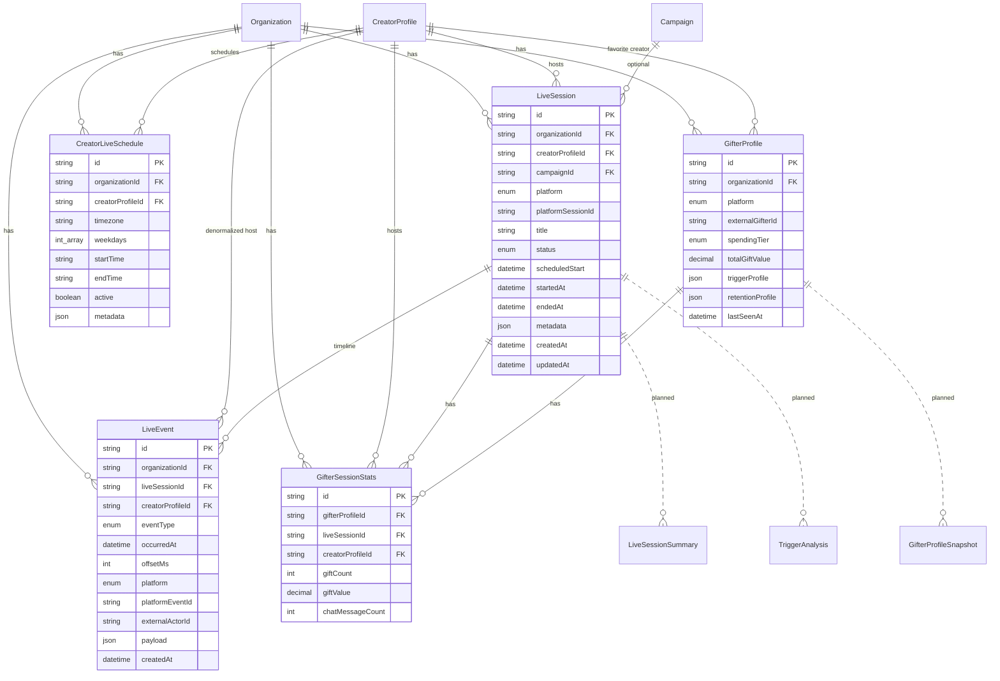

# Live Intelligence Data Model

**Status:** Partial — sessions, events, and gifter profile schema implemented  
**Branch:** `feature/gifter-profile-schema`  
**Migrations:** `20250703150000_live_session_schema`, `20250703160000_live_event_schema`, `20250703170000_gifter_profile_schema`  
**Prisma:** `packages/database/prisma/schema.prisma`

---

## Overview

Live Intelligence adds organization-scoped live session tracking, append-only event streams, gifter behavioral profiles, and derived trigger analysis. All tables include `organizationId` and cascade-delete with the parent organization unless noted.

**Implemented in this milestone:** `LiveSession`, `CreatorLiveSchedule`, `LiveEvent`, `GifterProfile`, `GifterSessionStats`, and related enums.  
**Not yet implemented:** gifter profile API, trigger analysis, summaries, coach alerts.

Raw video/audio is **not** stored. Transcript and chat content live in `live_events.payload` as text metadata only — see [Privacy and sensitive data](#privacy-and-sensitive-data).

---

## Entity relationship diagram

Solid relationships exist in Prisma today; dashed entities are planned for later migrations.



---

## Relationships (implemented)

| Parent           | Child                 | FK column                     | On delete |
| ---------------- | --------------------- | ----------------------------- | --------- |
| `Organization`   | `LiveSession`         | `organization_id`             | CASCADE   |
| `Organization`   | `CreatorLiveSchedule` | `organization_id`             | CASCADE   |
| `CreatorProfile` | `LiveSession`         | `creator_profile_id`          | CASCADE   |
| `CreatorProfile` | `CreatorLiveSchedule` | `creator_profile_id`          | CASCADE   |
| `Organization`   | `LiveEvent`           | `organization_id`             | CASCADE   |
| `LiveSession`    | `LiveEvent`           | `live_session_id`             | CASCADE   |
| `CreatorProfile` | `LiveEvent`           | `creator_profile_id`          | CASCADE   |
| `Organization`   | `GifterProfile`       | `organization_id`             | CASCADE   |
| `Organization`   | `GifterSessionStats`  | `organization_id`             | CASCADE   |
| `GifterProfile`  | `GifterSessionStats`  | `gifter_profile_id`           | CASCADE   |
| `LiveSession`    | `GifterSessionStats`  | `live_session_id`             | CASCADE   |
| `CreatorProfile` | `GifterSessionStats`  | `creator_profile_id`          | CASCADE   |
| `CreatorProfile` | `GifterProfile`       | `favorite_creator_profile_id` | SET NULL  |
| `Campaign`       | `LiveSession`         | `campaign_id`                 | SET NULL  |

`LiveEvent.creator_profile_id` is denormalized from the parent session for fast creator-scoped timeline queries without joining `live_sessions`.

---

## Enums

### `LivePlatform` (implemented)

`TIKTOK`, `BIGO`, `OTHER`

### `LiveSessionStatus` (implemented)

`SCHEDULED`, `LIVE`, `ENDED`, `CANCELLED`

### `LiveEventType` (implemented)

`SESSION_STARTED`, `SESSION_ENDED`, `CHAT_MESSAGE`, `GIFT_RECEIVED`, `VOICE_TRANSCRIPT_SEGMENT`, `PERFORMANCE_MOMENT`, `SONG_STARTED`, `SONG_ENDED`, `DANCE_MOMENT`, `PK_STARTED`, `PK_ENDED`, `COHOST_JOINED`, `COHOST_LEFT`, `VIEWER_JOINED`, `VIEWER_LEFT`, `MODERATOR_ACTION`, `SYSTEM_EVENT`, `OTHER`

### `GifterSpendingTier` (implemented)

`UNKNOWN`, `LOW`, `MEDIUM`, `HIGH`, `WHALE`, `VIP`

### Planned enums (not in Prisma yet)

#### `PerformanceMomentType`

`SINGING`, `DANCING`, `SONG_START`, `SONG_END`, `OTHER`

#### `TriggerCategory`

`SINGING`, `DANCING`, `BANTER`, `PK_BATTLE`, `DIRECT_ACKNOWLEDGEMENT`, `EMOTIONAL`, `UNKNOWN`

#### `AnalysisConfidence`

`LOW`, `MEDIUM`, `HIGH`

---

## `live_sessions` (implemented)

| Column                | Type                | Notes                               |
| --------------------- | ------------------- | ----------------------------------- |
| `id`                  | TEXT PK             | `cuid()`                            |
| `organization_id`     | TEXT FK             | Required                            |
| `creator_profile_id`  | TEXT FK             | Required                            |
| `campaign_id`         | TEXT FK             | Nullable; optional campaign linkage |
| `platform`            | `LivePlatform`      | Required                            |
| `platform_session_id` | TEXT                | Nullable platform stream/session ID |
| `title`               | TEXT                | Required                            |
| `description`         | TEXT                | Nullable                            |
| `started_at`          | TIMESTAMP           | Nullable; actual go-live            |
| `ended_at`            | TIMESTAMP           | Nullable                            |
| `scheduled_start`     | TIMESTAMP           | Nullable                            |
| `scheduled_end`       | TIMESTAMP           | Nullable                            |
| `duration_seconds`    | INT                 | Nullable; computed at end           |
| `peak_viewers`        | INT                 | Nullable rollup                     |
| `total_viewers`       | INT                 | Nullable rollup                     |
| `total_gifts`         | INT                 | Nullable rollup                     |
| `total_gift_value`    | DECIMAL(14,2)       | Nullable; platform gift units       |
| `status`              | `LiveSessionStatus` | Default `SCHEDULED`                 |
| `metadata`            | JSONB               | Default `{}`                        |
| `created_at`          | TIMESTAMP           | Auto                                |
| `updated_at`          | TIMESTAMP           | Auto                                |

### Session indexes

| Index                                   | Purpose                              |
| --------------------------------------- | ------------------------------------ |
| `(organization_id)`                     | Tenant listing                       |
| `(organization_id, creator_profile_id)` | Creator session history              |
| `(organization_id, status)`             | Filter by lifecycle state            |
| `(organization_id, platform)`           | Platform-specific dashboards         |
| `(organization_id, scheduled_start)`    | Upcoming scheduled lives             |
| `(organization_id, started_at)`         | Recent/completed lives               |
| `(creator_profile_id)`                  | Creator-centric lookups              |
| `(campaign_id)`                         | Campaign-attributed sessions         |
| `(platform_session_id)`                 | Platform webhook idempotency lookups |

Session rollups (`total_gifts`, `total_gift_value`, viewer counts) are stored on the session row for fast agency analytics. Individual gift and chat events are stored in `live_events`.

---

## `creator_live_schedules` (implemented)

Recurring or one-off planned live windows per creator. Uses IANA timezone plus local time-of-day strings for agency scheduling UI.

| Column               | Type      | Notes                                            |
| -------------------- | --------- | ------------------------------------------------ |
| `id`                 | TEXT PK   | `cuid()`                                         |
| `organization_id`    | TEXT FK   | Required                                         |
| `creator_profile_id` | TEXT FK   | Required                                         |
| `timezone`           | TEXT      | IANA timezone (e.g. `America/Los_Angeles`)       |
| `recurrence_rule`    | TEXT      | Nullable iCal RRULE                              |
| `weekdays`           | INT[]     | 0=Sunday … 6=Saturday; empty = not weekday-bound |
| `start_time`         | TEXT      | Local time `HH:mm` in schedule timezone          |
| `end_time`           | TEXT      | Local time `HH:mm` in schedule timezone          |
| `active`             | BOOLEAN   | Default `true`                                   |
| `metadata`           | JSONB     | Default `{}`                                     |
| `created_at`         | TIMESTAMP | Auto                                             |
| `updated_at`         | TIMESTAMP | Auto                                             |

### Schedule indexes

| Index                                   | Purpose                 |
| --------------------------------------- | ----------------------- |
| `(organization_id)`                     | Tenant listing          |
| `(organization_id, creator_profile_id)` | Creator schedule board  |
| `(organization_id, active)`             | Active schedules only   |
| `(creator_profile_id)`                  | Creator-centric lookups |

Schedules are independent of `LiveSession` rows. A future API may materialize `LiveSession` records from active schedules.

---

## `live_events` (implemented)

Append-only normalized timeline. **No `updated_at` column** — rows are insert-only. Compliance redaction may delete or replace rows via dedicated jobs; routine application code must not update event rows.

| Column               | Type            | Notes                                                   |
| -------------------- | --------------- | ------------------------------------------------------- |
| `id`                 | TEXT PK         | `cuid()`                                                |
| `organization_id`    | TEXT FK         | Required                                                |
| `live_session_id`    | TEXT FK         | Required                                                |
| `creator_profile_id` | TEXT FK         | Denormalized from session for creator timeline queries  |
| `event_type`         | `LiveEventType` | Required                                                |
| `occurred_at`        | TIMESTAMP       | Wall-clock event time                                   |
| `offset_ms`          | INT             | Nullable offset from session start for replay alignment |
| `platform`           | `LivePlatform`  | Source platform                                         |
| `platform_event_id`  | TEXT            | Nullable; ingest idempotency key                        |
| `external_actor_id`  | TEXT            | Nullable platform user/gifter ID                        |
| `actor_display_name` | TEXT            | Nullable; may change on platform                        |
| `payload`            | JSONB           | Event-specific metadata only (no raw audio/video)       |
| `metadata`           | JSONB           | Ingest/processing metadata; default `{}`                |
| `created_at`         | TIMESTAMP       | Insert time                                             |

Unique: `(organization_id, platform, platform_event_id)` when `platform_event_id` is set.

### Event indexes

| Index                                                | Purpose                               |
| ---------------------------------------------------- | ------------------------------------- |
| `(organization_id)`                                  | Tenant-scoped queries                 |
| `(live_session_id, occurred_at)`                     | Session timeline replay               |
| `(live_session_id, offset_ms)`                       | Offset-ordered replay                 |
| `(organization_id, creator_profile_id, occurred_at)` | Creator timeline across sessions      |
| `(organization_id, external_actor_id)`               | Actor/gifter event lookup             |
| `(organization_id, event_type)`                      | Filter gifts, chat, transcripts, etc. |
| `(organization_id, occurred_at)`                     | Time-range analytics                  |

### Privacy and sensitive data

> **Warning:** `CHAT_MESSAGE` and `VOICE_TRANSCRIPT_SEGMENT` events may contain personal or sensitive content in `payload`. Treat these rows as PII: restrict access via org RBAC, apply shorter retention TTLs than aggregate analytics, and support erasure/anonymization workflows. Do not store raw audio or video blobs in `payload` or `metadata`.

### Example `payload` shapes

#### GIFT_RECEIVED

```json
{
  "giftType": "ROSE",
  "quantity": 10,
  "diamondValue": 100,
  "currencyEquivalent": null
}
```

#### VOICE_TRANSCRIPT_SEGMENT

```json
{
  "text": "Thank you everyone for joining",
  "language": "en",
  "confidence": 0.92,
  "startedAtOffsetMs": 120000,
  "endedAtOffsetMs": 125000
}
```

#### PERFORMANCE_MOMENT

```json
{
  "momentType": "SINGING",
  "label": "Chorus — Song Title",
  "startedAtOffsetMs": 300000,
  "endedAtOffsetMs": 330000
}
```

---

## `gifter_profiles` (implemented)

Persistent cross-session gifter identity and rollups. **No raw chat or transcript text** — only aggregate counts, tiers, and derived JSON placeholders.

| Column                        | Type                 | Notes                                         |
| ----------------------------- | -------------------- | --------------------------------------------- |
| `id`                          | TEXT PK              | `cuid()`                                      |
| `organization_id`             | TEXT FK              | Required                                      |
| `platform`                    | `LivePlatform`       | Required                                      |
| `external_gifter_id`          | TEXT                 | Required platform ID                          |
| `display_name`                | TEXT                 | Nullable                                      |
| `avatar_url`                  | TEXT                 | Nullable                                      |
| `spending_tier`               | `GifterSpendingTier` | Default `UNKNOWN`                             |
| `total_gift_count`            | INT                  | Default `0`                                   |
| `total_gift_value`            | DECIMAL(14,2)        | Default `0`; platform gift units              |
| `total_sessions`              | INT                  | Default `0`                                   |
| `first_seen_at`               | TIMESTAMP            | Nullable                                      |
| `last_seen_at`                | TIMESTAMP            | Nullable                                      |
| `favorite_creator_profile_id` | TEXT FK              | Nullable                                      |
| `favorite_gift_type`          | TEXT                 | Nullable                                      |
| `trigger_profile`             | JSONB                | Derived analytics placeholder; not raw events |
| `retention_profile`           | JSONB                | Derived retention placeholder                 |
| `metadata`                    | JSONB                | Default `{}`                                  |
| `created_at`                  | TIMESTAMP            | Auto                                          |
| `updated_at`                  | TIMESTAMP            | Auto                                          |

Unique: `(organization_id, platform, external_gifter_id)`.

### Gifter profile indexes

| Index                                            | Purpose                      |
| ------------------------------------------------ | ---------------------------- |
| `(organization_id)`                              | Tenant listing               |
| `(organization_id, platform)`                    | Platform-scoped queries      |
| `(organization_id, external_gifter_id)`          | Lookup by platform gifter ID |
| `(organization_id, spending_tier)`               | Tier segmentation            |
| `(organization_id, favorite_creator_profile_id)` | Creator-attributed gifters   |
| `(organization_id, last_seen_at)`                | Recency sorting              |

### Gifter privacy and compliance

> **Warning:** Gifter profiles store platform identifiers, display names, and spending aggregates derived from live events. They must not store chat message bodies or transcript text — those remain in `live_events` with stricter access controls. Support anonymization of `external_gifter_id` and `display_name` on erasure requests. `trigger_profile` and `retention_profile` are derived analytics placeholders populated by future batch jobs, not authoritative PII stores.

---

## `gifter_session_stats` (implemented)

Per-session rollups for a gifter: gift counts/values and chat message counts only (no message content).

| Column               | Type          | Notes                               |
| -------------------- | ------------- | ----------------------------------- |
| `id`                 | TEXT PK       | `cuid()`                            |
| `organization_id`    | TEXT FK       | Required                            |
| `gifter_profile_id`  | TEXT FK       | Required                            |
| `live_session_id`    | TEXT FK       | Required                            |
| `creator_profile_id` | TEXT FK       | Denormalized from session           |
| `gift_count`         | INT           | Default `0`                         |
| `gift_value`         | DECIMAL(14,2) | Default `0`                         |
| `first_gift_at`      | TIMESTAMP     | Nullable                            |
| `last_gift_at`       | TIMESTAMP     | Nullable                            |
| `first_seen_at`      | TIMESTAMP     | Nullable                            |
| `last_seen_at`       | TIMESTAMP     | Nullable                            |
| `chat_message_count` | INT           | Default `0`; count only, no content |
| `metadata`           | JSONB         | Default `{}`                        |
| `created_at`         | TIMESTAMP     | Auto                                |
| `updated_at`         | TIMESTAMP     | Auto                                |

Unique: `(gifter_profile_id, live_session_id)`.

### Session stats indexes

| Index                                   | Purpose                        |
| --------------------------------------- | ------------------------------ |
| `(organization_id)`                     | Tenant listing                 |
| `(organization_id, gifter_profile_id)`  | Gifter session history         |
| `(organization_id, live_session_id)`    | Session gifter board           |
| `(organization_id, creator_profile_id)` | Creator session gifter rollups |
| `(live_session_id)`                     | Session-centric lookups        |
| `(creator_profile_id)`                  | Creator-centric lookups        |
| `(gifter_profile_id)`                   | Profile-centric lookups        |

Future workers will upsert stats from `live_events` where `external_actor_id` matches `gifter_profiles.external_gifter_id`.

---

## `gifter_profile_snapshots` (planned)

Point-in-time rollups for trend analysis (optional v2).

| Column              | Type      | Notes             |
| ------------------- | --------- | ----------------- |
| `id`                | TEXT PK   |                   |
| `gifter_profile_id` | TEXT FK   |                   |
| `organization_id`   | TEXT FK   |                   |
| `snapshot_at`       | TIMESTAMP |                   |
| `metrics`           | JSONB     | Full metrics copy |

---

## `trigger_analyses` (planned)

Derived AI/rules output per session or window.

| Column                | Type                 | Notes                            |
| --------------------- | -------------------- | -------------------------------- |
| `id`                  | TEXT PK              |                                  |
| `organization_id`     | TEXT FK              |                                  |
| `live_session_id`     | TEXT FK              |                                  |
| `gifter_profile_id`   | TEXT FK              | Nullable (session-level if null) |
| `trigger_category`    | `TriggerCategory`    |                                  |
| `confidence`          | `AnalysisConfidence` |                                  |
| `confidence_score`    | DECIMAL(5,4)         | 0–1                              |
| `sample_size`         | INT                  | Events used                      |
| `evidence_event_ids`  | JSONB                | Array of LiveEvent IDs           |
| `disclaimer`          | TEXT                 | Correlation warning              |
| `coaching_suggestion` | TEXT                 | Nullable                         |
| `metadata`            | JSONB                | Model version, etc.              |
| `created_at`          | TIMESTAMP            |                                  |

Indexes: `(live_session_id)`, `(organization_id, trigger_category)`.

---

## `live_session_summaries` (planned)

Post-live AI batch output.

| Column                | Type      | Notes                    |
| --------------------- | --------- | ------------------------ |
| `id`                  | TEXT PK   |                          |
| `organization_id`     | TEXT FK   |                          |
| `live_session_id`     | TEXT FK   | Unique                   |
| `summary_text`        | TEXT      | Markdown/plain           |
| `highlights`          | JSONB     | Top moments with offsets |
| `top_triggers`        | JSONB     | Ranked trigger analyses  |
| `repeatable_patterns` | JSONB     | Coaching recommendations |
| `model_version`       | TEXT      |                          |
| `generated_at`        | TIMESTAMP |                          |
| `metadata`            | JSONB     |                          |

---

## Data retention (planned)

| Entity                   | Default policy (planned)                                          |
| ------------------------ | ----------------------------------------------------------------- |
| `live_events`            | Purge per org TTL after session ends                              |
| `live_session_summaries` | Same as session                                                   |
| `gifter_profiles`        | Anonymize on erasure request; aggregates may remain de-identified |
| Raw chat text            | Shorter TTL than aggregates (org-configurable)                    |

---

## Future expansion

| Phase | Area               | Planned change                                                          |
| ----- | ------------------ | ----------------------------------------------------------------------- |
| 4     | Gifter profile API | REST read/list + rollup workers from `live_events`                      |
| 6–7   | AI outputs         | `live_session_summaries`, `trigger_analyses` populate `trigger_profile` |
| 8     | Real-time coach    | `LiveCoachAlert` table                                                  |
| 9     | Credits            | Link premium AI usage to `CreditLedgerEntry`                            |
| —     | Campaign ROI       | Join session rollups to `Campaign` budgets                              |
| —     | Retention TTL      | Org-configurable purge/anonymization jobs                               |

---

## Related docs

- [Product plan](../product/live-intelligence.md)
- [Architecture](../architecture/live-intelligence.md)
- [API planning](../api/live-intelligence.md)
- [Types](../../packages/types/src/live-intelligence.ts)
