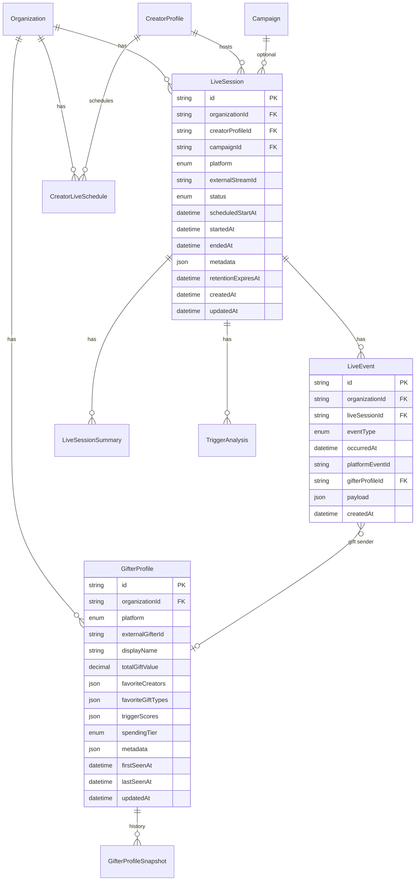

# Live Intelligence Data Model (Planning)

**Status:** Planning — not implemented in Prisma  
**Branch:** `feature/live-intelligence-planning`  
Prisma schema: future migration under `packages/database`

---

## Overview

Live Intelligence adds organization-scoped live session tracking, append-only event streams, gifter behavioral profiles, and derived trigger analysis. All tables include `organizationId` and cascade-delete with the parent organization unless noted.

Raw video/audio is **not** stored in v1. Transcripts are text segments with timestamps only.

---

## Entity relationship diagram



---

## Enums (planned)

### `LivePlatform`

`TIKTOK`, `OTHER`

### `LiveSessionStatus`

`SCHEDULED`, `LIVE`, `ENDED`, `CANCELLED`, `FAILED`

### `LiveEventType`

`SESSION_STARTED`, `SESSION_ENDED`, `CHAT_MESSAGE`, `GIFT_RECEIVED`, `VIEWER_JOINED`, `VIEWER_LEFT`, `VOICE_TRANSCRIPT_SEGMENT`, `PERFORMANCE_MOMENT`, `PK_STARTED`, `PK_ENDED`, `CREATOR_ACKNOWLEDGEMENT`, `EMOTIONAL_MOMENT`

### `PerformanceMomentType`

`SINGING`, `DANCING`, `SONG_START`, `SONG_END`, `OTHER`

### `SpendingTier`

`WHALE`, `HIGH`, `MEDIUM`, `LOW`, `OCCASIONAL`

### `TriggerCategory`

`SINGING`, `DANCING`, `BANTER`, `PK_BATTLE`, `DIRECT_ACKNOWLEDGEMENT`, `EMOTIONAL`, `UNKNOWN`

### `AnalysisConfidence`

`LOW`, `MEDIUM`, `HIGH`

---

## `live_sessions`

| Column                 | Type                | Notes                       |
| ---------------------- | ------------------- | --------------------------- |
| `id`                   | TEXT PK             | `cuid()`                    |
| `organization_id`      | TEXT FK             | Required                    |
| `creator_profile_id`   | TEXT FK             | Required                    |
| `campaign_id`          | TEXT FK             | Nullable                    |
| `platform`             | `LivePlatform`      | Required                    |
| `external_stream_id`   | TEXT                | Nullable platform stream ID |
| `status`               | `LiveSessionStatus` | Default `SCHEDULED`         |
| `title`                | TEXT                | Nullable                    |
| `scheduled_start_at`   | TIMESTAMP           | Nullable                    |
| `started_at`           | TIMESTAMP           | Nullable                    |
| `ended_at`             | TIMESTAMP           | Nullable                    |
| `metadata`             | JSONB               | Default `{}`                |
| `retention_expires_at` | TIMESTAMP           | Nullable TTL anchor         |
| `created_at`           | TIMESTAMP           | Auto                        |
| `updated_at`           | TIMESTAMP           | Auto                        |

Indexes: `(organization_id)`, `(organization_id, creator_profile_id)`, `(organization_id, status)`, `(external_stream_id)`, `(campaign_id)`.

---

## `creator_live_schedules`

| Column               | Type      | Notes               |
| -------------------- | --------- | ------------------- |
| `id`                 | TEXT PK   | `cuid()`            |
| `organization_id`    | TEXT FK   | Required            |
| `creator_profile_id` | TEXT FK   | Required            |
| `title`              | TEXT      | Required            |
| `timezone`           | TEXT      | IANA timezone       |
| `starts_at`          | TIMESTAMP | Required            |
| `ends_at`            | TIMESTAMP | Nullable            |
| `recurrence_rule`    | TEXT      | Nullable iCal RRULE |
| `is_active`          | BOOLEAN   | Default true        |
| `metadata`           | JSONB     | Default `{}`        |
| `created_at`         | TIMESTAMP | Auto                |
| `updated_at`         | TIMESTAMP | Auto                |

Indexes: `(organization_id, creator_profile_id)`, `(organization_id, starts_at)`.

---

## `live_events`

Append-only normalized timeline. **No updates** except compliance redaction jobs.

| Column              | Type            | Notes                  |
| ------------------- | --------------- | ---------------------- |
| `id`                | TEXT PK         | `cuid()`               |
| `organization_id`   | TEXT FK         | Required               |
| `live_session_id`   | TEXT FK         | Required               |
| `event_type`        | `LiveEventType` | Required               |
| `occurred_at`       | TIMESTAMP       | Required               |
| `platform_event_id` | TEXT            | Nullable; idempotency  |
| `gifter_profile_id` | TEXT FK         | Nullable (gifts, chat) |
| `payload`           | JSONB           | Event-specific body    |
| `created_at`        | TIMESTAMP       | Auto                   |

Unique: `(organization_id, platform_event_id)` where `platform_event_id` IS NOT NULL.

Indexes: `(live_session_id, occurred_at)`, `(organization_id, event_type)`, `(gifter_profile_id)`.

### Example `payload` shapes

#### GIFT_RECEIVED

```json
{
  "giftType": "ROSE",
  "quantity": 10,
  "diamondValue": 100,
  "currencyEquivalent": null
}
```

#### VOICE_TRANSCRIPT_SEGMENT

```json
{
  "text": "Thank you everyone for joining",
  "language": "en",
  "confidence": 0.92,
  "startedAtOffsetMs": 120000,
  "endedAtOffsetMs": 125000
}
```

#### PERFORMANCE_MOMENT

```json
{
  "momentType": "SINGING",
  "label": "Chorus — Song Title",
  "startedAtOffsetMs": 300000,
  "endedAtOffsetMs": 330000
}
```

---

## `gifter_profiles`

| Column                 | Type           | Notes                                     |
| ---------------------- | -------------- | ----------------------------------------- |
| `id`                   | TEXT PK        | `cuid()`                                  |
| `organization_id`      | TEXT FK        | Required                                  |
| `platform`             | `LivePlatform` | Required                                  |
| `external_gifter_id`   | TEXT           | Required platform ID                      |
| `display_name`         | TEXT           | Nullable                                  |
| `total_gift_value`     | DECIMAL        | Rolling + lifetime (platform units)       |
| `session_count`        | INT            | Sessions with ≥1 gift                     |
| `favorite_creators`    | JSONB          | Ranked creator profile IDs                |
| `favorite_gift_types`  | JSONB          | Ranked gift type codes                    |
| `gift_timing_patterns` | JSONB          | Histogram / segments                      |
| `trigger_scores`       | JSONB          | Per TriggerCategory scores + sample sizes |
| `spending_tier`        | `SpendingTier` | Derived                                   |
| `retention_score`      | DECIMAL        | Nullable 0–1                              |
| `metadata`             | JSONB          | Default `{}`                              |
| `first_seen_at`        | TIMESTAMP      |                                           |
| `last_seen_at`         | TIMESTAMP      |                                           |
| `updated_at`           | TIMESTAMP      | Auto                                      |

Unique: `(organization_id, platform, external_gifter_id)`.

---

## `gifter_profile_snapshots`

Point-in-time rollups for trend analysis (optional v2).

| Column              | Type      | Notes             |
| ------------------- | --------- | ----------------- |
| `id`                | TEXT PK   |                   |
| `gifter_profile_id` | TEXT FK   |                   |
| `organization_id`   | TEXT FK   |                   |
| `snapshot_at`       | TIMESTAMP |                   |
| `metrics`           | JSONB     | Full metrics copy |

---

## `trigger_analyses`

Derived AI/rules output per session or window.

| Column                | Type                 | Notes                            |
| --------------------- | -------------------- | -------------------------------- |
| `id`                  | TEXT PK              |                                  |
| `organization_id`     | TEXT FK              |                                  |
| `live_session_id`     | TEXT FK              |                                  |
| `gifter_profile_id`   | TEXT FK              | Nullable (session-level if null) |
| `trigger_category`    | `TriggerCategory`    |                                  |
| `confidence`          | `AnalysisConfidence` |                                  |
| `confidence_score`    | DECIMAL(5,4)         | 0–1                              |
| `sample_size`         | INT                  | Events used                      |
| `evidence_event_ids`  | JSONB                | Array of LiveEvent IDs           |
| `disclaimer`          | TEXT                 | Correlation warning              |
| `coaching_suggestion` | TEXT                 | Nullable                         |
| `metadata`            | JSONB                | Model version, etc.              |
| `created_at`          | TIMESTAMP            |                                  |

Indexes: `(live_session_id)`, `(organization_id, trigger_category)`.

---

## `live_session_summaries`

Post-live AI batch output.

| Column                | Type      | Notes                    |
| --------------------- | --------- | ------------------------ |
| `id`                  | TEXT PK   |                          |
| `organization_id`     | TEXT FK   |                          |
| `live_session_id`     | TEXT FK   | Unique                   |
| `summary_text`        | TEXT      | Markdown/plain           |
| `highlights`          | JSONB     | Top moments with offsets |
| `top_triggers`        | JSONB     | Ranked trigger analyses  |
| `repeatable_patterns` | JSONB     | Coaching recommendations |
| `model_version`       | TEXT      |                          |
| `generated_at`        | TIMESTAMP |                          |
| `metadata`            | JSONB     |                          |

---

## Data retention

| Entity                   | Default policy (planned)                                          |
| ------------------------ | ----------------------------------------------------------------- |
| `live_events`            | Purge `retention_expires_at` on parent session + 90 days          |
| `live_session_summaries` | Same as session                                                   |
| `gifter_profiles`        | Anonymize on erasure request; aggregates may remain de-identified |
| Raw chat text            | Shorter TTL than aggregates (org-configurable)                    |

---

## Future extensions

| Area                 | Planned change                              |
| -------------------- | ------------------------------------------- |
| Real-time coach      | `LiveCoachAlert` table                      |
| Credits usage        | Link to `CreditLedgerEntry`                 |
| Campaign ROI         | Join gifts to `Campaign` budgets            |
| Cross-org benchmarks | System-level anonymized aggregates (opt-in) |

---

## Related docs

- [Product plan](../product/live-intelligence.md)
- [Architecture](../architecture/live-intelligence.md)
- [API planning](../api/live-intelligence.md)
