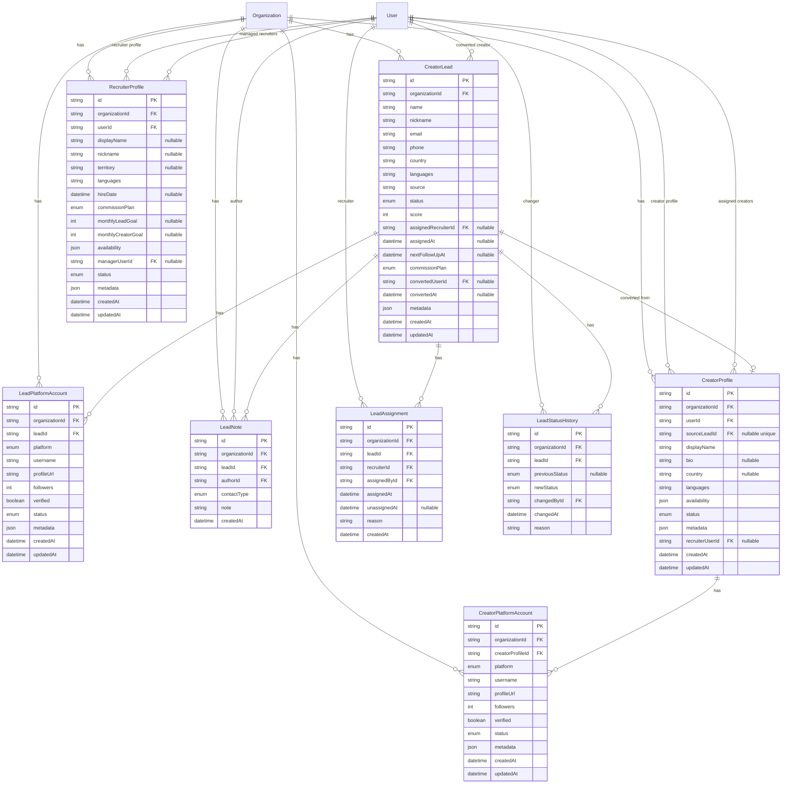

# Recruitment CRM Data Model (Release 0.3)

**Status:** Implemented in `feature/recruitment-crm-schema` (M1 — Schema)  
Prisma schema: `packages/database/prisma/schema.prisma`

---

## Overview

The Recruitment CRM extends the organization-scoped identity model with lead pipeline entities. All tables include `organizationId` and are intended for organizations with `type = AGENCY`.

Legacy `User.platforms` is **not** used for lead platform tracking. Leads use dedicated **platform account** rows.

**Prisma model names:** `CreatorLead`, `LeadPlatformAccount`, `LeadAssignment`, `LeadNote`, `LeadStatusHistory`, `RecruiterProfile`, `CreatorProfile`, `CreatorPlatformAccount`.

`RecruiterProfile` stores recruiter business data per organization membership user. **Access control remains on `OrganizationMembership`** — the profile does not grant permissions.

`CreatorProfile` stores creator roster data per organization user. Release 0.3 conversion and management APIs still read/write `CreatorLead.metadata` today; the new tables are the target first-class store (see [Creator profile transition](#creator-profile-transition)).

---

## Entity relationship diagram

---

## Enums (implemented)

### `LeadStatus`

`NEW`, `CONTACTED`, `INTERESTED`, `APPLICATION`, `CONTRACT_SENT`, `SIGNED`, `ACTIVE_CREATOR`, `INACTIVE`, `REJECTED`

### `LeadSource`

`MANUAL`, `REFERRAL`, `SOCIAL`, `EVENT`, `IMPORT`, `OTHER`

### `CommissionPlan`

`STANDARD` (default), `PREMIUM`, `CUSTOM`

### `LeadPlatformAccountStatus`

`ACTIVE`, `UNVERIFIED`, `SUSPENDED`, `REMOVED`

### `ContactType`

`CALL`, `WHATSAPP`, `TIKTOK`, `FACEBOOK`, `EMAIL`, `MEETING`, `OTHER`

### `PlatformType`

`TIKTOK`, `INSTAGRAM`, `YOUTUBE`, `FACEBOOK`, `TWITCH`, `OTHER`

_Note:_ Distinct from legacy `User.platforms` flags and legacy `Platform` enum — describes external social accounts on a lead.

### `RecruiterStatus`

`ACTIVE` (default), `INACTIVE`, `SUSPENDED`

Operational status for recruiter business profile rows. Distinct from `MembershipStatus` on `OrganizationMembership`.

### `CreatorStatus`

`ACTIVE` (default), `INACTIVE`, `SUSPENDED`, `ARCHIVED`

Operational status for creator roster profile rows. Distinct from `MembershipStatus` on `OrganizationMembership`.

---

## Entity definitions

### CreatorLead

Primary CRM record.

| Field                     | Type              | Notes                                             |
| ------------------------- | ----------------- | ------------------------------------------------- |
| `id`                      | cuid              | Primary key                                       |
| `organizationId`          | FK → Organization | Tenant scope                                      |
| `name`                    | string            | Legal or display name                             |
| `nickname`                | string?           | Handle / preferred name                           |
| `email`                   | string?           | Unique per org when present (_recommended index_) |
| `phone`                   | string?           | E.164 preferred in validation                     |
| `country`                 | string?           | ISO 3166-1 alpha-2                                |
| `languages`               | string[]          | BCP-47 codes, e.g. `["en","es"]`                  |
| `source`                  | enum              | How lead entered pipeline                         |
| `status`                  | enum              | Pipeline status                                   |
| `score`                   | int               | 0–100, default 0                                  |
| `assignedRecruiterId`     | FK → User?        | Current owner; null = unassigned pool             |
| `assignedAt`              | datetime?         | When current owner assigned                       |
| `nextFollowUpAt`          | datetime?         | Next scheduled follow-up                          |
| `commissionPlan`          | enum              | Default `STANDARD`                                |
| `convertedUserId`         | FK → User?        | Set when `ACTIVE_CREATOR`                         |
| `convertedAt`             | datetime?         | Conversion timestamp                              |
| `notesSummary`            | text?             | Short free-text; detailed notes in `LeadNote`     |
| `metadata`                | json              | Future hooks (campaigns, payments, analytics)     |
| `createdAt` / `updatedAt` | datetime          | Audit                                             |

**Indexes (recommended):**

- `(organizationId, status, nextFollowUpAt)`
- `(organizationId, assignedRecruiterId, status)`
- `(organizationId, email)` unique where email not null
- `(organizationId, createdAt DESC)`

---

### LeadPlatformAccount

Tracks a lead's presence on a social/commerce platform.

| Field        | Type    | Notes                                          |
| ------------ | ------- | ---------------------------------------------- |
| `platform`   | enum    | TikTok, Instagram, etc.                        |
| `username`   | string  | Platform handle                                |
| `profileUrl` | string? | Canonical profile link                         |
| `followers`  | int?    | Snapshot count                                 |
| `verified`   | boolean | Platform verified badge                        |
| `status`     | enum    | Account verification state                     |
| `metadata`   | json    | External IDs, niche tags, avg views (_future_) |

**Constraints:**

- Unique `(organizationId, platform, username)` recommended to reduce duplicates

---

### LeadNote

Append-only contact history and notes.

| Field         | Type      | Notes                     |
| ------------- | --------- | ------------------------- |
| `contactType` | enum      | CALL, WHATSAPP, TIKTOK, … |
| `note`        | string    | Contact notes             |
| `authorId`    | FK → User | Author                    |
| `createdAt`   | datetime  | Append-only timestamp     |

---

### LeadAssignment

Ownership change history. Active assignment has `unassignedAt IS NULL`.

| Field          | Type      | Notes                              |
| -------------- | --------- | ---------------------------------- |
| `recruiterId`  | FK → User | Assigned recruiter (owner)         |
| `assignedById` | FK → User | Actor (recruiter claim or manager) |
| `assignedAt`   | datetime  | Assignment start                   |
| `unassignedAt` | datetime? | Null while active; set on reassign |
| `reason`       | string?   | Reassignment reason                |

Current owner is denormalized on `CreatorLead.assignedRecruiterId` for list queries.

---

### LeadStatusHistory

Append-only pipeline status changes.

| Field            | Type      | Notes                      |
| ---------------- | --------- | -------------------------- |
| `previousStatus` | enum?     | Null for initial status    |
| `newStatus`      | enum      | Resulting status           |
| `changedById`    | FK → User | Actor                      |
| `changedAt`      | datetime  | Change timestamp           |
| `reason`         | string?   | Optional transition reason |

`CreatorLead.nextFollowUpAt` supports follow-up list views without a separate follow-up table in v1 schema.

---

### RecruiterProfile

Recruiter-specific business profile, separate from `OrganizationMembership`.

| Field                     | Type              | Notes                                       |
| ------------------------- | ----------------- | ------------------------------------------- |
| `id`                      | cuid              | Primary key                                 |
| `organizationId`          | FK → Organization | Tenant scope                                |
| `userId`                  | FK → User         | Linked platform user                        |
| `displayName`             | string?           | Recruiting display name                     |
| `nickname`                | string?           | Handle / alias                              |
| `territory`               | string?           | Region or territory label                   |
| `languages`               | string[]          | BCP-47 codes                                |
| `hireDate`                | datetime?         | Recruiter start date                        |
| `commissionPlan`          | enum              | Reuses `CommissionPlan`; default `STANDARD` |
| `monthlyLeadGoal`         | int?              | Target leads per month                      |
| `monthlyCreatorGoal`      | int?              | Target signed creators per month            |
| `availability`            | json              | Schedule hints (timezone, hours, weekdays)  |
| `managerUserId`           | FK → User?        | Reporting manager                           |
| `status`                  | enum              | `RecruiterStatus`; default `ACTIVE`         |
| `metadata`                | json              | Extension fields                            |
| `createdAt` / `updatedAt` | datetime          | Audit                                       |

**Constraints:**

- Unique `(organizationId, userId)` — one profile per user per org

**Indexes:**

- `(organizationId)`
- `(userId)`
- `(managerUserId)`
- `(organizationId, status)`

**Security note:** Permissions and CRM API access are resolved from `OrganizationMembership.role` and `@kolab/auth` permission matrix. `RecruiterProfile` is data-only and must not be used as an authorization source.

---

### CreatorProfile

Organization-scoped creator roster profile, separate from `OrganizationMembership`.

| Field                     | Type              | Notes                                      |
| ------------------------- | ----------------- | ------------------------------------------ |
| `id`                      | cuid              | Primary key                                |
| `organizationId`          | FK → Organization | Tenant scope                               |
| `userId`                  | FK → User         | Linked platform user                       |
| `sourceLeadId`            | FK → CreatorLead? | Conversion source lead; unique when set    |
| `displayName`             | string            | Creator display name                       |
| `bio`                     | string?           | Creator biography                          |
| `country`                 | string?           | ISO 3166-1 alpha-2 preferred in validation |
| `languages`               | string[]          | BCP-47 codes                               |
| `availability`            | json              | Schedule hints (timezone, hours, weekdays) |
| `status`                  | enum              | `CreatorStatus`; default `ACTIVE`          |
| `metadata`                | json              | Extension fields                           |
| `recruiterUserId`         | FK → User?        | Assigned recruiter from conversion         |
| `createdAt` / `updatedAt` | datetime          | Audit                                      |

**Constraints:**

- Unique `(organizationId, userId)` — one creator profile per user per org
- Unique `sourceLeadId` when present — one profile per converted lead

**Indexes:**

- `(organizationId)`
- `(userId)`
- `(recruiterUserId)`
- `(organizationId, status)`

**Security note:** Permissions remain on `OrganizationMembership`. `CreatorProfile.status` is operational roster metadata, not an authorization source.

---

### CreatorPlatformAccount

Tracks a creator's presence on a social/commerce platform.

| Field              | Type                | Notes                               |
| ------------------ | ------------------- | ----------------------------------- |
| `creatorProfileId` | FK → CreatorProfile | Parent creator roster row           |
| `platform`         | enum                | Reuses `PlatformType`               |
| `username`         | string              | Platform handle                     |
| `profileUrl`       | string?             | Canonical profile link              |
| `followers`        | int?                | Snapshot count                      |
| `verified`         | boolean             | Platform verified badge             |
| `status`           | enum                | Reuses `LeadPlatformAccountStatus`  |
| `metadata`         | json                | External IDs, niche tags (_future_) |

**Constraints:**

- Unique `(organizationId, platform, username)` — org-wide handle uniqueness

**Indexes:**

- `(creatorProfileId)`
- `(organizationId, platform)`

---

## Creator profile transition

Release 0.3 introduces `CreatorProfile` / `CreatorPlatformAccount` as the **target first-class store** for creator roster data.

| Phase                   | Storage                                                          | Notes                                    |
| ----------------------- | ---------------------------------------------------------------- | ---------------------------------------- |
| Current API             | `CreatorLead.metadata.creatorProfile`, `creatorPlatformAccounts` | Implemented conversion + management APIs |
| Schema (this milestone) | `creator_profiles`, `creator_platform_accounts`                  | Empty tables; no API backfill yet        |
| Next API milestone      | Dual-write or migrate reads to tables                            | Preserve lead metadata during transition |

Conversion continues to populate lead metadata. A follow-up API milestone will write/read `CreatorProfile` rows and optionally backfill existing converted leads.

---

## Status transition rules (data layer)

Enforced in application service; documented here for schema reviewers.

| From             | Allowed to                           |
| ---------------- | ------------------------------------ |
| `NEW`            | `CONTACTED`, `REJECTED`              |
| `CONTACTED`      | `INTERESTED`, `REJECTED`, `INACTIVE` |
| `INTERESTED`     | `APPLICATION`, `REJECTED`            |
| `APPLICATION`    | `CONTRACT_SENT`, `REJECTED`          |
| `CONTRACT_SENT`  | `SIGNED`, `REJECTED`                 |
| `SIGNED`         | `ACTIVE_CREATOR`, `REJECTED`         |
| `ACTIVE_CREATOR` | `INACTIVE`                           |
| `INACTIVE`       | `CONTACTED` (reactivation)           |
| `REJECTED`       | — (terminal in v1)                   |

---

## Migration strategy

1. Add enums and tables in `feature/recruitment-crm-schema`
2. No backfill required — greenfield tables
3. Seed optional demo leads for `Acme Agency` dev org (_optional_)
4. Foreign keys use `onDelete: Cascade` from Organization; `SetNull` on recruiter user delete for assignment fields
5. Add `CreatorProfile` / `CreatorPlatformAccount` in `feature/creator-profile-schema` — greenfield tables; API continues using lead metadata until a follow-up migration milestone

---

## Future extensions (schema hooks)

| Future feature   | Planned extension                               |
| ---------------- | ----------------------------------------------- |
| Campaigns        | `RecruitmentLead.campaignId` nullable FK        |
| TikTok Shop      | `metadata.shopSellerId` on platform account     |
| Payments         | `RecruitmentCommissionAgreement` table          |
| Documents        | `RecruitmentLeadDocument` with storage key      |
| Performance KPIs | Read models / materialized views — no v1 tables |

---

## Related documents

- [Product plan](../product/recruitment-crm.md)
- [Architecture](../architecture/recruitment-crm.md)
- [API plan](../api/recruitment-crm.md)
- [Identity ERD](./identity-erd.md)
