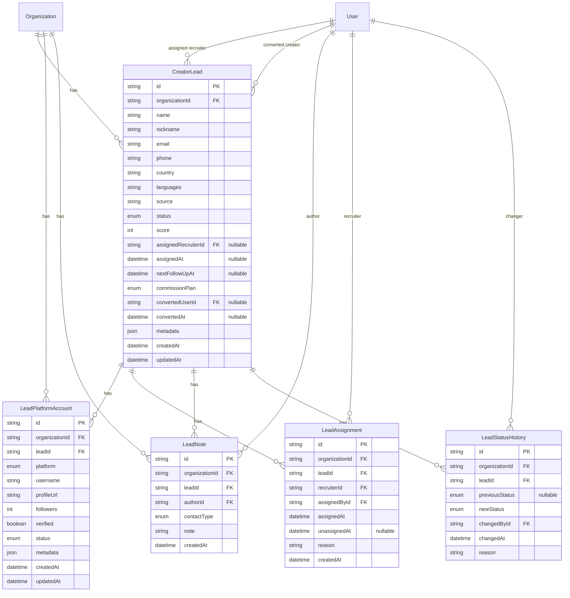

# Recruitment CRM Data Model (Release 0.3)

**Status:** Implemented in `feature/recruitment-crm-schema` (M1 — Schema)  
Prisma schema: `packages/database/prisma/schema.prisma`

---

## Overview

The Recruitment CRM extends the organization-scoped identity model with lead pipeline entities. All tables include `organizationId` and are intended for organizations with `type = AGENCY`.

Legacy `User.platforms` is **not** used for lead platform tracking. Leads use dedicated **platform account** rows.

**Prisma model names:** `CreatorLead`, `LeadPlatformAccount`, `LeadAssignment`, `LeadNote`, `LeadStatusHistory`.

---

## Entity relationship diagram

---

## Enums (implemented)

### `LeadStatus`

`NEW`, `CONTACTED`, `INTERESTED`, `APPLICATION`, `CONTRACT_SENT`, `SIGNED`, `ACTIVE_CREATOR`, `INACTIVE`, `REJECTED`

### `LeadSource`

`MANUAL`, `REFERRAL`, `SOCIAL`, `EVENT`, `IMPORT`, `OTHER`

### `CommissionPlan`

`STANDARD` (default), `PREMIUM`, `CUSTOM`

### `LeadPlatformAccountStatus`

`ACTIVE`, `UNVERIFIED`, `SUSPENDED`, `REMOVED`

### `ContactType`

`CALL`, `WHATSAPP`, `TIKTOK`, `FACEBOOK`, `EMAIL`, `MEETING`, `OTHER`

### `PlatformType`

`TIKTOK`, `INSTAGRAM`, `YOUTUBE`, `FACEBOOK`, `TWITCH`, `OTHER`

_Note:_ Distinct from legacy `User.platforms` flags and legacy `Platform` enum — describes external social accounts on a lead.

---

## Entity definitions

### CreatorLead

Primary CRM record.

| Field                     | Type              | Notes                                             |
| ------------------------- | ----------------- | ------------------------------------------------- |
| `id`                      | cuid              | Primary key                                       |
| `organizationId`          | FK → Organization | Tenant scope                                      |
| `name`                    | string            | Legal or display name                             |
| `nickname`                | string?           | Handle / preferred name                           |
| `email`                   | string?           | Unique per org when present (_recommended index_) |
| `phone`                   | string?           | E.164 preferred in validation                     |
| `country`                 | string?           | ISO 3166-1 alpha-2                                |
| `languages`               | string[]          | BCP-47 codes, e.g. `["en","es"]`                  |
| `source`                  | enum              | How lead entered pipeline                         |
| `status`                  | enum              | Pipeline status                                   |
| `score`                   | int               | 0–100, default 0                                  |
| `assignedRecruiterId`     | FK → User?        | Current owner; null = unassigned pool             |
| `assignedAt`              | datetime?         | When current owner assigned                       |
| `nextFollowUpAt`          | datetime?         | Next scheduled follow-up                          |
| `commissionPlan`          | enum              | Default `STANDARD`                                |
| `convertedUserId`         | FK → User?        | Set when `ACTIVE_CREATOR`                         |
| `convertedAt`             | datetime?         | Conversion timestamp                              |
| `notesSummary`            | text?             | Short free-text; detailed notes in `LeadNote`     |
| `metadata`                | json              | Future hooks (campaigns, payments, analytics)     |
| `createdAt` / `updatedAt` | datetime          | Audit                                             |

**Indexes (recommended):**

- `(organizationId, status, nextFollowUpAt)`
- `(organizationId, assignedRecruiterId, status)`
- `(organizationId, email)` unique where email not null
- `(organizationId, createdAt DESC)`

---

### LeadPlatformAccount

Tracks a lead's presence on a social/commerce platform.

| Field        | Type    | Notes                                          |
| ------------ | ------- | ---------------------------------------------- |
| `platform`   | enum    | TikTok, Instagram, etc.                        |
| `username`   | string  | Platform handle                                |
| `profileUrl` | string? | Canonical profile link                         |
| `followers`  | int?    | Snapshot count                                 |
| `verified`   | boolean | Platform verified badge                        |
| `status`     | enum    | Account verification state                     |
| `metadata`   | json    | External IDs, niche tags, avg views (_future_) |

**Constraints:**

- Unique `(organizationId, platform, username)` recommended to reduce duplicates

---

### LeadNote

Append-only contact history and notes.

| Field         | Type      | Notes                     |
| ------------- | --------- | ------------------------- |
| `contactType` | enum      | CALL, WHATSAPP, TIKTOK, … |
| `note`        | string    | Contact notes             |
| `authorId`    | FK → User | Author                    |
| `createdAt`   | datetime  | Append-only timestamp     |

---

### LeadAssignment

Ownership change history. Active assignment has `unassignedAt IS NULL`.

| Field          | Type      | Notes                              |
| -------------- | --------- | ---------------------------------- |
| `recruiterId`  | FK → User | Assigned recruiter (owner)         |
| `assignedById` | FK → User | Actor (recruiter claim or manager) |
| `assignedAt`   | datetime  | Assignment start                   |
| `unassignedAt` | datetime? | Null while active; set on reassign |
| `reason`       | string?   | Reassignment reason                |

Current owner is denormalized on `CreatorLead.assignedRecruiterId` for list queries.

---

### LeadStatusHistory

Append-only pipeline status changes.

| Field            | Type      | Notes                      |
| ---------------- | --------- | -------------------------- |
| `previousStatus` | enum?     | Null for initial status    |
| `newStatus`      | enum      | Resulting status           |
| `changedById`    | FK → User | Actor                      |
| `changedAt`      | datetime  | Change timestamp           |
| `reason`         | string?   | Optional transition reason |

`CreatorLead.nextFollowUpAt` supports follow-up list views without a separate follow-up table in v1 schema.

---

## Status transition rules (data layer)

Enforced in application service; documented here for schema reviewers.

| From             | Allowed to                           |
| ---------------- | ------------------------------------ |
| `NEW`            | `CONTACTED`, `REJECTED`              |
| `CONTACTED`      | `INTERESTED`, `REJECTED`, `INACTIVE` |
| `INTERESTED`     | `APPLICATION`, `REJECTED`            |
| `APPLICATION`    | `CONTRACT_SENT`, `REJECTED`          |
| `CONTRACT_SENT`  | `SIGNED`, `REJECTED`                 |
| `SIGNED`         | `ACTIVE_CREATOR`, `REJECTED`         |
| `ACTIVE_CREATOR` | `INACTIVE`                           |
| `INACTIVE`       | `CONTACTED` (reactivation)           |
| `REJECTED`       | — (terminal in v1)                   |

---

## Migration strategy

1. Add enums and tables in `feature/recruitment-crm-schema`
2. No backfill required — greenfield tables
3. Seed optional demo leads for `Acme Agency` dev org (_optional_)
4. Foreign keys use `onDelete: Cascade` from Organization; `SetNull` on recruiter user delete for assignment fields

---

## Future extensions (schema hooks)

| Future feature   | Planned extension                               |
| ---------------- | ----------------------------------------------- |
| Campaigns        | `RecruitmentLead.campaignId` nullable FK        |
| TikTok Shop      | `metadata.shopSellerId` on platform account     |
| Payments         | `RecruitmentCommissionAgreement` table          |
| Documents        | `RecruitmentLeadDocument` with storage key      |
| Performance KPIs | Read models / materialized views — no v1 tables |

---

## Related documents

- [Product plan](../product/recruitment-crm.md)
- [Architecture](../architecture/recruitment-crm.md)
- [API plan](../api/recruitment-crm.md)
- [Identity ERD](./identity-erd.md)
