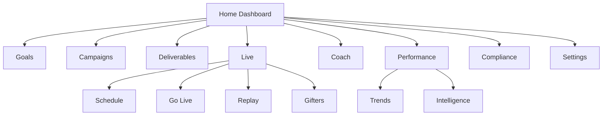

# Creator Studio UX

**Status:** Design reference for v0.7 implementation  
**Application:** `apps/creator-portal`  
**Related:** [Product brief](../product/creator-studio.md) · [Architecture](../architecture/creator-studio.md) · [Product Principles](../vision/product-principles.md)

---

## Design intent

Creator Studio should feel like a **calm daily workspace**, not an analytics dashboard. Creators open it before streaming, between sessions, and when agencies assign work. Every screen answers: _what matters now_ and _what do I do next_.

**Platform:** Responsive web first. Desktop and OBS overlays are out of scope until CS-09.

---

## UX principles

| Principle                    | Application                                                                              |
| ---------------------------- | ---------------------------------------------------------------------------------------- |
| **Action before analytics**  | Lead with quick actions, overdue deliverables, and coach alerts — not raw charts         |
| **Explain, don't overwhelm** | Show performance components with plain-language strengths/risks from API narratives      |
| **One home**                 | Dashboard is the default landing; modules deepen detail without duplicating home cards   |
| **Progressive disclosure**   | Summary on home; full replay, gifter detail, and trend evidence on dedicated routes      |
| **Trust the backend**        | Never show client-computed scores; display API values and `dataQualityWarnings` honestly |
| **Mobile-capable**           | Core flows work on phone — go-live check, deliverable upload, goal check-in              |
| **Accessible**               | Semantic headings, focus order, color contrast per `@kolab/ui` tokens                    |
| **Consistent with platform** | Reuse `@kolab/ui` components; no one-off design system in creator-portal                 |

Align with [Product Principles](../vision/product-principles.md): deterministic first, AI explains—not decides, humans approve critical decisions.

---

## Information architecture

**Primary nav (7 items max):** Home · Goals · Campaigns · Live · Coach · Performance · More (Compliance, Settings, Gifters).

---

## Module UX patterns

### Home dashboard

- **Hero strip:** Display name, performance score badge, live trend direction arrow.
- **Today column:** Goals progress, overdue deliverables (red), next live session countdown.
- **Coach strip:** Top 1–3 alerts/recommendations with CTA buttons.
- **Quick actions:** Render API `quickActions` sorted HIGH → MEDIUM → LOW; icon per type (`GO_LIVE`, `COMPLETE_DELIVERABLE`, etc.).
- **Empty states:** Friendly copy when no live sessions or campaigns — link to schedule or profile completion.

### Goals

- Card per active goal with progress bar from API `progressPercent`.
- Status chips: `ON_TRACK`, `AT_RISK`, `COMPLETED`, `FAILED`.
- Recalculate button triggers API; show spinner and last calculated timestamp.

### Campaign tasks and deliverables

- Campaign cards: brand name, due date, assignment status.
- Deliverable list grouped: overdue · due today · upcoming.
- Submission flow: upload + notes; confirmation state from API response.

### Live schedule and Go Live

- **Schedule:** Week list + month calendar toggle; timezone from user profile.
- **Go Live workspace:** Step checklist — compliance OK → goals reviewed → session linked → go live button.
- Live session status pill: `SCHEDULED` · `LIVE` · `ENDED`.
- During LIVE: show coach alert feed (polling or future websocket) — summaries only.

### Coach alerts and recommendations

- Alert cards: severity color, short message, evidence label (no raw chat).
- Recommendations: action title + rationale from API; single primary CTA per card.

### Performance, intelligence, trends

- **Performance:** Radial or bar components for sub-scores; expandable strengths/risks lists.
- **Intelligence:** Coaching priorities as ordered list; risk signals with warning icon.
- **Trends:** Direction arrows per metric; `INSUFFICIENT_DATA` shown as neutral state, not error.

### Timeline replay and gifter insights

- **Replay:** Horizontal timeline scrubber; highlight markers; no chat body in default view.
- **Gifters:** Table with tier, total value, last seen; detail drawer with session stats aggregates.

### Compliance and profile/settings

- **Compliance:** Checklist with completion percentage matching dashboard section.
- **Settings:** Profile edit, password, org display (read-only), notification toggles when API exists.

---

## Manager visibility (UX)

Creators never see a roster switcher or other creators' names in workflow context (except campaign brand names and gifter display names). No "view as manager" mode in Creator Studio.

---

## OBS and Live Studio (future UX)

Until CS-09:

- **Go Live** shows instructions for platform-native streaming plus Kōlab session ID.
- Copy explains that overlays and browser sources come in a future desktop app.

After CS-09 / v0.9:

- **Open in Live Studio** button launches desktop shell or browser-source URL.
- Creator Studio remains planning/coaching; Live Studio owns capture.

---

## Security and privacy (UX)

| Rule                         | UX behavior                                                                             |
| ---------------------------- | --------------------------------------------------------------------------------------- |
| No raw chat in default views | Replay shows event types and timestamps; chat behind explicit gated debug if ever added |
| Sensitive documents          | In-app viewer or download only after permission confirmation                            |
| Session timeout              | Redirect to login with return URL; no stale dashboard cache                             |
| Error states                 | 403/404 as generic "not available" — no leak of cross-org existence                     |

---

## Responsive breakpoints

| Breakpoint  | Layout                                            |
| ----------- | ------------------------------------------------- |
| &lt; 640px  | Single column; bottom nav; coach strip above fold |
| 640–1024px  | Two-column dashboard; collapsible side nav        |
| &gt; 1024px | Persistent side nav; dashboard three-column grid  |

Touch targets minimum 44px on mobile for go-live and deliverable actions.

---

## Success criteria (UX)

| Criterion            | Validation                                                                                     |
| -------------------- | ---------------------------------------------------------------------------------------------- |
| Time-to-first-action | Creator reaches a quick action or overdue item within 5 seconds of dashboard load              |
| Clarity              | Usability review: creators explain performance score in their own words using on-screen labels |
| Error comprehension  | `dataQualityWarnings` surfaced inline, not hidden in dev tools                                 |
| Parity               | Dashboard sections match API section names for support/debug alignment                         |

---

## Related documentation

- [Architecture](../architecture/creator-studio.md)
- [Creators API — dashboard](../api/creators.md#get-apicreatorsiddashboard)
- [Frontend standards](../engineering/frontend-standards.md)
