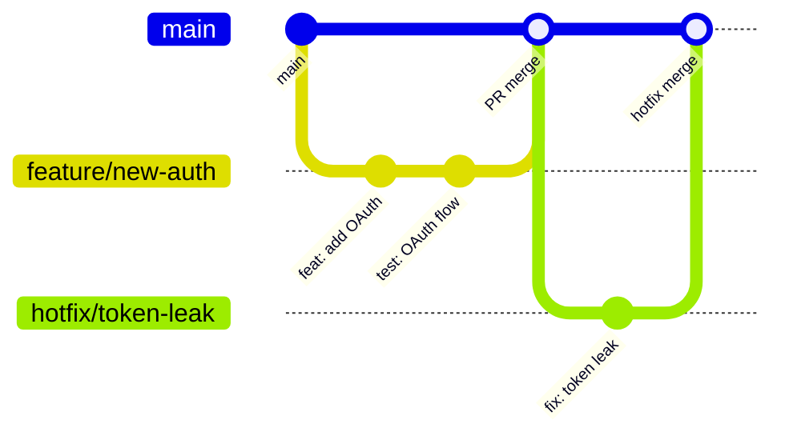

# Branch Strategy

Git branching model for the KŌLAB Platform monorepo. All work merges into `main` via pull request.

## Branches

| Branch      | Purpose                              | Base   | Merge target |
| ----------- | ------------------------------------ | ------ | ------------ |
| `main`      | Production-ready code; protected     | —      | —            |
| `feature/*` | New functionality                    | `main` | `main`       |
| `bugfix/*`  | Non-urgent defect fixes              | `main` | `main`       |
| `hotfix/*`  | Urgent production fixes              | `main` | `main`       |
| `release/*` | Release preparation and versioning   | `main` | `main`       |
| `docs/*`    | Documentation-only changes           | `main` | `main`       |
| `chore/*`   | Tooling, CI, deps — no product logic | `main` | `main`       |

## Naming conventions

Use lowercase kebab-case after the prefix:

```text
feature/creator-portal-dashboard
bugfix/jwt-expiry-validation
hotfix/redis-connection-timeout
release/v1.2.0
docs/coding-standards
chore/eslint-import-sort
```

Include a ticket or issue number when applicable:

```text
feature/KOL-142-tiktok-oauth
bugfix/KOL-198-login-redirect
```

## Workflow



### Feature development

1. `git checkout main && git pull`
2. `git checkout -b feature/<description>`
3. Implement, commit with Conventional Commits
4. Open PR → `main`; CI must pass ([quality gates](./quality-gates.md))
5. Squash or merge per team preference; delete branch after merge

### Bug fixes

Same as features, using `bugfix/` prefix. Use for defects found in development or staging.

### Hotfixes

For production incidents:

1. Branch from latest `main`: `hotfix/<description>`
2. Minimal, focused fix — no unrelated changes
3. Fast-track review; merge to `main`
4. Deploy immediately after merge

Document the incident in the [incident runbook](../runbooks/incident-response.md) if severity warrants.

### Releases

Use `release/*` branches for coordinated releases across multiple apps:

1. `git checkout -b release/vX.Y.Z`
2. Bump versions (Changesets: `pnpm changeset`)
3. Final QA and changelog review
4. Merge to `main`; tag the release commit

## Protection rules (main)

- Require pull request before merge
- Require CI quality gate to pass
- No direct pushes (except automated release bots, if configured)
- Require Conventional Commit messages (enforced locally via Husky + Commitlint)

## Commit messages on merge

Individual commits on feature branches should follow [Conventional Commits](./onboarding.md#commit-conventions). The merge commit or squash message should preserve the primary `type:` prefix.

## Related docs

- [Git standards](./git-standards.md)
- [Onboarding — commit conventions](./onboarding.md#commit-conventions)
- [Quality gates](./quality-gates.md)
- [PR template](../../.github/pull_request_template.md)
