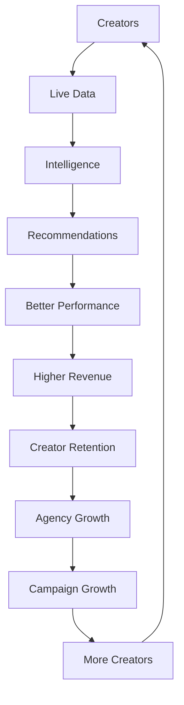

# Kōlab Master Roadmap

<!-- markdownlint-disable MD024 MD036 -->

**Status:** Living document — single source of truth for product delivery  
**Last updated:** 2026-07-05 (Creator Studio v1.0 complete; Manager Portal active)  
**Owner:** Kōlab Product & Engineering

**Related:** [Product Strategy](../vision/product-strategy.md) · [Competitive Advantages](../vision/competitive-advantages.md) · [Product Principles](../vision/product-principles.md) · [System Map](../architecture/system-map.md) · [Business Model](../business/business-model.md)

---

## How to read this document

| Indicator      | Meaning                                        |
| -------------- | ---------------------------------------------- |
| ✅ Complete    | Shipped and verified in `develop`              |
| 🚧 In Progress | Active engineering or partial delivery         |
| 📋 Planned     | Scoped; not yet in active development          |
| 💡 Ideas       | Direction validated; requirements open         |
| 🔮 Future      | Long-horizon bet                               |
| 🔬 Research    | Active investigation; not committed to roadmap |

**Roadmap item columns:**

- **Priority:** P0 (critical) · P1 (high) · P2 (medium) · P3 (low)
- **Effort:** S · M · L · XL (relative engineering size)
- **Completion:** 0–100% per track

Update this file when merging feature branches that change delivery truth.

---

## Platform Maturity Dashboard

Estimated completion by product and delivery track. **Overall** is the weighted blend of populated tracks (Backend 40%, Frontend 25%, Desktop 10%, Mobile 10%, AI 15%). Dashes indicate not applicable yet.

| Product              | Backend | Frontend | Desktop | Mobile | AI  | Overall |
| -------------------- | ------- | -------- | ------- | ------ | --- | ------- |
| Platform Foundation  | 92%     | 35%      | —       | —      | —   | 72%     |
| Developer Experience | 90%     | 20%      | —       | —      | —   | 65%     |
| Creator CRM          | 85%     | 28%      | —       | —      | —   | 61%     |
| Campaign Management  | 80%     | 18%      | —       | —      | —   | 57%     |
| Live Intelligence    | 78%     | 12%      | —       | —      | 5%  | 50%     |
| Creator Intelligence | 82%     | 10%      | —       | —      | 8%  | 52%     |
| Goals Engine         | 88%     | 5%       | —       | —      | —   | 58%     |
| Creator Studio       | 35%     | 95%      | 15%     | 10%    | —   | 88%     |
| Manager Portal       | 25%     | 18%      | —       | —      | 3%  | 22%     |
| OBS Replacement      | 40%     | 5%       | 8%      | —      | 5%  | 22%     |
| Analytics Platform   | 15%     | 5%       | —       | —      | 10% | 13%     |
| AI Platform          | 15%     | 5%       | —       | —      | 18% | 14%     |
| Marketplace          | 5%      | 0%       | —       | —      | —   | 3%      |
| Financial Platform   | 10%     | 0%       | —       | —      | —   | 7%      |
| Token Economy        | 12%     | 0%       | —       | —      | —   | 8%      |
| Mobile               | 22%     | —        | —       | 12%    | —   | 17%     |
| Enterprise           | 10%     | 5%       | —       | —      | —   | 8%      |

Refresh this table when a track ships material scope. See [Product maturity model](../vision/product-strategy.md#product-maturity-model).

---

## Kōlab Flywheel

Every major feature should strengthen one or more stages of the platform flywheel. If a proposal does not move the flywheel, reconsider its priority.

| Stage                  | Platform mechanisms                              |
| ---------------------- | ------------------------------------------------ |
| **Creators**           | Recruitment CRM, roster, onboarding              |
| **Live Data**          | Sessions, events, gifter rollups, schedules      |
| **Intelligence**       | Profiles, trends, performance scores             |
| **Recommendations**    | Coach alerts, goals, dashboard quick actions     |
| **Better Performance** | Goals engine, deliverable execution, coaching    |
| **Higher Revenue**     | Campaigns, live monetization signals             |
| **Creator Retention**  | Compliance, achievements, gifter retention goals |
| **Agency Growth**      | Manager operations, matching, analytics          |
| **Campaign Growth**    | Marketplace, brand tools (future)                |
| **More Creators**      | Recruiting pipeline closes the loop              |

See [Product Strategy — Platform flywheel](../vision/product-strategy.md#platform-flywheel).

---

## The Kōlab Data Network

Kōlab’s defensibility comes from **correlated operational data** — not from any single model or dashboard. Each signal becomes more valuable when joined with the others inside an organization-scoped graph.

| Data asset               | Correlates with                     | Compounding effect                              |
| ------------------------ | ----------------------------------- | ----------------------------------------------- |
| **Live events**          | Timeline, triggers, recommendations | Explains _what happened_ during revenue moments |
| **Timeline & replay**    | Coach alerts, session summaries     | Links actions to outcomes for coaching          |
| **Gifter profiles**      | Session stats, retention goals      | Surfaces who drives revenue and who is at risk  |
| **Campaign performance** | Deliverables, matching, scores      | Connects brand work to live results             |
| **Goal completion**      | Performance score, compliance       | Makes accountability measurable                 |
| **Performance scores**   | Trends, matching, dashboard         | Single explainable health index                 |
| **Recommendations**      | Alerts, intelligence profile        | Turns analysis into next actions                |
| **Coach alerts**         | Live sessions, gifter tiers         | Drives in-the-moment behavior change            |
| **Matching**             | Scores, compliance, assignments     | Reduces bad-fit campaigns before they start     |
| **Creator intelligence** | All of the above                    | Portfolio-level pattern detection               |

**Why this is a moat:** A competitor can replicate one chart. They cannot quickly replicate ten years of **joined** creator, live, campaign, and compliance history per organization — especially with audit trails and deterministic recalculation rules. The graph is the product.

Read [Competitive Advantages](../vision/competitive-advantages.md) and [Business Model](../business/business-model.md).

---

## Technical Debt

### Purpose

Track structural work that does not ship user-visible features but reduces risk, improves velocity, and unlocks scale. Technical debt items appear here—not hidden in backlogs.

### Tracking process

1. Propose an item with owner, priority, effort, and status.
2. Link affected domains (API, infra, clients).
3. Review monthly in roadmap maintenance.
4. Close only when verification criteria are met and docs updated.

| Item                     | Priority | Effort | Owner       | Status         | Notes                                     |
| ------------------------ | -------- | ------ | ----------- | -------------- | ----------------------------------------- |
| Metadata normalization   | P1       | L      | Platform    | 🚧 In Progress | Consolidate creator/session metadata keys |
| Background jobs          | P1       | L      | Platform    | 📋 Planned     | Scheduled recalculation, notifications    |
| Caching                  | P2       | M      | API         | 📋 Planned     | Redis patterns for hot reads              |
| Performance optimization | P2       | M      | API         | 📋 Planned     | Query plans, N+1 audits                   |
| Queue processing         | P1       | L      | Platform    | 📋 Planned     | Async ingest and rollups                  |
| API versioning           | P2       | M      | API         | 📋 Planned     | `/v1` contract policy                     |
| Observability            | P1       | L      | Platform    | 🚧 In Progress | Metrics, tracing, structured logs         |
| Multi-region readiness   | P3       | XL     | Infra       | 📋 Planned     | Data residency, failover                  |
| Database optimization    | P2       | M      | Database    | 📋 Planned     | Index review, archival strategy           |
| Testing improvements     | P1       | M      | Engineering | 🚧 In Progress | Integration fixtures, E2E paths           |

---

## Research

🔬 **Research** items are investigations—not committed roadmap deliveries. Promotion to 📋 Planned requires product brief, engineering spike, and flywheel alignment.

| Investigation            | Status      | Question                                    | Potential flywheel stage |
| ------------------------ | ----------- | ------------------------------------------- | ------------------------ |
| OBS automation           | 🔬 Research | Can Kōlab drive OBS via API/script safely?  | Live Data                |
| Plugin SDK               | 🔬 Research | SDK for third-party live overlays           | OBS Replacement          |
| Browser Source SDK       | 🔬 Research | Embedded browser sources in Live Studio     | OBS Replacement          |
| Video intelligence       | 🔬 Research | Clip detection from session events          | Intelligence             |
| Voice intelligence       | 🔬 Research | Voice trigger signals without raw retention | Intelligence             |
| AI moderation            | 🔬 Research | Policy-bound moderation assists             | Agency Growth            |
| Automatic clipping       | 🔬 Research | Highlight reels from trigger analysis       | Creator success          |
| Virtual creators         | 🔬 Research | Synthetic persona governance                | More Creators            |
| Digital humans           | 🔬 Research | Avatar streams with compliance              | Future Vision            |
| Cross-platform streaming | 🔬 Research | One session → multi-destination             | Live Data                |
| Vision AI                | 🔬 Research | Visual trigger detection on streams         | Intelligence             |
| Creator forecasting      | 🔬 Research | Deterministic revenue/consistency forecasts | Intelligence             |
| Monetization prediction  | 🔬 Research | Gift/revenue projections from gifter graph  | Higher Revenue           |

---

## Roadmap History

How strategic delivery evolved. Each version maps to merged platform scope—not marketing releases alone.

| Version                          | Theme                  | Scope delivered                                        | Strategic shift                  |
| -------------------------------- | ---------------------- | ------------------------------------------------------ | -------------------------------- |
| **v0.1 Platform**                | Foundation             | Monorepo, auth, Docker, CI, app shells                 | Prove multi-app platform         |
| **v0.2 CRM**                     | Identity & recruitment | Organizations, invitations, leads, creator roster      | Organization-scoped CRM          |
| **v0.3 Campaigns**               | Campaign operations    | Campaigns, applications, assignments, deliverables     | Brand workflow in-platform       |
| **v0.4 Live Intelligence**       | Live data plane        | Sessions, events, gifters, coaching outputs            | Live ops as structured data      |
| **v0.5 Creator Intelligence**    | Creator graph          | Intelligence profile, trends, performance score, goals | Cross-session creator model      |
| **v0.6 Creator Studio planning** | Creator surface        | Dashboard API, roadmap & strategic docs                | Creator OS backend-first         |
| **v0.7 Creator Studio**          | Creator OS v1.0        | Creator portal web app CS-01–CS-10                     | Creators operate daily in-studio |

**How the roadmap evolves:** Each version adds a **durable data layer** before client experiences. [Roadmap History](#roadmap-history) grows with every version tag; [Platform Maturity Dashboard](#platform-maturity-dashboard) updates continuously between versions.

---

## Executive summary

| Product area                  | Completion | Status |
| ----------------------------- | ---------- | ------ |
| Platform Foundation           | 92%        | ✅     |
| Developer Experience          | 88%        | ✅     |
| Creator CRM                   | 78%        | 🚧     |
| Agency CRM                    | 45%        | 🚧     |
| Campaign Management           | 72%        | 🚧     |
| Live Intelligence             | 70%        | 🚧     |
| Creator Intelligence          | 75%        | 🚧     |
| Creator Studio                | 95%        | ✅     |
| Manager Portal                | 18%        | 🚧     |
| Live Studio (OBS Replacement) | 5%         | 📋     |
| Analytics Platform            | 10%        | 📋     |
| AI Platform                   | 12%        | 📋     |
| Marketplace                   | 0%         | 🔮     |
| Financial Platform            | 8%         | 📋     |
| Token Economy                 | 15%        | 📋     |
| Mobile Applications           | 18%        | 📋     |
| Enterprise                    | 5%         | 🔮     |
| Internationalization          | 5%         | 🔮     |

**North Star:** [Become the operating system for creator businesses](../vision/product-strategy.md#north-star).

### Completed products

| Product        | Version | Status      | Notes                                                      |
| -------------- | ------- | ----------- | ---------------------------------------------------------- |
| Creator Studio | v1.0    | ✅ Complete | Web workspace CS-01–CS-10 shipped in `apps/creator-portal` |

### Current active development

| Focus          | Version | Status         | Next milestone            |
| -------------- | ------- | -------------- | ------------------------- |
| Manager Portal | v1.0    | 🚧 In Progress | MP-04 Campaign Operations |

**Next Active Development:** [Manager Portal](#manager-portal) — agency command center for portfolio, campaigns, recruiting, and operations.

---

## Why Kōlab Wins

Kōlab wins through **unified data**, **cross-session intelligence**, and **deterministic automation** — not isolated tools. The full narrative lives in [Competitive Advantages — Why Kōlab Wins](../vision/competitive-advantages.md#why-kōlab-wins), including:

- Unified platform across CRM, live ops, and campaigns
- Data network effects within each organization
- Cross-session and cross-platform intelligence
- Deterministic AI inputs and auditability
- Creator and agency operating systems on one backend
- OBS replacement with operational feedback loops
- Future token utility grounded in measurable outcomes

---

## Platform Foundation

### Purpose

Monorepo, infrastructure, auth, shared packages, and deployment patterns that every vertical builds on.

### Current completion: 92%

### Major capabilities

- Turborepo monorepo with shared packages
- PostgreSQL + Prisma ORM
- Redis session cache
- Docker Compose local/prod-like stacks
- JWT auth with refresh rotation
- CI quality gates

### Completed ✅

- Monorepo scaffolding (`apps/*`, `packages/*`)
- Database package and migration pipeline
- Auth package and API guards
- Four Next.js app shells (web, admin, creator-portal, moderator)
- NestJS API core
- Engineering standards and verify scripts

### In Progress 🚧

- Organization-scoped identity hardening across all modules
- Legacy role cleanup (Phase D)

### Planned 📋

- Staging environment parity automation
- Production observability SDK wiring

### Future Vision 🔮

- Multi-region deployment templates
- Feature flag service integration

### Roadmap items

| Item                         | Status | Priority | Dependencies         | Backend | Frontend | Desktop | Mobile | Docs | Completion |
| ---------------------------- | ------ | -------- | -------------------- | ------- | -------- | ------- | ------ | ---- | ---------- |
| Monorepo & Docker foundation | ✅     | P0       | —                    | L       | S        | —       | —      | M    | 100%       |
| JWT auth & refresh tokens    | ✅     | P0       | Monorepo             | L       | M        | —       | —      | M    | 100%       |
| Organization identity model  | 🚧     | P0       | Auth                 | L       | M        | —       | —      | M    | 85%        |
| Redis session cache          | ✅     | P1       | Auth                 | M       | —        | —       | —      | S    | 100%       |
| CI quality gates             | ✅     | P1       | Monorepo             | M       | M        | —       | —      | M    | 95%        |
| Multi-region deployment      | 🔮     | P3       | Production hardening | XL      | —        | —       | —      | M    | 0%         |

### How does this improve creator success?

Every roadmap item here must improve **creator success**, **agency efficiency**, **platform intelligence**, **revenue**, or **retention**. If it does not, deprioritize or reframe it.

This area strengthens the [Kōlab Flywheel](#kōlab-flywheel) by supplying the reliable base every flywheel stage depends on.

---

## Developer Experience

### Purpose

Repeatable workflows, standards, and tooling so features ship with consistent quality.

### Current completion: 88%

### Major capabilities

- Feature branch automation
- Backend verification pipeline
- Coding, testing, and git standards
- Turbo remote cache
- PR workflow scripts

### Completed ✅

- `pnpm feature:start`, `verify:backend`, PR helpers
- Engineering docs (coding, backend, frontend, testing, git)
- Markdownlint and lint-staged hooks
- Quality gates documentation

### In Progress 🚧

- Expanded E2E playbook per vertical
- API changelog automation

### Planned 📋

- Scaffold generator for new Nest modules
- Visual regression baseline for web apps

### Future Vision 🔮

- Internal developer portal with live API explorer

### Roadmap items

| Item                       | Status | Priority | Dependencies        | Backend | Frontend | Desktop | Mobile | Docs | Completion |
| -------------------------- | ------ | -------- | ------------------- | ------- | -------- | ------- | ------ | ---- | ---------- |
| Developer workflow scripts | ✅     | P0       | Platform Foundation | S       | S        | —       | —      | M    | 100%       |
| Engineering standards docs | ✅     | P0       | —                   | —       | —        | —       | —      | L    | 95%        |
| Backend verify pipeline    | ✅     | P0       | Platform Foundation | M       | —        | —       | —      | S    | 100%       |
| Module scaffold generator  | 📋     | P2       | Standards           | M       | —        | —       | —      | S    | 0%         |
| Developer portal           | 🔮     | P3       | API stability       | L       | M        | —       | —      | M    | 0%         |

### How does this improve creator success?

Every roadmap item here must improve **creator success**, **agency efficiency**, **platform intelligence**, **revenue**, or **retention**. If it does not, deprioritize or reframe it.

This area strengthens the [Kōlab Flywheel](#kōlab-flywheel) by accelerating delivery of intelligence and creator-facing value.

---

## Creator CRM

### Purpose

Recruit, convert, onboard, and manage creators with documents, contracts, compliance, and roster operations.

### Current completion: 78%

### Major capabilities

- Lead pipeline and conversion
- Creator profiles and platform accounts
- Skills and availability
- Documents and contracts with review workflows
- Onboarding checklist and compliance bundles
- Reporting (missing/expiring documents and contracts)

### Completed ✅

- Recruitment CRM APIs and schema
- Creator roster CRUD
- Platform accounts, skills, availability
- Documents and contracts modules
- Onboarding and compliance services
- Creator reporting endpoints

### In Progress 🚧

- Notification delivery channels for document expiration
- Enhanced compliance dashboards for managers

### Planned 📋

- Creator self-service document upload portal
- Bulk roster import

### Future Vision 🔮

- Creator-facing profile verification with platform OAuth

### Roadmap items

| Item                        | Status | Priority | Dependencies      | Backend | Frontend | Desktop | Mobile | Docs | Completion |
| --------------------------- | ------ | -------- | ----------------- | ------- | -------- | ------- | ------ | ---- | ---------- |
| Recruitment lead pipeline   | ✅     | P0       | Identity          | L       | M        | —       | —      | M    | 100%       |
| Creator roster & accounts   | ✅     | P0       | Identity          | L       | M        | —       | —      | M    | 100%       |
| Documents & contracts       | ✅     | P0       | Storage           | L       | L        | —       | —      | L    | 90%        |
| Onboarding & compliance     | ✅     | P1       | Documents         | M       | M        | —       | —      | M    | 85%        |
| Expiration notifications    | 🚧     | P1       | Notifications pkg | M       | S        | —       | S      | S    | 40%        |
| Creator self-service portal | 📋     | P2       | Creator Studio    | M       | L        | —       | M      | M    | 10%        |

### How does this improve creator success?

Every roadmap item here must improve **creator success**, **agency efficiency**, **platform intelligence**, **revenue**, or **retention**. If it does not, deprioritize or reframe it.

This area strengthens the [Kōlab Flywheel](#kōlab-flywheel) by adding creators to the network with compliant, auditable onboarding.

**Docs:** [Recruitment CRM](../architecture/recruitment-crm.md) · [Creators API](../api/creators.md)

---

## Agency CRM

### Purpose

Agency-wide operations: recruiter profiles, agency settings, team management, and portfolio visibility.

### Current completion: 45%

### Major capabilities

- Recruiter profiles
- Agency API foundations
- Organization membership and roles
- Audit visibility

### Completed ✅

- Recruiter profile API
- Agency endpoints
- Organization roles and permissions model
- Audit log API

### In Progress 🚧

- Agency-level reporting
- Team workload views

### Planned 📋

- Portfolio dashboards for managers
- SLA tracking on lead follow-ups

### Future Vision 🔮

- Multi-brand agency hierarchies

### Roadmap items

| Item                    | Status | Priority | Dependencies   | Backend | Frontend | Desktop | Mobile | Docs | Completion |
| ----------------------- | ------ | -------- | -------------- | ------- | -------- | ------- | ------ | ---- | ---------- |
| Recruiter profiles      | ✅     | P1       | Creator CRM    | M       | S        | —       | —      | S    | 100%       |
| Agency API              | ✅     | P1       | Identity       | M       | S        | —       | —      | S    | 80%        |
| Agency reporting        | 🚧     | P1       | Creator CRM    | L       | M        | —       | —      | M    | 35%        |
| Portfolio dashboards    | 📋     | P1       | Manager Portal | L       | L        | —       | M      | M    | 5%         |
| Multi-brand hierarchies | 🔮     | P3       | Enterprise     | XL      | L        | —       | —      | M    | 0%         |

### How does this improve creator success?

Every roadmap item here must improve **creator success**, **agency efficiency**, **platform intelligence**, **revenue**, or **retention**. If it does not, deprioritize or reframe it.

This area strengthens the [Kōlab Flywheel](#kōlab-flywheel) by scaling agency operations without losing roster quality.

**Docs:** [Agency API](../api/agency.md) · [Recruiters API](../api/recruiters.md)

---

## Campaign Management

### Purpose

Define campaigns, manage applications and assignments, track creator deliverables, and match creators deterministically.

### Current completion: 72%

### Major capabilities

- Campaign CRUD and deliverable templates
- Creator applications and assignments
- Creator deliverable workflow
- Campaign creator matching

### Completed ✅

- Campaign schema and APIs
- Applications and assignments
- Creator deliverables with status transitions
- Deterministic creator matching generation

### In Progress 🚧

- Brand-facing campaign summaries
- Deliverable reminder automation

### Planned 📋

- Campaign analytics rollups
- Contract linkage to campaign assignments

### Future Vision 🔮

- Cross-org brand portals with scoped access

### Roadmap items

| Item                       | Status | Priority | Dependencies         | Backend | Frontend | Desktop | Mobile | Docs | Completion |
| -------------------------- | ------ | -------- | -------------------- | ------- | -------- | ------- | ------ | ---- | ---------- |
| Campaign foundation        | ✅     | P0       | Identity             | L       | M        | —       | —      | M    | 100%       |
| Applications & assignments | ✅     | P0       | Creator CRM          | L       | M        | —       | —      | M    | 95%        |
| Creator deliverables       | ✅     | P0       | Assignments          | L       | M        | —       | —      | M    | 90%        |
| Creator matching           | ✅     | P1       | Creator Intelligence | M       | M        | —       | —      | M    | 85%        |
| Campaign analytics         | 📋     | P2       | Analytics Platform   | L       | L        | —       | M      | M    | 10%        |
| Brand portal               | 🔮     | P3       | Marketplace          | XL      | XL       | —       | M      | L    | 0%         |

### How does this improve creator success?

Every roadmap item here must improve **creator success**, **agency efficiency**, **platform intelligence**, **revenue**, or **retention**. If it does not, deprioritize or reframe it.

This area strengthens the [Kōlab Flywheel](#kōlab-flywheel) by turning brand demand into measurable creator revenue.

**Docs:** [Campaigns API](../api/campaigns.md) · [Campaigns ERD](../database/campaigns-erd.md)

---

## Live Intelligence

### Purpose

Capture live sessions, ingest events, analyze triggers, and produce deterministic coaching outputs.

### Current completion: 70%

### Major capabilities

- Live session lifecycle
- Event ingestion (single and batch)
- Gifter profiles and session stats
- Timeline, replay, trigger analysis
- Session recommendations and coach alerts
- Session summaries and intelligence snapshots
- Creator live schedules

### Completed ✅

- Live session schema and CRUD
- Event ingestion pipeline
- Gifter rollup processing
- Timeline and replay views
- Trigger analysis, recommendations, coach alerts
- Session summary and intelligence snapshot generation

### In Progress 🚧

- Real-time websocket fan-out (deferred — not in scope for current API phase)
- Schedule → session automation

### Planned 📋

- Cross-session benchmark comparisons
- Live health monitoring dashboards

### Future Vision 🔮

- Sub-second event streaming at global scale

### Roadmap items

| Item                       | Status | Priority | Dependencies    | Backend | Frontend | Desktop | Mobile | Docs | Completion |
| -------------------------- | ------ | -------- | --------------- | ------- | -------- | ------- | ------ | ---- | ---------- |
| Session & event foundation | ✅     | P0       | Identity        | L       | M        | —       | —      | L    | 100%       |
| Gifter analytics           | ✅     | P0       | Sessions        | L       | M        | —       | —      | M    | 90%        |
| Coaching recommendations   | ✅     | P1       | Events          | L       | M        | —       | —      | M    | 85%        |
| Coach alerts               | ✅     | P1       | Recommendations | M       | M        | —       | —      | M    | 85%        |
| Live schedules             | ✅     | P1       | Creator CRM     | M       | S        | —       | —      | M    | 80%        |
| Real-time websocket feed   | 📋     | P2       | Streaming pkg   | XL      | M        | M       | M      | M    | 5%         |
| Global event scale-out     | 🔮     | P3       | Enterprise      | XL      | —        | —       | —      | M    | 0%         |

### How does this improve creator success?

Every roadmap item here must improve **creator success**, **agency efficiency**, **platform intelligence**, **revenue**, or **retention**. If it does not, deprioritize or reframe it.

This area strengthens the [Kōlab Flywheel](#kōlab-flywheel) by capturing live data that feeds intelligence and coaching.

**Docs:** [Live Intelligence architecture](../architecture/live-intelligence.md) · [Live Intelligence API](../api/live-intelligence.md)

---

## Creator Intelligence

### Purpose

Synthesize cross-session creator insights: health scores, trends, performance scoring, and coaching priorities.

### Current completion: 75%

### Major capabilities

- Creator intelligence profile generation
- Live trend snapshots
- Multi-dimensional performance score
- Data quality warnings and explainability

### Completed ✅

- Intelligence profile stored on creator metadata
- Live trend snapshot generation
- Performance score with bands, strengths, risks
- Audit events for generate/view operations

### In Progress 🚧

- Portfolio-level intelligence rollups for managers
- Score versioning and historical comparison

### Planned 📋

- Creator digital twin export API
- Automated coaching plan templates

### Future Vision 🔮

- Predictive churn models with deterministic features only

### Roadmap items

| Item                 | Status | Priority | Dependencies       | Backend | Frontend | Desktop | Mobile | Docs | Completion |
| -------------------- | ------ | -------- | ------------------ | ------- | -------- | ------- | ------ | ---- | ---------- |
| Intelligence profile | ✅     | P1       | Live Intelligence  | L       | M        | —       | —      | M    | 90%        |
| Live trend detection | ✅     | P1       | Live Intelligence  | M       | M        | —       | —      | M    | 85%        |
| Performance score    | ✅     | P1       | CRM + Campaigns    | L       | M        | —       | —      | M    | 90%        |
| Score history        | 📋     | P2       | Performance score  | M       | M        | —       | —      | S    | 15%        |
| Digital twin API     | 📋     | P2       | AI Platform        | L       | S        | —       | —      | M    | 10%        |
| Predictive churn     | 🔮     | P3       | Analytics Platform | XL      | M        | —       | —      | M    | 0%         |

### How does this improve creator success?

Every roadmap item here must improve **creator success**, **agency efficiency**, **platform intelligence**, **revenue**, or **retention**. If it does not, deprioritize or reframe it.

This area strengthens the [Kōlab Flywheel](#kōlab-flywheel) by turning historical sessions into explainable creator insight.

**Docs:** [Creators API](../api/creators.md) · [Competitive Advantages — Creator Intelligence](../vision/competitive-advantages.md#creator-intelligence)

---

## Creator Studio

### Purpose

Creator-facing home for goals, live activity, campaigns, coaching, compliance, and quick actions.

### Current completion: 95% (v1.0)

**Status:** ✅ **COMPLETE** — Creator Studio v1.0 shipped in `apps/creator-portal`.

### Major capabilities (v1.0)

- Authenticated studio shell with navigation, breadcrumbs, and org context
- Home dashboard consuming aggregated creator dashboard API
- Goals and performance workspaces with display-only API rendering
- Campaign workspace (list, kanban, detail) with deliverables and applications
- Coach workspace (recommendations, alerts, intelligence tabs)
- Live workspace with session overview, timeline, summary, and intelligence
- Replay & Gifter Intelligence workspace (timeline, highlights, triggers, gifters)
- Profile, compliance, and settings workspaces
- Production workspace UI foundation (mock provider; desktop/OBS deferred)
- Cross-workspace integration polish: shared shells, loading/empty/error states, tab memory, accessibility

### Completed ✅

- Creator dashboard aggregation endpoint and audit
- Creator portal web app CS-01 through CS-10
- Mock and live API data modes for all workspaces
- Shared workspace UI patterns and navigation polish

### Future Vision 🔮

- Configurable dashboard widgets
- Native mobile Creator Studio app
- Live Studio deep-link and desktop wrapper (v0.9+)
- Real-time websocket coach delivery

### Roadmap items

| Item                   | Status | Priority | Dependencies         | Backend | Frontend | Desktop | Mobile | Docs | Completion |
| ---------------------- | ------ | -------- | -------------------- | ------- | -------- | ------- | ------ | ---- | ---------- |
| Dashboard API          | ✅     | P0       | Goals + Intelligence | L       | —        | —       | —      | M    | 100%       |
| Creator portal home UI | ✅     | P0       | Dashboard API        | S       | XL       | —       | L      | M    | 100%       |
| Goals UI               | ✅     | P1       | Goals engine         | S       | L        | —       | M      | M    | 100%       |
| Campaign workspace UI  | ✅     | P1       | Campaigns API        | S       | L        | —       | M      | M    | 100%       |
| Coach workspace UI     | ✅     | P1       | Live Intelligence    | S       | L        | —       | M      | M    | 100%       |
| Live workspace UI      | ✅     | P1       | Live Intelligence    | S       | L        | —       | M      | M    | 100%       |
| Replay intelligence UI | ✅     | P1       | Live Intelligence    | S       | L        | —       | M      | M    | 100%       |
| Profile & settings UI  | ✅     | P1       | Creator CRM          | S       | M        | —       | M      | M    | 100%       |
| Production foundation  | ✅     | P2       | Live workspace       | —       | L        | M       | —      | M    | 100%       |
| Integration & polish   | ✅     | P1       | All CS workspaces    | S       | L        | —       | —      | M    | 100%       |
| Live launcher (native) | 🔮     | P2       | Live Studio v0.9     | M       | L        | M       | M      | M    | 5%         |
| Configurable widgets   | 🔮     | P2       | Analytics            | M       | L        | —       | L      | S    | 0%         |

### How does this improve creator success?

Every roadmap item here must improve **creator success**, **agency efficiency**, **platform intelligence**, **revenue**, or **retention**. If it does not, deprioritize or reframe it.

This area strengthens the [Kōlab Flywheel](#kōlab-flywheel) by giving creators one place to act on goals, coach signals, and campaigns.

**Docs:** [Product brief](../product/creator-studio.md) · [Architecture](../architecture/creator-studio.md) · [UX](../design/creator-studio-ux.md) · [Creators API — dashboard](../api/creators.md)

### Implementation phases (v0.7 / v1.0)

| Phase | Scope                           | Status |
| ----- | ------------------------------- | ------ |
| CS-01 | App shell, auth, navigation     | ✅     |
| CS-02 | Home dashboard                  | ✅     |
| CS-03 | Goals and performance           | ✅     |
| CS-04 | Campaign workspace              | ✅     |
| CS-05 | Coach and recommendations       | ✅     |
| CS-06 | Live workspace                  | ✅     |
| CS-07 | Replay and gifter insights      | ✅     |
| CS-08 | Profile and settings            | ✅     |
| CS-09 | Production workspace foundation | ✅     |
| CS-10 | Integration and polish          | ✅     |

See [Architecture — Implementation phases](../architecture/creator-studio.md#implementation-phases).

---

## Manager Portal

### Purpose

Agency command center for managers: portfolio intelligence, campaign oversight, matching review, and team accountability.

### Current completion: 36%

**Status:** 🚧 **IN PROGRESS** — MP-01 through MP-03 shipped; MP-04+ planned (v0.8 / Manager Portal v1).

### Major capabilities

- Portfolio creator list with scores
- Campaign assignment oversight
- Matching review and override
- Team audit and compliance queues

### Completed ✅

- Backend APIs that Manager Portal will compose (CRM, campaigns, intelligence)
- Creator Studio v1.0 patterns for workspace shells, navigation, and data modes
- Manager Portal app shell in `apps/manager-portal` (MP-01)
- Creator Management workspace at `/portal/creators` (MP-02)
- Live Operations workspace at `/portal/live` (MP-03)

### In Progress 🚧

- MP-04 Campaign operations
- UX research and information architecture for remaining workspaces

### Planned 📋

- Campaign operations (MP-04)
- Recruiting CRM (MP-05)
- Notifications & tasks (MP-06)
- Reporting (MP-07)
- Administration (MP-08)
- Integration & polish (MP-09)

### Future Vision 🔮

- AI-assisted manager briefings (deterministic inputs)

### Roadmap items

| Item                  | Status | Priority | Dependencies           | Backend | Frontend | Desktop | Mobile | Docs | Completion |
| --------------------- | ------ | -------- | ---------------------- | ------- | -------- | ------- | ------ | ---- | ---------- |
| API composition layer | 🚧     | P0       | Agency CRM + Campaigns | M       | —        | —       | —      | S    | 30%        |
| Manager app shell     | ✅     | P0       | Identity               | S       | L        | —       | —      | M    | 100%       |
| Portfolio dashboard   | 📋     | P0       | Creator Intelligence   | M       | XL       | —       | M      | M    | 5%         |
| Compliance queues     | 📋     | P1       | Creator CRM            | M       | L        | —       | M      | M    | 0%         |
| AI manager briefings  | 🔮     | P2       | AI Platform            | L       | M        | —       | M      | M    | 0%         |

### Implementation phases (v0.8)

| Phase | Scope                     | Status |
| ----- | ------------------------- | ------ |
| MP-01 | Manager shell             | ✅     |
| MP-02 | Creator management        | ✅     |
| MP-03 | Live operations dashboard | ✅     |
| MP-04 | Campaign operations       | 📋     |
| MP-05 | Recruiting CRM            | 📋     |
| MP-06 | Notifications & tasks     | 📋     |
| MP-07 | Reporting                 | 📋     |
| MP-08 | Administration            | 📋     |
| MP-09 | Integration & polish      | 📋     |

### How does this improve creator success?

Every roadmap item here must improve **creator success**, **agency efficiency**, **platform intelligence**, **revenue**, or **retention**. If it does not, deprioritize or reframe it.

This area strengthens the [Kōlab Flywheel](#kōlab-flywheel) by raising agency efficiency across portfolios and campaigns.

---

## Live Studio (OBS Replacement)

### Purpose

Native live production app integrating scheduling, capture, intelligence overlays, and session upload into Kōlab.

### Current completion: 5%

### Major capabilities

- Desktop streaming client
- Schedule-aware go-live flows
- In-stream coach alerts
- Automatic session linkage to CRM and campaigns

### Completed ✅

- Streaming package placeholder
- Live session and schedule backend

### In Progress 🚧

- Technical spike on desktop capture stack

### Planned 📋

- MVP desktop client (Windows first)
- Intelligence overlay panel
- Session metadata sync

### Future Vision 🔮

- Full OBS feature parity with Kōlab-native plugins only

### Roadmap items

| Item                  | Status | Priority | Dependencies      | Backend | Frontend | Desktop | Mobile | Docs | Completion |
| --------------------- | ------ | -------- | ----------------- | ------- | -------- | ------- | ------ | ---- | ---------- |
| Live session backend  | ✅     | P0       | Live Intelligence | L       | —        | —       | —      | M    | 100%       |
| Desktop client MVP    | 📋     | P0       | Live Intelligence | M       | M        | XL      | —      | L    | 5%         |
| Intelligence overlays | 📋     | P1       | Coach alerts      | M       | M        | L       | —      | M    | 0%         |
| macOS client          | 📋     | P2       | Windows MVP       | S       | S        | L       | —      | S    | 0%         |
| OBS parity            | 🔮     | P3       | Live Studio MVP   | L       | M        | XL      | —      | L    | 0%         |

### How does this improve creator success?

Every roadmap item here must improve **creator success**, **agency efficiency**, **platform intelligence**, **revenue**, or **retention**. If it does not, deprioritize or reframe it.

This area strengthens the [Kōlab Flywheel](#kōlab-flywheel) by closing the loop between production and live intelligence.

**Docs:** [Competitive Advantages — OBS Replacement](../vision/competitive-advantages.md#obs-replacement-live-studio)

---

## Analytics Platform

### Purpose

Portfolio and brand analytics: exports, dashboards, funnels, and campaign ROI beyond operational APIs.

### Current completion: 10%

### Major capabilities

- Event export pipeline
- Warehouse-ready schemas
- Cohort and retention views
- Brand-facing reports

### Completed ✅

- Operational metrics embedded in intelligence scores

### In Progress 🚧

- Analytics package scaffolding

### Planned 📋

- nightly ETL to analytics store
- Manager analytics dashboards
- Campaign ROI reports

### Future Vision 🔮

- Self-serve BI connectors (BigQuery, Snowflake)

### Roadmap items

| Item                       | Status | Priority | Dependencies        | Backend | Frontend | Desktop | Mobile | Docs | Completion |
| -------------------------- | ------ | -------- | ------------------- | ------- | -------- | ------- | ------ | ---- | ---------- |
| Analytics package scaffold | 🚧     | P2       | Platform Foundation | M       | —        | —       | —      | S    | 20%        |
| ETL pipeline               | 📋     | P1       | Live + CRM data     | XL      | —        | —       | —      | M    | 0%         |
| Manager analytics UI       | 📋     | P1       | Manager Portal      | M       | L        | —       | M      | M    | 0%         |
| Brand ROI reports          | 📋     | P2       | Campaign Management | L       | L        | —       | —      | M    | 0%         |
| Warehouse connectors       | 🔮     | P3       | Enterprise          | L       | —        | —       | —      | M    | 0%         |

### How does this improve creator success?

Every roadmap item here must improve **creator success**, **agency efficiency**, **platform intelligence**, **revenue**, or **retention**. If it does not, deprioritize or reframe it.

This area strengthens the [Kōlab Flywheel](#kōlab-flywheel) by making platform intelligence visible to agencies and brands.

---

## AI Platform

### Purpose

Agents, automations, and generative assists operating on deterministic Kōlab inputs with audit and permission inheritance.

### Current completion: 12%

### Major capabilities

- `ai-services` Nest app
- `@kolab/ai` package
- Structured agent workflows
- Human-in-the-loop approvals

### Completed ✅

- AI services app shell
- AI package placeholder
- Deterministic intelligence inputs company-wide

### In Progress 🚧

- Agent workflow design docs
- Evaluation harness for prompt templates

### Planned 📋

- Creator coaching agent (read-only recommendations)
- Manager briefing agent
- Document review assist

### Future Vision 🔮

- Organization-tuned models with strict data boundaries

### Roadmap items

| Item                   | Status | Priority | Dependencies         | Backend | Frontend | Desktop | Mobile | Docs | Completion |
| ---------------------- | ------ | -------- | -------------------- | ------- | -------- | ------- | ------ | ---- | ---------- |
| ai-services shell      | ✅     | P2       | Platform Foundation  | M       | —        | —       | —      | S    | 100%       |
| Agent workflow engine  | 📋     | P1       | Product Principles   | XL      | M        | —       | —      | L    | 10%        |
| Coaching agent         | 📋     | P2       | Creator Intelligence | L       | M        | —       | M      | M    | 0%         |
| Manager briefing agent | 📋     | P2       | Manager Portal       | L       | M        | —       | M      | M    | 0%         |
| Custom model tuning    | 🔮     | P3       | Enterprise           | XL      | —        | —       | —      | L    | 0%         |

### How does this improve creator success?

Every roadmap item here must improve **creator success**, **agency efficiency**, **platform intelligence**, **revenue**, or **retention**. If it does not, deprioritize or reframe it.

This area strengthens the [Kōlab Flywheel](#kōlab-flywheel) by automating repetitive work while keeping humans in control of critical decisions.

---

## Marketplace

### Purpose

Connect brands and creators for campaigns, sponsorships, and packaged offerings inside Kōlab.

### Current completion: 0%

### Major capabilities

- Creator discovery listings
- Brand campaign posting
- Application marketplace flows
- Reputation and performance badges

### Completed ✅

- None (downstream of campaigns and scoring)

### Planned 📋

- Marketplace schema design
- Listing and search APIs
- Brand onboarding

### Future Vision 🔮

- Global creator marketplace with cross-org discovery controls

### Roadmap items

| Item               | Status | Priority | Dependencies        | Backend | Frontend | Desktop | Mobile | Docs | Completion |
| ------------------ | ------ | -------- | ------------------- | ------- | -------- | ------- | ------ | ---- | ---------- |
| Marketplace schema | 📋     | P2       | Campaign Management | L       | —        | —       | —      | M    | 0%         |
| Listing APIs       | 📋     | P2       | Marketplace schema  | L       | M        | —       | M      | M    | 0%         |
| Brand onboarding   | 📋     | P2       | Financial Platform  | M       | L        | —       | —      | M    | 0%         |
| Global discovery   | 🔮     | P3       | Enterprise + i18n   | XL      | XL       | —       | L      | L    | 0%         |

### How does this improve creator success?

Every roadmap item here must improve **creator success**, **agency efficiency**, **platform intelligence**, **revenue**, or **retention**. If it does not, deprioritize or reframe it.

This area strengthens the [Kōlab Flywheel](#kōlab-flywheel) by expanding campaign growth and creator discovery.

---

## Financial Platform

### Purpose

Invoicing, payouts, revenue share, and financial reporting for agencies, creators, and brands.

### Current completion: 8%

### Major capabilities

- `@kolab/payments` package
- Payout accounts and tax profiles
- Campaign payment schedules
- Ledger and reconciliation

### Completed ✅

- Payments package placeholder
- Token economy architecture planning

### Planned 📋

- Ledger schema
- Stripe (or equivalent) integration
- Creator payout statements

### Future Vision 🔮

- Multi-currency settlement and tax reporting

### Roadmap items

| Item                      | Status | Priority | Dependencies        | Backend | Frontend | Desktop | Mobile | Docs | Completion |
| ------------------------- | ------ | -------- | ------------------- | ------- | -------- | ------- | ------ | ---- | ---------- |
| Payments package scaffold | ✅     | P2       | Platform Foundation | S       | —        | —       | —      | S    | 100%       |
| Ledger schema             | 📋     | P1       | Campaign Management | XL      | —        | —       | —      | L    | 5%         |
| Payout integration        | 📋     | P1       | Ledger              | XL      | L        | —       | M      | L    | 0%         |
| Creator statements UI     | 📋     | P2       | Creator Studio      | M       | L        | —       | M      | M    | 0%         |
| Multi-currency            | 🔮     | P3       | Enterprise + i18n   | XL      | M        | —       | M      | L    | 0%         |

### How does this improve creator success?

Every roadmap item here must improve **creator success**, **agency efficiency**, **platform intelligence**, **revenue**, or **retention**. If it does not, deprioritize or reframe it.

This area strengthens the [Kōlab Flywheel](#kōlab-flywheel) by linking performance to revenue settlement and trust.

**Docs:** [Token Economy architecture](../architecture/token-economy.md)

---

## Token Economy

### Purpose

Kōlab Credits ledger and optional utility token for rewarding measurable platform outcomes.

### Current completion: 15%

### Major capabilities

- Credits accrual and spend ledger
- Policy engine for earn events
- Audit and org scope
- Future token bridge (jurisdiction-dependent)

### Completed ✅

- Architecture and product planning docs

### Planned 📋

- Credits ledger schema
- Earn/spend APIs
- Admin credits management UI

### Future Vision 🔮

- Token utility tied to campaigns, goals, and marketplace transactions

### Roadmap items

| Item                       | Status | Priority | Dependencies       | Backend | Frontend | Desktop | Mobile | Docs | Completion |
| -------------------------- | ------ | -------- | ------------------ | ------- | -------- | ------- | ------ | ---- | ---------- |
| Token economy architecture | ✅     | P2       | —                  | —       | —        | —       | —      | L    | 100%       |
| Credits ledger             | 📋     | P2       | Financial Platform | XL      | M        | —       | —      | L    | 10%        |
| Earn/spend APIs            | 📋     | P2       | Credits ledger     | L       | S        | —       | —      | M    | 0%         |
| Admin credits UI           | 📋     | P3       | Admin app          | M       | L        | —       | —      | M    | 0%         |
| Utility token bridge       | 🔮     | P4       | Legal + Financial  | XL      | M        | —       | M      | L    | 0%         |

### How does this improve creator success?

Every roadmap item here must improve **creator success**, **agency efficiency**, **platform intelligence**, **revenue**, or **retention**. If it does not, deprioritize or reframe it.

This area strengthens the [Kōlab Flywheel](#kōlab-flywheel) by rewarding measurable outcomes that correlate with retention.

**Docs:** [Token Economy product plan](../product/token-economy.md)

---

## Mobile Applications

### Purpose

Native mobile experiences for creators and managers on iOS and Android.

### Current completion: 18%

### Major capabilities

- `mobile-api` Nest service
- Mobile auth flows
- Push notification infrastructure
- Creator dashboard mobile views

### Completed ✅

- mobile-api app shell

### Planned 📋

- React Native or Flutter app decision and scaffold
- Creator dashboard mobile UI
- Push notifications for deliverables and go-live reminders

### Future Vision 🔮

- Manager mobile approvals and compliance queues

### Roadmap items

| Item                     | Status | Priority | Dependencies      | Backend | Frontend | Desktop | Mobile | Docs | Completion |
| ------------------------ | ------ | -------- | ----------------- | ------- | -------- | ------- | ------ | ---- | ---------- |
| mobile-api shell         | ✅     | P2       | Auth              | M       | —        | —       | —      | S    | 100%       |
| Mobile app scaffold      | 📋     | P2       | Creator Studio    | M       | —        | —       | XL     | M    | 5%         |
| Creator dashboard mobile | 📋     | P1       | Dashboard API     | S       | —        | —       | L      | M    | 10%        |
| Push notifications       | 📋     | P2       | Notifications pkg | M       | —        | —       | M      | M    | 15%        |
| Manager mobile           | 🔮     | P3       | Manager Portal    | M       | —        | —       | L      | M    | 0%         |

### How does this improve creator success?

Every roadmap item here must improve **creator success**, **agency efficiency**, **platform intelligence**, **revenue**, or **retention**. If it does not, deprioritize or reframe it.

This area strengthens the [Kōlab Flywheel](#kōlab-flywheel) by extending creator success and alerts beyond the desktop.

---

## Enterprise

### Purpose

Large-agency and multi-entity controls: SSO, advanced permissions, data residency, and SLA support.

### Current completion: 5%

### Major capabilities

- SAML/OIDC SSO
- Custom roles and policies
- Data residency options
- Dedicated support runbooks

### Planned 📋

- SSO integration design
- Custom role API
- Enterprise audit exports

### Future Vision 🔮

- Dedicated single-tenant deployments

### Roadmap items

| Item                 | Status | Priority | Dependencies        | Backend | Frontend | Desktop | Mobile | Docs | Completion |
| -------------------- | ------ | -------- | ------------------- | ------- | -------- | ------- | ------ | ---- | ---------- |
| SSO integration      | 📋     | P2       | Identity            | XL      | M        | —       | M      | L    | 0%         |
| Custom roles         | 📋     | P2       | Permissions         | L       | M        | —       | —      | M    | 5%         |
| Audit export         | 📋     | P2       | Audit logs          | M       | M        | —       | —      | M    | 10%        |
| Single-tenant deploy | 🔮     | P4       | Platform Foundation | XL      | —        | —       | —      | L    | 0%         |

### How does this improve creator success?

Every roadmap item here must improve **creator success**, **agency efficiency**, **platform intelligence**, **revenue**, or **retention**. If it does not, deprioritize or reframe it.

This area strengthens the [Kōlab Flywheel](#kōlab-flywheel) by unlocking agency growth for large, regulated organizations.

---

## Internationalization

### Purpose

Locale-aware UI, multi-language creator profiles, and region-specific compliance workflows.

### Current completion: 5%

### Major capabilities

- i18n framework in web apps
- Locale-aware dates and currency
- Translated compliance templates

### Planned 📋

- i18n baseline in creator-portal and admin
- Translation workflow
- RTL layout support

### Future Vision 🔮

- Region packs (US, LATAM, EU, APAC) with localized policy templates

### Roadmap items

| Item                    | Status | Priority | Dependencies    | Backend | Frontend | Desktop | Mobile | Docs | Completion |
| ----------------------- | ------ | -------- | --------------- | ------- | -------- | ------- | ------ | ---- | ---------- |
| i18n framework          | 📋     | P2       | Frontend shells | M       | L        | M       | L      | M    | 10%        |
| Translation workflow    | 📋     | P3       | i18n framework  | S       | M        | —       | M      | M    | 0%         |
| Region compliance packs | 🔮     | P3       | Enterprise      | L       | L        | —       | —      | L    | 0%         |

### How does this improve creator success?

Every roadmap item here must improve **creator success**, **agency efficiency**, **platform intelligence**, **revenue**, or **retention**. If it does not, deprioritize or reframe it.

This area strengthens the [Kōlab Flywheel](#kōlab-flywheel) by expanding the creator network across regions.

---

## Goals Engine

### Purpose

Typed creator goals with deterministic progress recalculation from live, campaign, and intelligence data.

### Current completion: 80%

### Major capabilities

- Goal CRUD and status transitions
- Ten goal types (live hours, deliverables, performance, compliance, gifters, etc.)
- Progress snapshots on recalculation
- Audit on all mutations

### Completed ✅

- `CreatorGoal` and `CreatorGoalProgress` schema
- Goals API on creators module
- Recalculation from existing data sources

### Planned 📋

- Goal templates for agencies
- Automated periodic recalculation jobs

### Roadmap items

| Item                    | Status | Priority | Dependencies     | Backend | Frontend | Desktop | Mobile | Docs | Completion |
| ----------------------- | ------ | -------- | ---------------- | ------- | -------- | ------- | ------ | ---- | ---------- |
| Goals schema & API      | ✅     | P1       | Live + Campaigns | L       | —        | —       | —      | M    | 95%        |
| Goal templates          | 📋     | P2       | Agency CRM       | M       | M        | —       | —      | S    | 0%         |
| Scheduled recalculation | 📋     | P2       | Goals API        | M       | —        | —       | —      | S    | 0%         |

### How does this improve creator success?

Every roadmap item here must improve **creator success**, **agency efficiency**, **platform intelligence**, **revenue**, or **retention**. If it does not, deprioritize or reframe it.

This area strengthens the [Kōlab Flywheel](#kōlab-flywheel) by driving better performance through accountable, measurable targets.

**Docs:** [Creator Goals ERD](../database/creator-goals-erd.md)

---

## Future Vision

Kōlab becomes the default operating layer for professional creator businesses worldwide:

1. **Every live session** improves coaching, matching, and goals automatically.
2. **Every campaign** closes the loop from application to deliverable to payout with full audit.
3. **Every creator** sees the same truth as their agency in Creator Studio.
4. **Every agency** runs portfolio operations in Manager Portal with explainable AI assists.
5. **Every brand** discovers and measures creators through Marketplace and Analytics.
6. **Every market** runs on localized compliance and financial rails.

---

## Future roadmap phases

### Phase 1 — Foundation ✅

Monorepo, auth, identity, engineering standards, Docker, CI.

**Exit criteria:** Organization-scoped API pattern established; quality gates enforced.

### Phase 2 — Intelligence 🚧

Live Intelligence, Creator Intelligence, performance scoring, goals, gifter analytics, campaign matching.

**Exit criteria:** Deterministic creator graph available via APIs; audit coverage on intelligence mutations.

### Phase 3 — Creator Studio ✅

Creator Studio v1.0 web app complete (CS-01–CS-10). Creators operate day-to-day in `apps/creator-portal`.

**Exit criteria:** Creators operate day-to-day without spreadsheet side systems. ✅

### Phase 4 — Manager Portal 🚧

Portfolio dashboards, campaign command, compliance queues, team audit.

**Exit criteria:** Managers run roster and campaigns without admin-only workarounds.

### Phase 5 — OBS Replacement 📋

Live Studio desktop client, schedule integration, intelligence overlays.

**Exit criteria:** Representative agency cohort replaces OBS for Kōlab-managed sessions.

### Phase 6 — AI Platform 📋

Agent workflows on deterministic inputs; coaching and manager briefings.

**Exit criteria:** AI features auditable and permission-scoped; no silent automation.

### Phase 7 — Marketplace 📋

Listings, brand discovery, marketplace applications.

**Exit criteria:** Brands post and hire through Kōlab with performance-linked reputation.

### Phase 8 — Financial Platform 📋

Ledger, payouts, statements, campaign payment schedules.

**Exit criteria:** Creator payouts reconciled end-to-end inside platform audit trail.

### Phase 9 — Token Economy 📋

Credits ledger; earn/spend policies; optional utility token bridge.

**Exit criteria:** Credits reward measurable outcomes tied to goals and campaigns.

### Phase 10 — Global Creator Network 🔮

Internationalization, enterprise SSO, multi-region deployment, cross-market marketplace.

**Exit criteria:** Kōlab operates multi-region with localized compliance packs.

---

## Maintenance

When shipping a feature:

1. Update the relevant product section (status, completion %, roadmap table row).
2. Cross-link new API or architecture docs.
3. Align [System Map](../architecture/system-map.md) if new domains appear.
4. Update [Traceability Matrix](./traceability.md) and [Release Roadmap](./releases.md) when status or phase changes.
5. Run `pnpm exec markdownlint-cli2 docs/**/*.md` before merge.

---

## Roadmap Freeze Policy

**The roadmap is now considered version 1.0.**

This document is no longer a brainstorming artifact. It is a **living operational document** that governs delivery priorities until the next approved strategic revision.

**Future updates should occur only when:**

- Roadmap progress changes (maturity dashboard, product section status, traceability rows)
- Architecture changes ([Decision Log](../architecture/decision-log.md), [Event Taxonomy](../architecture/event-taxonomy.md))
- Risks change ([Risk Register](../business/risk-register.md))
- Major strategic decisions change (vision, business model, competitive posture)
- Measurable success metrics change ([Traceability Matrix](./traceability.md), release success criteria)

Ad-hoc feature ideas belong in the [Research](#research) pipeline until promoted through product brief, engineering spike, and flywheel alignment review.

**Next primary development focus:** [Manager Portal](#manager-portal) — agency command center for portfolio oversight, campaign operations, recruiting CRM, and team accountability (v0.8 / MP-01–MP-09).

---

## Related documentation

- [Documentation hub](../README.md)
- [Release Roadmap](./releases.md)
- [Traceability Matrix](./traceability.md)
- [Decision Log](../architecture/decision-log.md)
- [Risk Register](../business/risk-register.md)
- [Data Dictionary](../database/data-dictionary.md)
- [Event Taxonomy](../architecture/event-taxonomy.md)
- [Business Model](../business/business-model.md)
- [Product Strategy](../vision/product-strategy.md)
- [Competitive Advantages](../vision/competitive-advantages.md)
- [Product Principles](../vision/product-principles.md)
- [System Map](../architecture/system-map.md)
