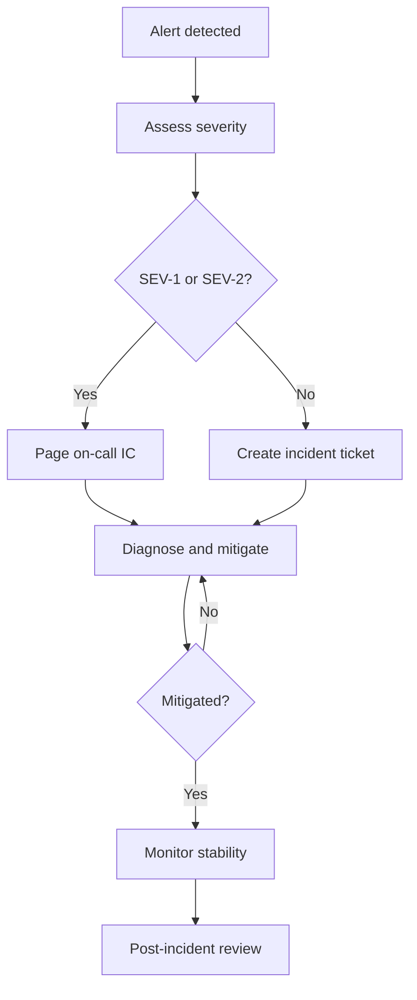

# Incident Response Runbook

> **Status:** Placeholder — to be completed before production launch.

Operational runbook for detecting, responding to, and recovering from production incidents on the KŌLAB Platform.

## Severity levels

| Level | Description                    | Response time     | Example                                   |
| ----- | ------------------------------ | ----------------- | ----------------------------------------- |
| SEV-1 | Complete outage or data breach | Immediate         | API down, JWT secret leaked               |
| SEV-2 | Major feature degraded         | < 1 hour          | Auth failures, database connectivity loss |
| SEV-3 | Minor degradation              | < 4 hours         | Elevated error rates, slow responses      |
| SEV-4 | Low impact                     | Next business day | Non-critical UI bug in production         |

## Roles

| Role                    | Responsibility                            |
| ----------------------- | ----------------------------------------- |
| Incident Commander (IC) | Coordinates response, communicates status |
| Technical Lead          | Diagnoses root cause, directs fixes       |
| Communications          | Updates stakeholders and status page      |
| Scribe                  | Documents timeline and actions            |

> **TODO:** Assign on-call rotation and contact methods before production.

## Detection

Incidents may be detected via:

- Monitoring and alerting (Sentry, OpenTelemetry — Phase 4)
- CI/CD pipeline failures
- User reports
- Dependabot / security audit alerts
- Secret scanning (Gitleaks) failures

## Response workflow



### 1. Acknowledge

- Confirm the alert is real (not a false positive)
- Assign severity level
- Create an incident channel or thread

### 2. Mitigate

Priority: restore service before root-cause analysis.

| Scenario                 | Immediate action                                  |
| ------------------------ | ------------------------------------------------- |
| Bad deploy               | Roll back to last known good release              |
| JWT secret compromise    | Rotate `JWT_SECRET`, invalidate all sessions      |
| Database failure         | Failover or restore from backup                   |
| DDoS / abuse             | Enable rate limiting, block offending IPs         |
| Dependency vulnerability | Apply Dependabot fix or disable affected endpoint |

Hotfix branch: `hotfix/<description>` — see [branch strategy](../engineering/branch-strategy.md).

### 3. Communicate

- **Internal:** Status updates every 30 minutes for SEV-1/SEV-2
- **External:** Status page update if user-facing impact
- **Template:**

  ```text
  [SEV-X] <Title> — <Status: Investigating | Mitigating | Resolved>
  Impact: <who/what is affected>
  Actions: <what we're doing>
  ETA: <estimated resolution or next update>
  ```

### 4. Resolve

- Confirm metrics and health checks are normal
- Close incident channel
- Schedule post-incident review within 48 hours

## Post-incident review (PIR)

Document in `docs/runbooks/incidents/YYYY-MM-DD-title.md`:

1. **Timeline** — Detection → mitigation → resolution
2. **Root cause** — What failed and why
3. **Impact** — Duration, users affected, data exposure
4. **Action items** — Preventive fixes with owners and deadlines
5. **What went well / what to improve**

## Security incidents

For suspected breaches or secret exposure:

1. Rotate affected credentials immediately (`JWT_SECRET`, API keys, database passwords)
2. Review Gitleaks and audit logs
3. Do not delete evidence — preserve logs for investigation
4. Follow [security docs](../security/README.md) reporting process
5. Engage legal/compliance if personal data is involved

## Contacts

| Contact | Role             | Method |
| ------- | ---------------- | ------ |
| _TBD_   | On-call engineer | _TBD_  |
| _TBD_   | Platform lead    | _TBD_  |
| _TBD_   | Security contact | _TBD_  |

## Related docs

- [Security overview](../security/README.md)
- [Branch strategy — hotfixes](../engineering/branch-strategy.md#hotfixes)
- [Deployment](../deployment/README.md)
- [Quality gates](../engineering/quality-gates.md)
