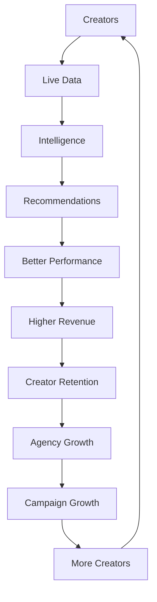

# Kōlab Product Strategy

**Status:** Strategic reference  
**Audience:** Leadership, product, engineering  
**Related:** [Master Roadmap](../roadmap/master-roadmap.md) · [Competitive Advantages](./competitive-advantages.md) · [Product Principles](./product-principles.md)

---

## Mission

Give creator businesses and the agencies that manage them a single, trustworthy operating layer for growth — from recruitment and compliance through live performance, campaigns, and long-term revenue.

---

## Vision

Build the **operating system for creator businesses**: one platform where creators, managers, recruiters, and brands share the same truth about performance, obligations, and opportunity — without duct-taping spreadsheets, OBS plugins, and disconnected SaaS tools.

---

## North Star

**Become the operating system for creator businesses.**

Every product decision should move Kōlab closer to that outcome: unified data, explainable intelligence, and composable workflows that scale from a solo creator to a global agency roster.

---

## Target users

### Creators

Independent and rostered creators who need clarity on goals, live performance, campaign deliverables, compliance, and next actions. Creators interact primarily through **Creator Studio** (future client surfaces) backed by deterministic APIs today.

### Agencies

Multi-creator organizations that recruit, onboard, manage campaigns, and report to brands. Agencies need organization-scoped CRM, audit trails, role-based access, and portfolio-level intelligence.

### Managers

Agency staff who run day-to-day creator operations: assignments, coaching, compliance reviews, and campaign execution. Managers are the primary users of the **Manager Portal** (planned).

### Recruiters

Specialized agency roles focused on lead pipeline, conversion to creator profiles, and platform account linkage. Recruiters are served by **Creator CRM** and recruitment APIs today.

### Brands

External partners who sponsor campaigns, review deliverables, and measure outcomes. Brand access matures through **Campaign Management**, **Analytics Platform**, and future marketplace flows.

---

## Long-term goals

### Creator Operating System

A creator-facing control center that aggregates goals, live activity, campaigns, coaching, compliance, and achievements in one dashboard — powered by the same backend models agencies trust.

**Today:** Creator dashboard API and goals engine foundations exist on the backend.  
**Next:** Creator Studio client experiences and mobile companion apps.

See [Master Roadmap — Creator Studio](../roadmap/master-roadmap.md#creator-studio).

### Agency Operating System

An agency command layer for roster management, campaign operations, intelligence at portfolio scale, and auditable workflows across recruiters, managers, and compliance teams.

**Today:** Identity, recruitment CRM, creator roster, documents, campaigns, and live intelligence APIs.  
**Next:** Manager Portal, portfolio analytics, and enterprise controls.

See [Master Roadmap — Agency CRM](../roadmap/master-roadmap.md#agency-crm) and [Manager Portal](../roadmap/master-roadmap.md#manager-portal).

### Unified Creator Economy

Connect performance intelligence, campaign execution, marketplace discovery, and financial settlement into one economic graph — with optional token utility as a later accelerant, not a prerequisite for core value.

**Today:** Architecture and product planning for credits and token economy.  
**Next:** Financial platform, marketplace, and token utility phases.

See [Token Economy architecture](../architecture/token-economy.md) and [Master Roadmap — Future Vision](../roadmap/master-roadmap.md#future-vision).

---

## Strategic pillars

| Pillar                         | What it means                                     | Primary docs                                              |
| ------------------------------ | ------------------------------------------------- | --------------------------------------------------------- |
| **Backend first**              | Durable models and APIs before UI polish          | [Product Principles](./product-principles.md)             |
| **Deterministic intelligence** | Explainable scores and goals before generative AI | [Live Intelligence](../architecture/live-intelligence.md) |
| **Organization scope**         | Every row and request tied to tenant context      | [Identity](../architecture/identity.md)                   |
| **Composable surfaces**        | Web, desktop, and mobile consume the same APIs    | [System Map](../architecture/system-map.md)               |

---

## Competitive posture

Kōlab wins by unifying CRM, live intelligence, campaign execution, and creator coaching in one data model — not by shipping isolated point solutions. Read [Competitive Advantages](./competitive-advantages.md) for the full differentiation narrative, including the **Why Kōlab Wins** chapter.

---

## Roadmap alignment

Delivery is organized into ten strategic phases in the [Master Roadmap](../roadmap/master-roadmap.md#future-roadmap-phases):

1. Foundation
2. Intelligence
3. Creator Studio
4. Manager Portal
5. OBS Replacement
6. AI Platform
7. Marketplace
8. Financial Platform
9. Token Economy
10. Global Creator Network

Each phase builds on the previous phase’s data model and API contracts. Features do not ship “UI only” without backend ownership and audit coverage.

---

## Platform flywheel

Kōlab compounds value through a closed loop: creators produce live data → intelligence → recommendations → better performance → revenue → retention → agency and campaign growth → more creators.

Every major initiative should strengthen at least one flywheel stage. See [Master Roadmap — Kōlab Flywheel](../roadmap/master-roadmap.md#kōlab-flywheel).

---

## Market positioning

| Segment                   | Kōlab position                                 | Alternatives we replace                     |
| ------------------------- | ---------------------------------------------- | ------------------------------------------- |
| **Creator agencies**      | Operating system for roster + live + campaigns | CRM + spreadsheets + OBS plugins            |
| **Professional creators** | Creator Studio backed by agency-trusted data   | Disconnected analytics and goal trackers    |
| **Brands (future)**       | Campaign execution with measurable creators    | Influencer marketplaces without ops depth   |
| **Enterprise agencies**   | Auditable, org-scoped platform                 | Custom internal tools with high maintenance |

Kōlab is **not** a generic social analytics dashboard. It is operational software for businesses built on live creator revenue.

---

## Product maturity model

| Level  | Name         | Characteristics                 | Example products today          |
| ------ | ------------ | ------------------------------- | ------------------------------- |
| **L0** | Schema       | Data model + migrations         | Live session tables             |
| **L1** | API          | Org-scoped endpoints + audit    | Goals engine, campaign matching |
| **L2** | Intelligence | Deterministic derived signals   | Performance score, coach alerts |
| **L3** | Aggregation  | Composed read models            | Creator dashboard API           |
| **L4** | Client       | Dedicated UX surface            | Creator portal (in progress)    |
| **L5** | Ecosystem    | Marketplace, financials, tokens | Planned phases 7–9              |

Track maturity per product in the [Platform Maturity Dashboard](../roadmap/master-roadmap.md#platform-maturity-dashboard).

---

## Platform expansion strategy

Expansion follows **depth before breadth**:

1. **Same organization, more signal** — live events, gifters, goals, scores (current focus).
2. **Same organization, more users** — Manager Portal, mobile, enterprise seats.
3. **Same organization, more revenue rails** — financial platform, marketplace.
4. **More organizations, shared learnings** — improved matching and benchmarks (never cross-tenant data leakage).
5. **Global network (long-term)** — i18n, regional compliance, cross-market marketplace with strict scope.

See [Business Model](../business/business-model.md) for how expansion maps to revenue.

---

## Five-year vision

By 2031, Kōlab is the default **agency operating system** for professional live creator rosters in North America and LATAM:

- Creators run their week from Creator Studio; agencies run portfolios from Manager Portal.
- Live Studio replaces OBS for a majority of managed sessions.
- Campaigns, deliverables, and payouts close inside one audit trail.
- AI assists are explainable, permission-scoped, and optional — never the source of truth for money or compliance.

---

## Ten-year vision

By 2036, Kōlab is the **global creator business infrastructure layer**:

- Multi-region deployment with localized compliance packs.
- Marketplace connects brands and verified creators with performance-linked reputation.
- Token utility (where permitted) rewards measurable outcomes already tracked by the platform.
- The Kōlab data network — live, gifter, campaign, and goal history — is the primary moat described in [The Kōlab Data Network](../roadmap/master-roadmap.md#the-kōlab-data-network).

**North star unchanged:** become the operating system for creator businesses.

---

## Related documentation

- [Master Roadmap](../roadmap/master-roadmap.md)
- [Business Model](../business/business-model.md)
- [Competitive Advantages](./competitive-advantages.md)
- [Product Principles](./product-principles.md)
- [System Map](../architecture/system-map.md)
- [Product overview](../product/README.md)
